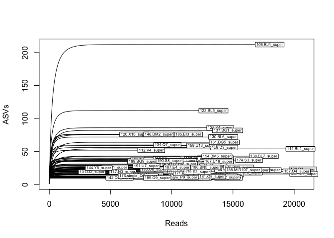
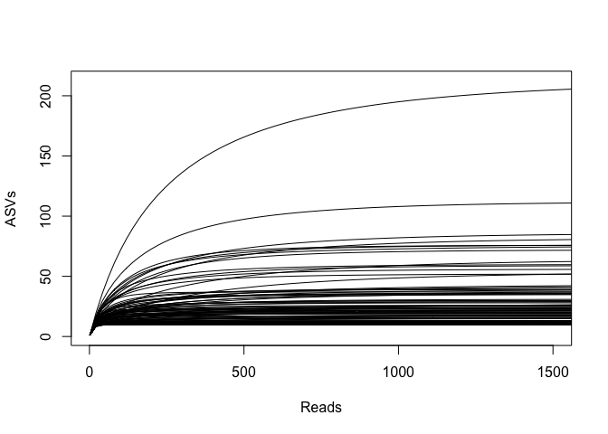
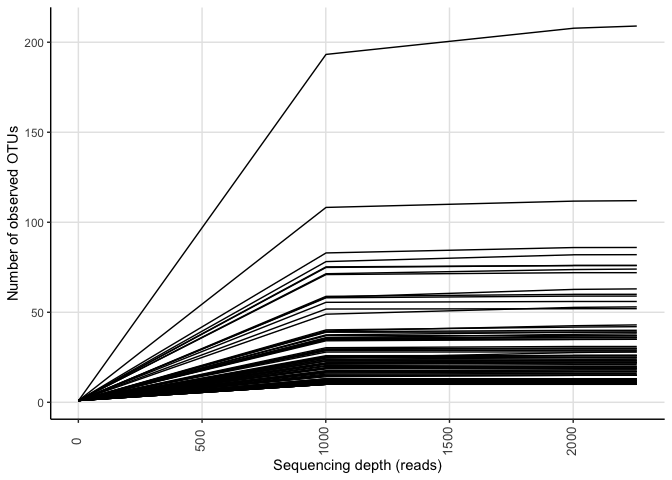
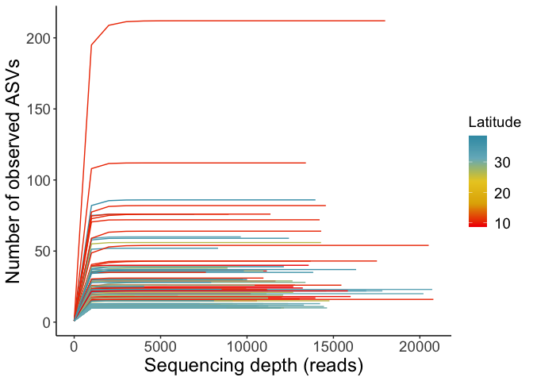
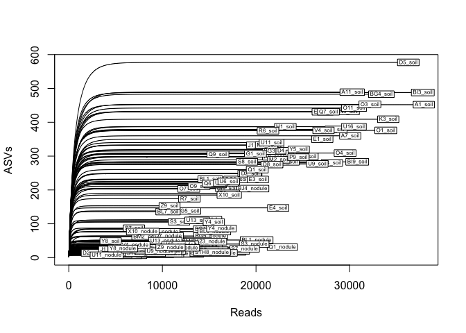
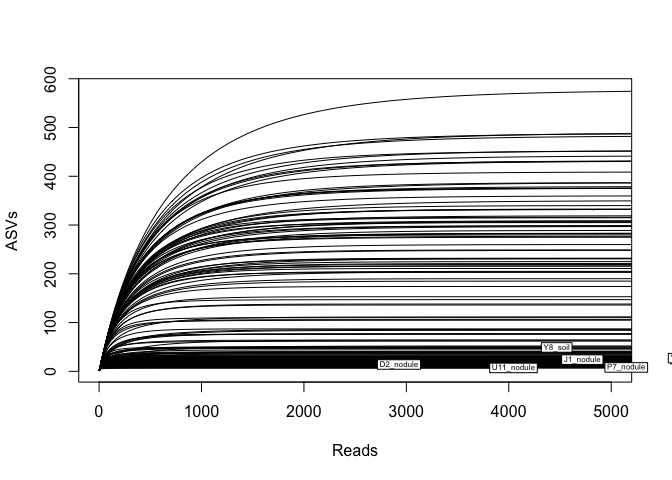
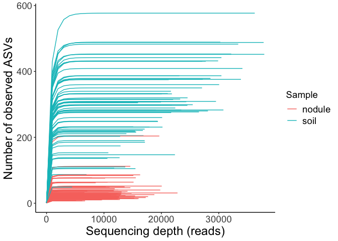

ASV filtering
================
Tia Harrison
25/01/2021

# Setup

## Load the packages for analysis

``` r
# Packages for analysis 
library(phyloseq)
library(vegan)
library(tidyverse)

# Load packages for plotting purposes
library(ampvis2)
library(devtools)
```

## Load function for plotting

Function can be used for plotting the rarefied data and customize the
colour and groups, Copy and paste the function from github:
<https://gist.github.com/KasperSkytte/8d0ca4206a66be7ff6d76fc4ab8e66c6>

``` r
# for converting phyloseq object to ampvis2 object 
phyloseq_to_ampvis2 <- function(physeq) {
  #check object for class
  if(!any(class(physeq) %in% "phyloseq"))
    stop("physeq object must be of class \"phyloseq\"", call. = FALSE)
  
  #ampvis2 requires taxonomy and abundance table, phyloseq checks for the latter
  if(is.null(physeq@tax_table))
    stop("No taxonomy found in the phyloseq object and is required for ampvis2", call. = FALSE)
  
  #OTUs must be in rows, not columns
  if(phyloseq::taxa_are_rows(physeq))
    abund <- as.data.frame(phyloseq::otu_table(physeq)@.Data)
  else
    abund <- as.data.frame(t(phyloseq::otu_table(physeq)@.Data))
  
  #tax_table is assumed to have OTUs in rows too
  tax <- phyloseq::tax_table(physeq)@.Data
  
  #merge by rownames (OTUs)
  otutable <- merge(
    abund,
    tax,
    by = 0,
    all.x = TRUE,
    all.y = FALSE,
    sort = FALSE
  )
  colnames(otutable)[1] <- "OTU"
  
  #extract sample_data (metadata)
  if(!is.null(physeq@sam_data)) {
    metadata <- data.frame(
      phyloseq::sample_data(physeq),
      row.names = phyloseq::sample_names(physeq), 
      stringsAsFactors = FALSE, 
      check.names = FALSE
    )
    
    #check if any columns match exactly with rownames
    #if none matched assume row names are sample identifiers
    samplesCol <- unlist(lapply(metadata, function(x) {
      identical(x, rownames(metadata))}))
    
    if(any(samplesCol)) {
      #error if a column matched and it's not the first
      if(!samplesCol[[1]])
        stop("Sample ID's must be in the first column in the sample metadata, please reorder", call. = FALSE)
    } else {
      #assume rownames are sample identifiers, merge at the end with name "SampleID"
      if(any(colnames(metadata) %in% "SampleID"))
        stop("A column in the sample metadata is already named \"SampleID\" but does not seem to contain sample ID's", call. = FALSE)
      metadata$SampleID <- rownames(metadata)
      
      #reorder columns so SampleID is the first
      metadata <- metadata[, c(which(colnames(metadata) %in% "SampleID"), 1:(ncol(metadata)-1L)), drop = FALSE]
    }
  } else
    metadata <- NULL
  
  #extract phylogenetic tree, assumed to be of class "phylo"
  if(!is.null(physeq@phy_tree)) {
    tree <- phyloseq::phy_tree(physeq)
  } else
    tree <- NULL
  
  #extract OTU DNA sequences, assumed to be of class "XStringSet"
  if(!is.null(physeq@refseq)) {
    #convert XStringSet to DNAbin using a temporary file (easiest)
    fastaTempFile <- tempfile(pattern = "ampvis2_", fileext = ".fa")
    Biostrings::writeXStringSet(physeq@refseq, filepath = fastaTempFile)
  } else
    fastaTempFile <- NULL
  
  #load as normally with amp_load
  ampvis2::amp_load(
    otutable = otutable,
    metadata = metadata,
    tree = tree,
    fasta = fastaTempFile
  )
}
```

# Sample types data

## Load the culture and field data for analysis in phyloseq

The data needs to be loaded into R in a specific way to use in the
package phyloseq rather than using read_csv or read_tsv. Combine
multiple outputs from qiime2 (otu table, tree, metadata) into one
object.

``` r
# Import feature table data for phyloseq 
biom_table <- import_biom(BIOMfilename = "table-with-taxonomy-blast9080.biom", treefilename = "tree-blast9080.nwk")

# Check the import 
biom_table
```

    ## phyloseq-class experiment-level object
    ## otu_table()   OTU Table:         [ 2929 taxa and 250 samples ]
    ## tax_table()   Taxonomy Table:    [ 2929 taxa by 7 taxonomic ranks ]
    ## phy_tree()    Phylogenetic Tree: [ 2929 tips and 2927 internal nodes ]

``` r
# Import the metadata file 
metadata <- import_qiime_sample_data(mapfilename = "metadata_samples_update.tsv")

# Merge the ASV and the metadata file into one object 
biom_phylo <- merge_phyloseq(biom_table, metadata)

# Add taxonomy category names to the biom table 
colnames(tax_table(biom_phylo))= c("Kingdom","Phylum","Class","Order","Family","Genus", "Species")
```

## Explore the data

Look at how much data is in the phyloseq object to be used for analysis.

``` r
# Explore the data 
nsamples(biom_phylo) # number of samples in the biom table 
```

    ## [1] 250

``` r
ntaxa(biom_phylo) # number of sequence variants (ASVs)
```

    ## [1] 2929

``` r
depths<-sample_sums(biom_phylo) 
summary(depths)  # summary statistics of sampling depth
```

    ##    Min. 1st Qu.  Median    Mean 3rd Qu.    Max. 
    ##    1080    8527   11416   12370   14619   36526

``` r
# Check what variables are included
sample_variables(biom_phylo)
```

    ## [1] "sample.id"       "sample.id.clean" "nodule.no"       "population.id"  
    ## [5] "latitude"        "longitude"       "sample.type"     "pair"           
    ## [9] "sample.id.pair"

# Rarefy

## Rarefy the sample type data

We want to rarefy the samples without replacement (do not put reads back
into the pool after sampling one). Choose a sampling depth based on a
value that keeps as many sequences as possible while excluding as few
samples as possible.

``` r
# Prep for rarecurve 
biom_data<-otu_table(biom_phylo)
class(biom_data)<-"matrix" # as.matrix will not work for some reason 
biom_data2<-t(biom_data)

# Plot the rarefaction curves 
# rarecurve(t(otu_table(biom_phylo)), step=20, cex=0.5, xlab="Reads", ylab="ASVs")
rarecurve(biom_data2, step=20, cex=0.5, xlab="Reads", ylab="ASVs")
```

<!-- -->

``` r
# Zoom in on the beginning of the x axis to view curves better 
rarecurve(biom_data2, step=20, cex=0.5, xlab="Reads", ylab="ASVs", xlim=c(1, 5000))
```

<!-- -->

``` r
# Depth chosen based on the sample with the second fewest reads 
# Only removing one sample from the total project
biom_rarefied = rarefy_even_depth(biom_phylo, rngseed=1, sample.size=2257, replace=F)

# Look at the new table information 
biom_rarefied
```

    ## phyloseq-class experiment-level object
    ## otu_table()   OTU Table:         [ 2911 taxa and 249 samples ]
    ## sample_data() Sample Data:       [ 249 samples by 9 sample variables ]
    ## tax_table()   Taxonomy Table:    [ 2911 taxa by 7 taxonomic ranks ]
    ## phy_tree()    Phylogenetic Tree: [ 2911 tips and 2909 internal nodes ]

``` r
# Does nodule number have an impact on reads and ASVs called ? 
# Convert phyloseq object to ampvis2 object 
amp_test<- phyloseq_to_ampvis2(biom_phylo)
amp_test
```

    ## ampvis2 object with 4 elements. 
    ## Summary of OTU table:
    ##      Samples         OTUs  Total#Reads    Min#Reads    Max#Reads Median#Reads 
    ##          250         2929      3092463         1080        36526      11416.5 
    ##    Avg#Reads 
    ##     12369.85 
    ## 
    ## Assigned taxonomy:
    ##      Kingdom       Phylum        Class        Order       Family        Genus 
    ##   2929(100%) 2864(97.78%) 2858(97.58%) 2821(96.31%)  2680(91.5%) 2096(71.56%) 
    ##      Species 
    ##  541(18.47%) 
    ## 
    ## Metadata variables: 9 
    ##  sample_id, sample_id_clean, nodule_no, population_id, latitude, longitude, sample_type, pair, sample_id_pair

``` r
# Plot and colour by nodule number
amp_rarecurve(amp_test, color_by = "nodule_no") +
  ylab("Number of observed ASVs") +
  labs(color="Nodule no.") +
  theme_classic() +
  theme(axis.title.x = element_text(size=18), axis.title.y = element_text(size=18), axis.text.y= element_text(size=14), axis.text.x= element_text(size=14), legend.title= element_text(size=14), legend.text=element_text(size=14))
```

<!-- -->

``` r
# Plot and colour by sample type 
amp_rarecurve(amp_test, color_by = "sample_type") 
```

<!-- -->

``` r
# Inspect the data 
biom_rarefied
```

    ## phyloseq-class experiment-level object
    ## otu_table()   OTU Table:         [ 2911 taxa and 249 samples ]
    ## sample_data() Sample Data:       [ 249 samples by 9 sample variables ]
    ## tax_table()   Taxonomy Table:    [ 2911 taxa by 7 taxonomic ranks ]
    ## phy_tree()    Phylogenetic Tree: [ 2911 tips and 2909 internal nodes ]

``` r
# Save the rarefied phyloseq object for future work 
saveRDS(biom_rarefied, "biom_rarefied_blast9080.rds")
```

## Rarefy for just nodule data

``` r
# Prep the data for the rarecurve function 
biom_phylo_nod<- subset_samples(biom_phylo, sample.type == "field")
biom_phylo_nod2= prune_taxa(taxa_sums(biom_phylo_nod)>0, biom_phylo_nod)

# Prep for rarecurve 
biom_phylo_nod3<-otu_table(biom_phylo_nod2)
class(biom_phylo_nod3)<-"matrix" # as.matrix will not work for some reason 
biom_phylo_nod4<-t(biom_phylo_nod3)

# Plot the rarefaction curves 
# rarecurve(t(otu_table(biom_phylo)), step=20, cex=0.5, xlab="Reads", ylab="ASVs")
rarecurve(biom_phylo_nod4, step=20, cex=0.5, xlab="Reads", ylab="ASVs")
```

<!-- -->

``` r
# Zoom in on the beginning of the x axis to view curves better 
rarecurve(biom_phylo_nod4, step=20, cex=0.5, xlab="Reads", ylab="ASVs", xlim=c(1, 1500))
```

<!-- -->

## Filter for field samples only and plot against latitude

Here I am going to just look at the field samples (the community that
came directly from nodules with no grow up phase of microbes in the lab)

``` r
# Get just the nodule data 
nodule <- subset_samples(biom_rarefied, sample.type == "field")
nodule_clean= prune_taxa(taxa_sums(nodule)>0, nodule)

# Then transform to new object 
nodule_test<- phyloseq_to_ampvis2(nodule_clean)

amp_rarecurve(nodule_test)
```

<!-- -->

``` r
# Transform a different one 
nodule_test<-phyloseq_to_ampvis2(biom_phylo_nod2)

# Get the colour 
library(wesanderson)
latcolour <- wes_palette("Zissou1", 50, type = "continuous")

# Plot the curve 
amp_rarecurve(nodule_test, color_by = "latitude") +
  ylab("Number of observed ASVs") +
  labs(color="Latitude") +
  theme_classic() +
  scale_colour_gradientn(colours = rev(latcolour))+
  # scale_colour_gradient2(low = latcolour[5], high=latcolour[1], mid=latcolour[3]) + 
  theme(axis.title.x = element_text(size=18), axis.title.y = element_text(size=18), axis.text.y= element_text(size=14), axis.text.x= element_text(size=14), legend.title= element_text(size=14), legend.text=element_text(size=14))
```

<!-- -->

# Soil data

Load in all the sequence data from qiime2 and metadata to make the full
phyloseq object. This data contains ASVs called from both the nodule
(field) sequences and their corresponding soil sequences together.

``` r
# Import feature table data for phyloseq 
biom_soil_nod <- import_biom(BIOMfilename = "table-with-taxonomy-soilnodule.biom", treefilename = "tree_soil_nodule.nwk")

# Check the import 
biom_soil_nod
```

    ## phyloseq-class experiment-level object
    ## otu_table()   OTU Table:         [ 20475 taxa and 159 samples ]
    ## tax_table()   Taxonomy Table:    [ 20475 taxa by 7 taxonomic ranks ]
    ## phy_tree()    Phylogenetic Tree: [ 20475 tips and 20473 internal nodes ]

``` r
# Import the metadata file 
metadata_soil_nod <- import_qiime_sample_data(mapfilename = "metadata_soil_nod.tsv")

# Merge the ASV and the metadata file into one object 
biom_phylo_soilnod <- merge_phyloseq(biom_soil_nod, metadata_soil_nod)

# Add taxonomy category names to the biom table 
colnames(tax_table(biom_phylo_soilnod))= c("Kingdom","Phylum","Class","Order","Family","Genus", "Species")

biom_phylo_soilnod
```

    ## phyloseq-class experiment-level object
    ## otu_table()   OTU Table:         [ 20475 taxa and 159 samples ]
    ## sample_data() Sample Data:       [ 159 samples by 6 sample variables ]
    ## tax_table()   Taxonomy Table:    [ 20475 taxa by 7 taxonomic ranks ]
    ## phy_tree()    Phylogenetic Tree: [ 20475 tips and 20473 internal nodes ]

## Explore the soil and field data

``` r
# Explore the data 
nsamples(biom_phylo_soilnod) # number of samples in the biom table 
```

    ## [1] 159

``` r
ntaxa(biom_phylo_soilnod) # number of sequence variants (ASVs)
```

    ## [1] 20475

``` r
depths<-sample_sums(biom_phylo_soilnod) 
summary(depths)  # summary statistics of sampling depth
```

    ##    Min. 1st Qu.  Median    Mean 3rd Qu.    Max. 
    ##    2928   10300   13744   15777   20102   37928

``` r
# Check what variables are included
sample_variables(biom_phylo_soilnod)
```

    ## [1] "sample.id"   "ID_clean"    "Sample_type" "Pop_code"    "Latitude"   
    ## [6] "Longitude"

``` r
# Save the non-rarefied data 
saveRDS(biom_phylo_soilnod, "biom_rarefied_soilnod_raw.rds")
```

## Filtering the ASV table

``` r
# Prepare the data 
soil_data<-otu_table(biom_phylo_soilnod)
class(soil_data)<-"matrix" # as.matrix will not work for some reason 
soil_data2<-t(soil_data)

# Plot the rarefaction curves 
rarecurve(soil_data2, step=20, cex=0.5, xlab="Reads", ylab="ASVs")
```

<!-- -->

``` r
# Zoom in on the beginning of the x axis to view curves better 
rarecurve(soil_data2, step=20, cex=0.5, xlab="Reads", ylab="ASVs", xlim=c(1, 5000))
```

<!-- -->

``` r
# Depth chosen based on the sample with the fewest reads (2928)
# Set seed to the same number as in the latitude analysis  
biom_rarefied_soilnod = rarefy_even_depth(biom_phylo_soilnod, rngseed=1, sample.size=2928, replace=F)

# Look at the new table information 
biom_rarefied_soilnod
```

    ## phyloseq-class experiment-level object
    ## otu_table()   OTU Table:         [ 20285 taxa and 159 samples ]
    ## sample_data() Sample Data:       [ 159 samples by 6 sample variables ]
    ## tax_table()   Taxonomy Table:    [ 20285 taxa by 7 taxonomic ranks ]
    ## phy_tree()    Phylogenetic Tree: [ 20285 tips and 20283 internal nodes ]

``` r
# Save the rarefied phyloseq object for future work 
saveRDS(biom_rarefied_soilnod, "biom_rarefied_soilnod.rds")
```

## Colour the soil and nodule data

``` r
amp_test2<- phyloseq_to_ampvis2(biom_phylo_soilnod)

# Plot and colour by nodule number
amp_rarecurve(amp_test2, color_by = "Sample_type") +
  ylab("Number of observed ASVs") +
  labs(color="Sample") +
  theme_classic() +
  theme(axis.title.x = element_text(size=18), axis.title.y = element_text(size=18), axis.text.y= element_text(size=14), axis.text.x= element_text(size=14), legend.title= element_text(size=14), legend.text=element_text(size=14))
```

<!-- -->
