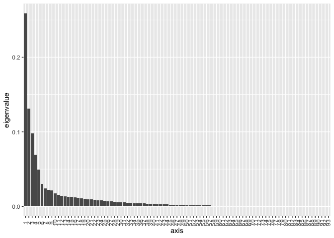
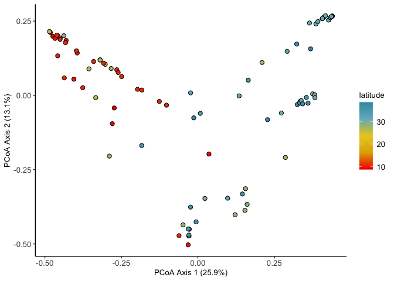
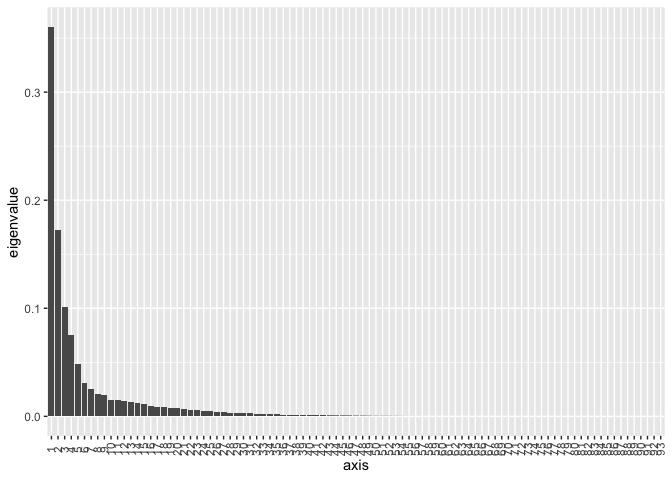
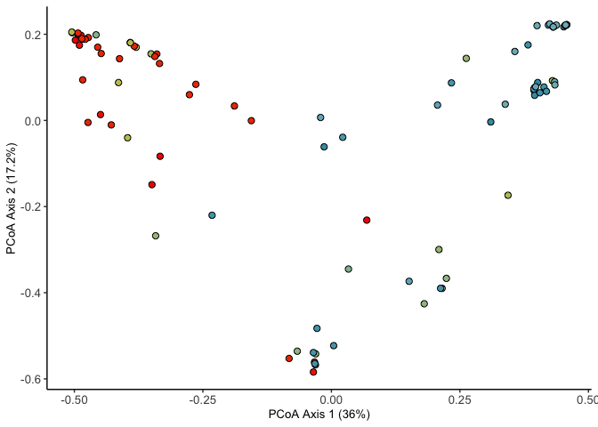
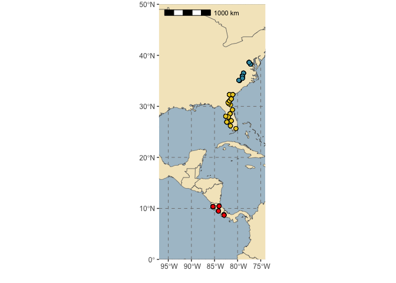
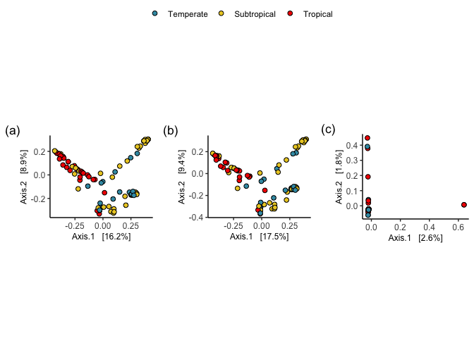
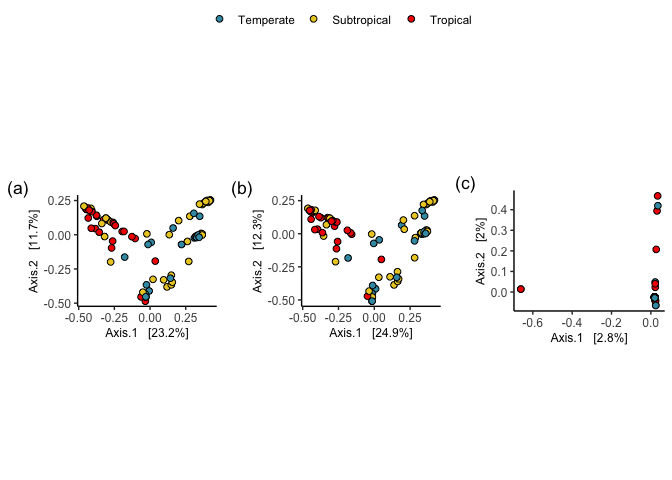
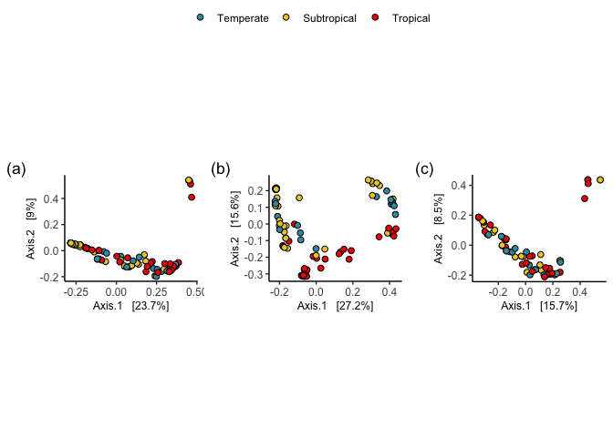
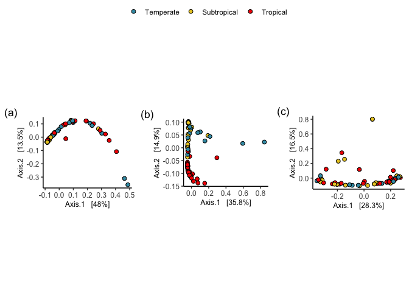

Nodule diversity
================
Tia Harrison
11/11/2020

# Set up

## Load the packages for analysis

``` r
# Analysis 
library(vegan)
library(ade4)
library(psy)
library(phyloseq)
library(biomformat)
library(data.table)
library(lsmeans)
library(car) 
library(lme4)
library(multcomp)
library(tidyverse)
library(performance)
library(phylotools)
library(ANCOMBC)

# Plotting 
library(microbiome)
library(RColorBrewer)
library(ggpubr)
library(rnaturalearth)
library(rnaturalearthdata)
library(rgeos)
library(ggspatial)
library(ggthemes)
library(broom)
library(wesanderson)
library(nationalparkcolors)
library(cowplot)
library(gridExtra)
library(UpSetR)
```

# Data

## Load the rarefied data from previous analyses

``` r
biom_rarefied<-read_rds("biom_rarefied_blast9080.rds")
biom_rarefied
```

    ## phyloseq-class experiment-level object
    ## otu_table()   OTU Table:         [ 2911 taxa and 249 samples ]
    ## sample_data() Sample Data:       [ 249 samples by 9 sample variables ]
    ## tax_table()   Taxonomy Table:    [ 2911 taxa by 7 taxonomic ranks ]
    ## phy_tree()    Phylogenetic Tree: [ 2911 tips and 2909 internal nodes ]

## Subsample the dataset to just field samples

Since we saw that the field samples are different from the cultured
samples and that the cultured samples are dominated by super fast
growing non-rhizobia strains, we will work with just field samples from
now on.

``` r
# Sub-sample the data to just samples labelled "field"
field <- subset_samples(biom_rarefied, sample.type == "field")

# Remove empty rows/taxa from dataset 
field_clean= prune_taxa(taxa_sums(field)>0, field)
```

# Data exploration

## Plot the ASV abundances

Is there turnover in the main ASVs over latitude?

``` r
# Prepare for the bar plot 
field_abund2 <- microbiome::transform(field_clean, "compositional") # Make all ASVs relative abundance 

# Set the palette 
palette_col <- colorRampPalette(brewer.pal(12, "Paired")) # specify the palette 
palette_full <- palette_col(1450) # palette for the full ASV dataset 

# Plot the result 
plot_full <- plot_composition(field_abund2, sample.sort="latitude",  x.label="population.id") +
  scale_fill_manual(values = palette_full) +
  theme_classic() + 
  theme(legend.position = "none") 

# To customize save the data from the plot 
plot_data<-plot_full$data

plot_full_custom2<- ggplot(plot_data, aes(x= Sample, y=Abundance, fill=Tax)) +
  geom_bar(position="stack", stat="identity", size=0.1, colour="white") +
  scale_x_discrete(labels = plot_data$xlabel, breaks = plot_data$Sample) +
  scale_fill_manual(values = (palette_full)) +
  theme_classic() + 
  theme(legend.position = "none", 
        axis.title.x = element_text(size=13), 
        axis.title.y = element_text(size=13), 
        axis.text.y= element_text(size=12), 
        axis.text.x= element_text(size=6, angle=90))
plot_full_custom2
```

<!-- -->

## Population breakdown

How many samples in each population across the gradient?

``` r
# Get the data 
nodule_pops<-data.frame(sample_data(field_clean))

# Average number of nodules per plant for each population 
nodule_pops2 <- nodule_pops%>%
  group_by(population.id) %>%
  dplyr::summarize(average=mean(nodule.no))
nodule_pops2
```

    ## # A tibble: 29 × 2
    ##    population.id average
    ##    <chr>           <dbl>
    ##  1 A                3   
    ##  2 BG              10.6 
    ##  3 BI              11   
    ##  4 BJ              12   
    ##  5 BL               9.25
    ##  6 BM               7.5 
    ##  7 BN               9   
    ##  8 BUS             10.3 
    ##  9 D                6.8 
    ## 10 E                6.6 
    ## # ℹ 19 more rows

``` r
# Correlation between latitude and nodule no 
cor.test(nodule_pops$latitude, nodule_pops$nodule.no, method="spearman")
```

    ## 
    ##  Spearman's rank correlation rho
    ## 
    ## data:  nodule_pops$latitude and nodule_pops$nodule.no
    ## S = 157529, p-value = 0.09301
    ## alternative hypothesis: true rho is not equal to 0
    ## sample estimates:
    ##       rho 
    ## -0.175201

``` r
# Get population breakdown 
nodule_pops2<-nodule_pops%>%
   mutate(region=case_when(latitude < 11 ~ "Tropical", 
                          latitude > 35 ~ "Temperate", 
                          latitude > 25 | latitude <33 ~ "Subtropical"))%>% 
  group_by(population.id, region, latitude)%>%
  tally()%>%
  arrange(desc(region))
nodule_pops2
```

    ## # A tibble: 29 × 4
    ## # Groups:   population.id, region [29]
    ##    population.id region    latitude     n
    ##    <chr>         <chr>        <dbl> <int>
    ##  1 BG            Tropical     10.3      5
    ##  2 BI            Tropical     10.3      3
    ##  3 BJ            Tropical     10.3      1
    ##  4 BL            Tropical     10.4      4
    ##  5 BM            Tropical     10.4      2
    ##  6 BN            Tropical     10.4      5
    ##  7 BUS           Tropical      8.78     3
    ##  8 MIR           Tropical      8.68     3
    ##  9 STH           Tropical      9.48     6
    ## 10 S             Temperate    36.5      4
    ## # ℹ 19 more rows

``` r
# Correlation between latitude and sampling effort 
cor.test(nodule_pops2$latitude, nodule_pops2$n, method="spearman")
```

    ## 
    ##  Spearman's rank correlation rho
    ## 
    ## data:  nodule_pops2$latitude and nodule_pops2$n
    ## S = 4821.4, p-value = 0.33
    ## alternative hypothesis: true rho is not equal to 0
    ## sample estimates:
    ##       rho 
    ## -0.187533

# Initial Analysis

## Differences in field samples using beta diversity measures

Look for differences in the field sample communities across the
latitudinal gradient.

### Jaccard distance

Just taking into consideration the presences and absences of ASVs in the
data

``` r
# Jaccard distance using raw values 
jaccard_field = phyloseq::distance(field_clean, method="jaccard")
jaccard_field_ord = ordinate(field_clean, method="PCoA", distance=jaccard_field)
plot_scree(jaccard_field_ord) # Check how much variation is summarized on each axis 
```

<!-- -->

``` r
# Set the colour for latitude 
latcolour <- wes_palette("Zissou1", 50, type = "continuous")

# Plot the PCoA 
jaccard_plot<-plot_ordination(field_clean, jaccard_field_ord) + 
  theme(aspect.ratio=1) +
  geom_point(aes(fill=latitude), size=2.2, shape=21) +
  scale_fill_gradientn(colours = rev(latcolour)) + 
  ylab("PCoA Axis 2 (13.1%)")+
  xlab("PCoA Axis 1 (25.9%)")+
  theme_classic() +
  labs(color="Latitude") +
  theme(axis.title.x = element_text(size=10), 
        axis.title.y = element_text(size=10), 
        axis.text.y= element_text(size=10), 
        axis.text.x= element_text(size=10), 
        legend.title= element_text(size=10), 
        legend.text=element_text(size=10))
jaccard_plot
```

<!-- -->

### Bray-Curtis distance

Taking abundance of ASVs into account.

``` r
# Calculate the distances between the samples and PCoA
field_bray = phyloseq::distance(field_clean, method="bray")
field_bray_ord = ordinate(field_clean, method="PCoA", distance=field_bray)
plot_scree(field_bray_ord)
```

<!-- -->

``` r
# Plot the PCoA 
plot_field_bray<-plot_ordination(field_clean, field_bray_ord) + 
  theme(aspect.ratio=1) +
  geom_point(aes(fill=latitude), size =2.2, shape=21) +
  scale_fill_gradientn(colours = rev(latcolour)) + 
  ylab("PCoA Axis 2 (17.2%)")+
  xlab("PCoA Axis 1 (36%)")+
  theme_classic() +
  labs(color="Latitude") +
  theme(axis.title.x = element_text(size=10), 
        axis.title.y = element_text(size=10), 
        axis.text.y = element_text(size=10), 
        axis.text.x= element_text(size=10), 
        legend.title= element_text(size=10),   
        legend.text=element_text(size=10), 
        legend.justification=c("right", "bottom"), 
        legend.position="none")
plot_field_bray
```

<!-- -->

### Accounting for phylogenetic relatedness

Look at both weighted and unweighted unifrac distance to see if rare
species or common species have an impact

``` r
# Calculate the distances between the samples - unifrac distance 
field_unifrac = phyloseq::distance(field_clean, method="unifrac")
field_unifrac_ord = ordinate(field_clean, method="PCoA", distance=field_unifrac)
plot_scree(field_unifrac_ord)
```

<!-- -->

``` r
# Plot the PCoA 
plot_field_unifrac<-plot_ordination(field_clean, field_unifrac_ord) + 
  theme(aspect.ratio=1) +
  geom_point(aes(fill=latitude), size =2.2, shape=21) +  
  scale_fill_gradientn(colours = rev(latcolour)) + 
  theme_classic() +
  labs(color="Latitude") +
   theme(axis.title.x = element_text(size=10), 
        axis.title.y = element_text(size=10), 
        axis.text.y = element_text(size=10), 
        axis.text.x= element_text(size=10), 
        legend.title= element_text(size=10),   
        legend.text=element_text(size=10), 
        legend.justification=c("right", "bottom"), 
        legend.position="none")
plot_field_unifrac
```

<!-- -->

``` r
# Calculate the distances between the samples - weighted unifrac distance 
field_wunifrac = phyloseq::distance(field_clean, method="wunifrac")
field_wunifrac_ord = ordinate(field_clean, method="PCoA", distance=field_wunifrac)
plot_scree(field_wunifrac_ord)
```

<!-- -->

``` r
# Plot the PCoA 
plot_field_wunifrac<-plot_ordination(field_clean, field_wunifrac_ord) + 
  theme(aspect.ratio=1) +
  geom_point(aes(fill=latitude), size =2.2, shape=21) +
  scale_fill_gradientn(colours = rev(latcolour)) + 
  theme_classic() +
  labs(color="Latitude") +
   theme(axis.title.x = element_text(size=10), 
        axis.title.y = element_text(size=10), 
        axis.text.y = element_text(size=10), 
        axis.text.x= element_text(size=10), 
        legend.title= element_text(size=10),   
        legend.text=element_text(size=10), 
        legend.justification=c("right", "bottom"), 
        legend.position="none")
plot_field_wunifrac
```

<!-- -->

## Relationship between alpha diversity with latitude

Analyzing different measures of taxa richness across latitude

1.  Observed values are the raw counts of ASVs.
2.  Chao1 diversity takes into consideration abundance differences and
    assumes a poission distribution but it looks the same as the
    observed ASVs probably because each ASV has at least 20 reads behind
    it and Chao1 can find more differences if there are ASVs with only a
    few reads.
3.  Simpson diversity gives more weight to common species so differences
    in rare species will have no impact on the diversity measures.
4.  Shannon diversity assumes all species are represented in a sample
    and randomly sampled. Accounts for both abundance and evenness.

For diversity metrics that are continuous and bound between 0 and 1 are
hard to model because it is hard to make it normal. People have logged
count data to use in analyses and that can work. What are other
solutions? Even if the assumptions are not met, if the effect size is
very strong and the p value is very low then that result is likely true.

``` r
# Plot the number of ASVs at each point of latitude 
# In measures input the types of diversity you want to plot 
field_plot<-plot_richness(field_clean, x="latitude", measures=c("Observed", "Shannon", "Simpson")) +
  geom_smooth(method="lm") +
  (xlab("Latitude"))+
  theme_classic() +
  theme(axis.title.x = element_text(size=15), 
        axis.title.y = element_text(size=15), 
        axis.text.y=   element_text(size=14), 
        axis.text.x= element_text(size=14), 
        legend.title= element_text(size=14),   
        legend.text=element_text(size=14), 
        strip.text.x = element_text(size = 14))
field_plot
```

<!-- -->

### Observed ASVs

Significant relationship between observed ASVs and latitude both with
logged and raw values, showing an increase in diversity towards lower
latitude.

``` r
# Save the data for analysis 
field_alpha=data.table(field_plot$data)
field_obs=field_alpha[(variable == "Observed")]
hist(field_obs$value) # right skewed meaning right tail (log or square root)
```

<!-- -->

``` r
# But observed data is essentially count data 

# Plot relationship between latitude and ASVs
field_lat<-ggplot(field_obs, aes(x=latitude, y=(value))) + 
  geom_smooth(method="lm", colour="black") + 
  geom_point(alpha=0.6)+
  (ylab("Observed ASVs (no)"))+
  (xlab("Latitude"))+
  theme_classic() +
  theme(axis.title.x = element_text(size=14), 
        axis.title.y = element_text(size=14), 
        axis.text.y=   element_text(size=12), 
        axis.text.x= element_text(size=12), 
        legend.title= element_text(size=12),   
        legend.text=element_text(size=12))
field_lat
```

<!-- -->

``` r
# Check the normality of the variables 
ggplot(field_obs, aes(x=value))+
  geom_histogram()
```

<!-- -->

``` r
# Run the best fitting model 
mod_field_qp=glm(value~latitude, family = quasipoisson(),data=field_obs)

# Inspect model fit 
plot(mod_field_qp)
```

<!-- --><!-- --><!-- --><!-- -->

``` r
# Test significance 
Anova(mod_field_qp, type=3)
```

    ## Analysis of Deviance Table (Type III tests)
    ## 
    ## Response: value
    ##          LR Chisq Df Pr(>Chisq)  
    ## latitude   6.0427  1    0.01396 *
    ## ---
    ## Signif. codes:  0 '***' 0.001 '**' 0.01 '*' 0.05 '.' 0.1 ' ' 1

``` r
summary(mod_field_qp)
```

    ## 
    ## Call:
    ## glm(formula = value ~ latitude, family = quasipoisson(), data = field_obs)
    ## 
    ## Deviance Residuals: 
    ##     Min       1Q   Median       3Q      Max  
    ## -5.1259  -3.2215  -1.8232   0.9341  19.0795  
    ## 
    ## Coefficients:
    ##              Estimate Std. Error t value Pr(>|t|)    
    ## (Intercept)  3.861858   0.195324   19.77   <2e-16 ***
    ## latitude    -0.019819   0.008023   -2.47   0.0154 *  
    ## ---
    ## Signif. codes:  0 '***' 0.001 '**' 0.01 '*' 0.05 '.' 0.1 ' ' 1
    ## 
    ## (Dispersion parameter for quasipoisson family taken to be 21.69656)
    ## 
    ##     Null deviance: 1567.1  on 92  degrees of freedom
    ## Residual deviance: 1436.0  on 91  degrees of freedom
    ## AIC: NA
    ## 
    ## Number of Fisher Scoring iterations: 5

``` r
# Cook's distance identifies record 9 as highly influential
# Try removing and testing it again to see if it makes a difference 

field_obs_out<-field_obs %>%
  filter(value<200)

# Run model again without outlier 
# Try quasi since there is overdispersion 
mod_field_q_out=glm(value ~ latitude, family = quasipoisson(), data=field_obs_out)

# Inspect model fit 
plot(mod_field_q_out)
```

<!-- --><!-- --><!-- --><!-- -->

``` r
# Test significance 
Anova(mod_field_q_out, type=3)
```

    ## Analysis of Deviance Table (Type III tests)
    ## 
    ## Response: value
    ##          LR Chisq Df Pr(>Chisq)  
    ## latitude   3.9382  1     0.0472 *
    ## ---
    ## Signif. codes:  0 '***' 0.001 '**' 0.01 '*' 0.05 '.' 0.1 ' ' 1

``` r
summary(mod_field_q_out)
```

    ## 
    ## Call:
    ## glm(formula = value ~ latitude, family = quasipoisson(), data = field_obs_out)
    ## 
    ## Deviance Residuals: 
    ##    Min      1Q  Median      3Q     Max  
    ## -4.375  -2.996  -1.391   1.369  10.603  
    ## 
    ## Coefficients:
    ##              Estimate Std. Error t value Pr(>|t|)    
    ## (Intercept)  3.657187   0.169734  21.547   <2e-16 ***
    ## latitude    -0.013480   0.006751  -1.997   0.0489 *  
    ## ---
    ## Signif. codes:  0 '***' 0.001 '**' 0.01 '*' 0.05 '.' 0.1 ' ' 1
    ## 
    ## (Dispersion parameter for quasipoisson family taken to be 14.07052)
    ## 
    ##     Null deviance: 1104.3  on 91  degrees of freedom
    ## Residual deviance: 1048.9  on 90  degrees of freedom
    ## AIC: NA
    ## 
    ## Number of Fisher Scoring iterations: 5

``` r
# Plot the data without the outlier 
# Plot relationship between latitude and ASVs
field_lat_out<-ggplot(field_obs_out, aes(x=latitude, y=(value))) + 
  geom_smooth(method="lm", colour="black") + 
  geom_point(alpha=0.6)+
  (ylab("Observed ASVs (no)"))+
  (xlab("Latitude"))+
  theme_classic() +
  theme(axis.title.x = element_text(size=14), 
        axis.title.y = element_text(size=14), 
        axis.text.y=   element_text(size=12), 
        axis.text.x= element_text(size=12), 
        legend.title= element_text(size=12),   
        legend.text=element_text(size=12))
field_lat_out
```

<!-- -->

## Finding the core microbiome

Look for the “core” ASVs in all the samples. I expect this will include
the main rhizobia species but it would be interesting if there is a
non-rhizobia strain in the core. Some methods include looking for ASVs
that occur in all the samples. Or look for ASVs that occur in 50% of
samples but present in all populations.

Prevalence is how many samples the ASV was found in And detection is the
relative abundance of that sample found in the sample

``` r
# Find the top 20 ASVs
most_abundant<- sort(taxa_sums(field_clean), TRUE)[1:20]
# Look up these codes to see what there are 

# Prevalence table for each ASV 
# How many samples each ASV is found in 
prev_field_test <- apply(X = otu_table(field_clean),
                 MARGIN = 1,
                 FUN = function(x){sum(x > 0)})

prev_field_test <- data.frame(Prevalence = prev_field_test,
                      TotalAbundance = taxa_sums(field_clean),
                      tax_table(field_clean))

# Rename the columns and order based on Prevalence 
prev_field_test2 <- prev_field_test %>%
  rownames_to_column(var="rownames") %>%
  mutate(Prevalence=Prevalence/93)%>%
  arrange(desc(Prevalence))
# After getting the list of ASVs that are most prevalent then look up the ASV code in the reps.seqs.qzv file in qiime2 viewer 

# Check out the abundance 
# Abundance is pooled across all samples 
prev_field_test3 <- prev_field_test %>%
  rownames_to_column(var="rownames") %>%
  mutate(Prevalence=Prevalence/93)%>%
  arrange(desc(TotalAbundance))

# Alternate way of finding core microbiome  
# Calculate abundances of ASVs
field.rel <- microbiome::transform(field_clean, "compositional")
#head(prevalence(field.rel, detection = 1/100, sort = TRUE, count = TRUE))
field.core <- core(field.rel, detection = 0, prevalence = .25) # Found in 25%
#tax_table(field.core) # These are taxanomic classifications for the ASVs 
```

### Core ASVs based on population and region

Now look at core ASVs in different populations and tropical,
subtropical, and temperate zones.

``` r
# Merge samples based on population 
pops<- merge_samples(sample_data(field_clean), "population.id")

# If you want to make a phyloseq object with the merged sample ids 
pops_test<-merge_samples(field_clean, "population.id")

# Get relative values 
pop.rel <- microbiome::transform(pops, "compositional")
# Core microbiome for each population 
pop.core <- core(field.rel, detection = 0, prevalence = 0.5)
tax_table(pop.core)
```

    ## Taxonomy Table:     [2 taxa by 7 taxonomic ranks]:
    ##                                  Kingdom       Phylum             
    ## a151cdb9b0024a7200b4b1f0353c87a9 "k__Bacteria" "p__Proteobacteria"
    ## 404563426ac72033230e2988cc969255 "k__Bacteria" "p__Proteobacteria"
    ##                                  Class                    Order           
    ## a151cdb9b0024a7200b4b1f0353c87a9 "c__Alphaproteobacteria" "o__Rhizobiales"
    ## 404563426ac72033230e2988cc969255 "c__Alphaproteobacteria" "o__Rhizobiales"
    ##                                  Family                 Genus Species
    ## a151cdb9b0024a7200b4b1f0353c87a9 "f__Bradyrhizobiaceae" "g__" "s__"  
    ## 404563426ac72033230e2988cc969255 "f__Bradyrhizobiaceae" "g__" "s__"

``` r
# Only 2 ASVs found in 50% of populations 

# Merge samples based on tropical, subtropical, or temperate location and then find the most common ASVs 
location_data<-data.frame(sample_data(field_clean))
location_data<- location_data %>%
  rownames_to_column("ID_code")

# under 11 degrees = tropical 
# Between 25 and 33 = subtropical 
# Above 35 = temperate 
location_data<- location_data %>% 
  mutate(region=case_when(latitude < 11 ~ "Tropical", 
                          latitude > 35 ~ "Temperate", 
                          latitude > 25 | latitude <33 ~ "Subtropical"))%>%  
  column_to_rownames("sample.id") # Change the rownames to match the phyloseq object 

# Change into the right format 
location_data<-sample_data(location_data)

# Merge the new data with the phyloseq object 
test_field<-field_clean # rename the field object
location_field<-merge_phyloseq(test_field, location_data)

# Merge the ASVs based on the new regions 
regions<- merge_samples(sample_data(location_field), "region")
region.rel <- microbiome::transform(regions, "compositional")
# There are no ASVs that are in all three regions or zones 

# Get the most common ASVs in each region 
# Subset to each of the three locations 
tropical<- subset_samples(location_field, region =="Tropical")
subtropical<- subset_samples(location_field, region =="Subtropical")
temperate<- subset_samples(location_field, region =="Temperate")

# Prevalence table for each region 
prev_tropical <- apply(X = otu_table(tropical),
                 MARGIN = 1,
                 FUN = function(x){sum(x > 0)})
prev_tropical <- data.frame(Prevalence = prev_tropical,
                      TotalAbundance = taxa_sums(tropical),
                      tax_table(tropical))

prev_sub <- apply(X = otu_table(subtropical),
                 MARGIN = 1,
                 FUN = function(x){sum(x > 0)})
prev_sub <- data.frame(Prevalence = prev_sub,
                      TotalAbundance = taxa_sums(subtropical),
                      tax_table(subtropical))

prev_temp <- apply(X = otu_table(temperate),
                 MARGIN = 1,
                 FUN = function(x){sum(x > 0)})
prev_temp <- data.frame(Prevalence = prev_temp,
                      TotalAbundance = taxa_sums(temperate),
                      tax_table(temperate))

# Rename the prevalence and abundance columns 
prev_tropical2 <- prev_tropical %>%
  rename(Prevalence_tropics = Prevalence)
prev_sub2 <- prev_sub %>%
  rename(Prevalence_sub = Prevalence)
prev_temp2<- prev_temp %>% 
  rename(Prevalence_temp = Prevalence)

# Merge the datasets 
combined<- merge(prev_tropical2, prev_sub2, by=c("row.names", "Kingdom", "Order", "Phylum", "Class", "Genus", "Species", "Family"))
combined<- combined %>%
  column_to_rownames("Row.names")
combined2<- merge(combined, prev_temp2, by=c("row.names", "Kingdom", "Order", "Phylum", "Class", "Genus", "Species", "Family"))

# Take a look at common ASVs in both sample types 
# 93 samples total 
comb <- combined2 %>%
  mutate(Prevalence_tropics=Prevalence_tropics/32) %>%  # divide by total samples in the tropics  
  mutate(Prevalence_sub=Prevalence_sub/44)%>%
  mutate(Prevalence_temp=Prevalence_temp/17)%>%
  arrange(desc(Prevalence_temp))
```

# Subsetting the data for rhizobia samples only

Subset the data set for only ASVs that are nodulating and nitrogen
fixing rhizobia species. I used these two resources that list known
rhizobia species.

<https://sites.google.com/view/taxonomyagrorhizo?q=node/4>
<https://www.rhizobia.co.nz/taxonomy/rhizobia>

I subset the data in two different ways and both produced similar
results. Therefore only code for the second option (code reported here).

1.  To identify rhizobia ASVs, we filtered the ASVs for genera that are
    reported to be rhizobia species that make nodules and fix nitrogen
    in plants (Weir 2006; de Lajudie et al. 2019). We only included ASVs
    in the rhizobia dataset that belonged to the following genera:
    Bradyrhizobia, Rhizobium, Mesorhizobium, Ensifer, Sinorhizobium,
    Cupriavidus, Burkholderia, Devosia, Microvigra, Phyllobacterium,
    Ochrobactrum, and Shinella. We performed a BLAST search (blastn) on
    all ASVs that were unidentified at the genus level and if one of the
    top hits belonged to one of the genera in the previous list, we
    included it as a rhizobia ASV.

2.  Because tropical strains of rhizobia are probably not well
    represented in the Greengenes or NCBI database, we also identified
    rhizobia ASVs by inspecting the phylogeny of the 16S ASVs produced
    by qiime2. Any ASVs that clustered together with known and
    identified rhizobia strains were also identified as rhizobia ASVs

## Phylogenetic identification of rhizobia ASVs

Here I looked up known rhizobia genera in the ASV phylogeny and included
all ASVs that were clustered together with the known rhizobia
species/ASVs.

### Make the tree

``` r
# Save the tree and the species labels for tip names 
full_tree<- phy_tree(field_clean)
taxa_names<- tax_table(field_clean)
taxa_names<- as.data.frame(taxa_names)

# Rename the tip labels 
taxa_names3<- taxa_names%>%
  rownames_to_column("tips")
taxa_names3<-taxa_names3%>%
  unite("Name", tips:Species, remove=FALSE)
taxa_names3<- taxa_names3%>%
  dplyr::select(tips, Name)

# Make and save the new tree to look at in itol and record codes that cluster into known rhizobia clades 
new_tree<- sub.taxa.label(full_tree, taxa_names3)
write.tree(new_tree, file="ASV_tree_latitude_species.txt")
```

### Make the two different communities and explore

After inspecting the tree in iTOL made a list of rhizobia only ASVs.
Split the data into the rhizobia only and non-rhizobia only communities.

``` r
rhiz_ASVS<-read_csv("all_rhizobia_codes.csv")
rhiz_ASVS_test<-rhiz_ASVS$Rhizobia_ASV
asv_codes<-taxa_names(field_clean)

# Filter this for the main rhizobia ASVs 
rhizobia_clean<-prune_taxa(rhiz_ASVS_test, field_clean) # 307 rhizobia ASVs 

# Get list of nonrhizobia asvs 
nonrhiz_asvs_test<- asv_codes[!(asv_codes %in% rhiz_ASVS_test)] # remove rhiz asvs from big list of asvs 

# Filter for just the non-rhizobia asvs 
nonrhizobia_clean<-prune_taxa(nonrhiz_asvs_test, field_clean) # 1143 taxa 

1143+307 # This checks out to the total number of ASVs yay! 
```

    ## [1] 1450

# Latitude gradients in diversity in non-rhizobia and rhizobia communities

Here the rhizobia and non-rhizobia ASVs are determined by the phylogeny
of the ASVs. Is there an increase in diversity towards the tropics in
the non-rhizobia and rhiozbia community?

We did not remove samples that have zero rhizobia and non-rhizobia ASVs
because we want to estimate the proportion of the nonrhizobia sample
across the latitudinal range so the zeros actually make sense. Some
plants might not have any non-rhizobia asvs and that is meaningful.

## Plot the regressions

``` r
# Plot the number of ASVs at each point of latitude 
rhizobia_richness1<-plot_richness(rhizobia_clean, x="latitude", measures=c("Observed", "Shannon", "Simpson", "Chao1")) +
  geom_smooth(method="lm") +
  (xlab("Latitude"))+
  theme_classic() +
  theme(axis.title.x = element_text(size=15), axis.title.y = element_text(size=15), axis.text.y=   element_text(size=14), axis.text.x= element_text(size=14), legend.title= element_text(size=14),   legend.text=element_text(size=14), strip.text.x = element_text(size = 14))
rhizobia_richness1
```

<!-- -->

``` r
nonrhizobia_richness1<-plot_richness(nonrhizobia_clean, x="latitude", measures=c("Observed", "Shannon", "Simpson", "Chao1")) +
  geom_smooth(method="lm") +
  (xlab("Latitude"))+
  theme_classic() +
  theme(axis.title.x = element_text(size=15), axis.title.y = element_text(size=15), axis.text.y=   element_text(size=14), axis.text.x= element_text(size=14), legend.title= element_text(size=14),   legend.text=element_text(size=14), strip.text.x = element_text(size = 14))
nonrhizobia_richness1
```

<!-- -->

## Rhizobia only analysis

``` r
# Save the observed data for analysis 
rhiz_alpha1=data.table(rhizobia_richness1$data)
rhiz_obs1=rhiz_alpha1[(variable == "Observed")]
ggplot(rhiz_obs1, aes(x=value))+
  geom_histogram()
```

<!-- -->

``` r
# Simple model 
rhiz_mod=lm(value~latitude, data=rhiz_obs1)
plot(rhiz_mod) # This one actually looks pretty good 
```

<!-- --><!-- --><!-- --><!-- -->

``` r
summary(rhiz_mod)
```

    ## 
    ## Call:
    ## lm(formula = value ~ latitude, data = rhiz_obs1)
    ## 
    ## Residuals:
    ##    Min     1Q Median     3Q    Max 
    ## -7.549 -5.847 -1.847  4.153 20.621 
    ## 
    ## Coefficients:
    ##             Estimate Std. Error t value Pr(>|t|)    
    ## (Intercept) 19.23746    1.82281  10.554   <2e-16 ***
    ## latitude    -0.06658    0.06920  -0.962    0.339    
    ## ---
    ## Signif. codes:  0 '***' 0.001 '**' 0.01 '*' 0.05 '.' 0.1 ' ' 1
    ## 
    ## Residual standard error: 7.132 on 91 degrees of freedom
    ## Multiple R-squared:  0.01007,    Adjusted R-squared:  -0.0008072 
    ## F-statistic: 0.9258 on 1 and 91 DF,  p-value: 0.3385

``` r
Anova(rhiz_mod, type=3)
```

    ## Anova Table (Type III tests)
    ## 
    ## Response: value
    ##             Sum Sq Df  F value Pr(>F)    
    ## (Intercept) 5665.1  1 111.3810 <2e-16 ***
    ## latitude      47.1  1   0.9258 0.3385    
    ## Residuals   4628.5 91                    
    ## ---
    ## Signif. codes:  0 '***' 0.001 '**' 0.01 '*' 0.05 '.' 0.1 ' ' 1

``` r
# Shannon 
rhiz_sh=rhiz_alpha1[(variable == "Shannon")]
rhiz_mod_sh=lm(value~latitude, data=rhiz_sh)
plot(rhiz_mod_sh) 
```

<!-- --><!-- --><!-- --><!-- -->

``` r
summary(rhiz_mod_sh)
```

    ## 
    ## Call:
    ## lm(formula = value ~ latitude, data = rhiz_sh)
    ## 
    ## Residuals:
    ##     Min      1Q  Median      3Q     Max 
    ## -0.7282 -0.2094 -0.1225  0.1988  0.9881 
    ## 
    ## Coefficients:
    ##              Estimate Std. Error t value Pr(>|t|)    
    ## (Intercept)  2.581248   0.079896  32.308   <2e-16 ***
    ## latitude    -0.002269   0.003033  -0.748    0.456    
    ## ---
    ## Signif. codes:  0 '***' 0.001 '**' 0.01 '*' 0.05 '.' 0.1 ' ' 1
    ## 
    ## Residual standard error: 0.3126 on 91 degrees of freedom
    ## Multiple R-squared:  0.006111,   Adjusted R-squared:  -0.00481 
    ## F-statistic: 0.5596 on 1 and 91 DF,  p-value: 0.4564

``` r
Anova(rhiz_mod_sh, type=3)
```

    ## Anova Table (Type III tests)
    ## 
    ## Response: value
    ##              Sum Sq Df   F value Pr(>F)    
    ## (Intercept) 101.993  1 1043.7756 <2e-16 ***
    ## latitude      0.055  1    0.5596 0.4564    
    ## Residuals     8.892 91                     
    ## ---
    ## Signif. codes:  0 '***' 0.001 '**' 0.01 '*' 0.05 '.' 0.1 ' ' 1

``` r
# Simpson 
rhiz_sm=rhiz_alpha1[(variable == "Simpson")]
rhiz_mod_sm=lm(value~latitude, data=rhiz_sm)
plot(rhiz_mod_sm) 
```

<!-- --><!-- --><!-- --><!-- -->

``` r
summary(rhiz_mod_sm)
```

    ## 
    ## Call:
    ## lm(formula = value ~ latitude, data = rhiz_sm)
    ## 
    ## Residuals:
    ##       Min        1Q    Median        3Q       Max 
    ## -0.143817 -0.013763 -0.005372  0.016831  0.061809 
    ## 
    ## Coefficients:
    ##               Estimate Std. Error t value Pr(>|t|)    
    ## (Intercept)  0.9135314  0.0068338  133.68   <2e-16 ***
    ## latitude    -0.0002647  0.0002594   -1.02     0.31    
    ## ---
    ## Signif. codes:  0 '***' 0.001 '**' 0.01 '*' 0.05 '.' 0.1 ' ' 1
    ## 
    ## Residual standard error: 0.02674 on 91 degrees of freedom
    ## Multiple R-squared:  0.01131,    Adjusted R-squared:  0.0004448 
    ## F-statistic: 1.041 on 1 and 91 DF,  p-value: 0.3103

``` r
Anova(rhiz_mod_sm, type=3)
```

    ## Anova Table (Type III tests)
    ## 
    ## Response: value
    ##              Sum Sq Df    F value Pr(>F)    
    ## (Intercept) 12.7750  1 17870.0661 <2e-16 ***
    ## latitude     0.0007  1     1.0409 0.3103    
    ## Residuals    0.0651 91                      
    ## ---
    ## Signif. codes:  0 '***' 0.001 '**' 0.01 '*' 0.05 '.' 0.1 ' ' 1

``` r
# CHao 
rhiz_ch=rhiz_alpha1[(variable == "Chao1")]
rhiz_mod_ch=lm(value~latitude, data=rhiz_ch)
plot(rhiz_mod_ch) 
```

<!-- --><!-- --><!-- --><!-- -->

``` r
summary(rhiz_mod_ch)
```

    ## 
    ## Call:
    ## lm(formula = value ~ latitude, data = rhiz_ch)
    ## 
    ## Residuals:
    ##    Min     1Q Median     3Q    Max 
    ## -7.594 -5.873 -1.873  4.127 21.589 
    ## 
    ## Coefficients:
    ##             Estimate Std. Error t value Pr(>|t|)    
    ## (Intercept) 19.29042    1.84206  10.472   <2e-16 ***
    ## latitude    -0.06733    0.06993  -0.963    0.338    
    ## ---
    ## Signif. codes:  0 '***' 0.001 '**' 0.01 '*' 0.05 '.' 0.1 ' ' 1
    ## 
    ## Residual standard error: 7.207 on 91 degrees of freedom
    ## Multiple R-squared:  0.01008,    Adjusted R-squared:  -0.0007937 
    ## F-statistic: 0.927 on 1 and 91 DF,  p-value: 0.3382

``` r
Anova(rhiz_mod_ch, type=3)
```

    ## Anova Table (Type III tests)
    ## 
    ## Response: value
    ##             Sum Sq Df F value Pr(>F)    
    ## (Intercept) 5696.3  1 109.667 <2e-16 ***
    ## latitude      48.2  1   0.927 0.3382    
    ## Residuals   4726.7 91                   
    ## ---
    ## Signif. codes:  0 '***' 0.001 '**' 0.01 '*' 0.05 '.' 0.1 ' ' 1

## Rhizobia analysis with 3 geographic breaks

Since there is a break in the latitude sampling scheme, we broke up the
gradient into three groups: tropical, subtropical, and temperate
populations.

``` r
# Alternative is to test the three categories 
rhiz_obs1_reg <- rhiz_obs1 %>%
  mutate(region=case_when(latitude < 11 ~ "Tropical", 
                          latitude > 35 ~ "Temperate", 
                          latitude > 25 | latitude <33 ~ "Subtropical")) %>%
  mutate(region=as.factor(region))

# Run the model 
rhiz_mod_3=lm(value~region, data=rhiz_obs1_reg)
plot(rhiz_mod_3) # good
```

<!-- --><!-- --><!-- --><!-- -->

``` r
summary(rhiz_mod_3)
```

    ## 
    ## Call:
    ## lm(formula = value ~ region, data = rhiz_obs1_reg)
    ## 
    ## Residuals:
    ##    Min     1Q Median     3Q    Max 
    ## -8.529 -5.523 -2.688  3.477 21.477 
    ## 
    ## Coefficients:
    ##                 Estimate Std. Error t value Pr(>|t|)    
    ## (Intercept)       16.523      1.075  15.377   <2e-16 ***
    ## regionTemperate    2.007      2.035   0.986    0.327    
    ## regionTropical     2.165      1.656   1.307    0.194    
    ## ---
    ## Signif. codes:  0 '***' 0.001 '**' 0.01 '*' 0.05 '.' 0.1 ' ' 1
    ## 
    ## Residual standard error: 7.127 on 90 degrees of freedom
    ## Multiple R-squared:  0.02213,    Adjusted R-squared:  0.0004022 
    ## F-statistic: 1.019 on 2 and 90 DF,  p-value: 0.3653

``` r
Anova(rhiz_mod_3, type=3) # Not significant, again matches the full gradient model 
```

    ## Anova Table (Type III tests)
    ## 
    ## Response: value
    ##              Sum Sq Df  F value Pr(>F)    
    ## (Intercept) 12012.0  1 236.4526 <2e-16 ***
    ## region        103.5  2   1.0185 0.3653    
    ## Residuals    4572.1 90                    
    ## ---
    ## Signif. codes:  0 '***' 0.001 '**' 0.01 '*' 0.05 '.' 0.1 ' ' 1

## Non rhiozbia analysis

Analyze just the non-rhizobia ASVs

``` r
# Save the observed data for analysis 
nonrhiz_alpha1=data.table(nonrhizobia_richness1$data)
nonrhiz_obs1=nonrhiz_alpha1[(variable == "Observed")]
ggplot(nonrhiz_obs1, aes(x=value))+
  geom_histogram()
```

<!-- -->

``` r
nonrhiz_obs1<-nonrhiz_obs1 %>%
  mutate(PlantID=as.factor(sample.id))

# Richness model 
nonrhiz_nb=glm.nb(value~latitude, data=nonrhiz_obs1)
# Inspect model fit 
plot(nonrhiz_nb)
```

<!-- --><!-- --><!-- --><!-- -->

``` r
# Test significance 
Anova(nonrhiz_nb, type=3) 
```

    ## Analysis of Deviance Table (Type III tests)
    ## 
    ## Response: value
    ##          LR Chisq Df Pr(>Chisq)  
    ## latitude   5.1226  1    0.02362 *
    ## ---
    ## Signif. codes:  0 '***' 0.001 '**' 0.01 '*' 0.05 '.' 0.1 ' ' 1

``` r
summary(nonrhiz_nb)
```

    ## 
    ## Call:
    ## glm.nb(formula = value ~ latitude, data = nonrhiz_obs1, init.theta = 0.3298746227, 
    ##     link = log)
    ## 
    ## Deviance Residuals: 
    ##      Min        1Q    Median        3Q       Max  
    ## -1.63718  -1.47854  -0.70623   0.03059   2.07481  
    ## 
    ## Coefficients:
    ##             Estimate Std. Error z value Pr(>|z|)    
    ## (Intercept)  3.25584    0.44947   7.244 4.36e-13 ***
    ## latitude    -0.03369    0.01712  -1.968    0.049 *  
    ## ---
    ## Signif. codes:  0 '***' 0.001 '**' 0.01 '*' 0.05 '.' 0.1 ' ' 1
    ## 
    ## (Dispersion parameter for Negative Binomial(0.3299) family taken to be 1)
    ## 
    ##     Null deviance: 107.38  on 92  degrees of freedom
    ## Residual deviance: 102.26  on 91  degrees of freedom
    ## AIC: 593.49
    ## 
    ## Number of Fisher Scoring iterations: 1
    ## 
    ## 
    ##               Theta:  0.3299 
    ##           Std. Err.:  0.0512 
    ## 
    ##  2 x log-likelihood:  -587.4940

``` r
## Shannon 
nonrhiz_sh=nonrhiz_alpha1[(variable == "Shannon")]
nrhiz_mod_sh=lm(value~latitude, data=nonrhiz_sh)
plot(nrhiz_mod_sh) 
```

<!-- --><!-- --><!-- --><!-- -->

``` r
summary(nrhiz_mod_sh)
```

    ## 
    ## Call:
    ## lm(formula = value ~ latitude, data = nonrhiz_sh)
    ## 
    ## Residuals:
    ##     Min      1Q  Median      3Q     Max 
    ## -1.6811 -1.0830 -0.5736  1.1086  3.3034 
    ## 
    ## Coefficients:
    ##             Estimate Std. Error t value Pr(>|t|)    
    ## (Intercept)  1.93246    0.34472   5.606  2.2e-07 ***
    ## latitude    -0.02896    0.01309  -2.213   0.0294 *  
    ## ---
    ## Signif. codes:  0 '***' 0.001 '**' 0.01 '*' 0.05 '.' 0.1 ' ' 1
    ## 
    ## Residual standard error: 1.349 on 91 degrees of freedom
    ## Multiple R-squared:  0.05107,    Adjusted R-squared:  0.04064 
    ## F-statistic: 4.897 on 1 and 91 DF,  p-value: 0.0294

``` r
Anova(nrhiz_mod_sh, type=3)
```

    ## Anova Table (Type III tests)
    ## 
    ## Response: value
    ##              Sum Sq Df F value    Pr(>F)    
    ## (Intercept)  57.166  1 31.4259 2.198e-07 ***
    ## latitude      8.909  1  4.8974    0.0294 *  
    ## Residuals   165.534 91                      
    ## ---
    ## Signif. codes:  0 '***' 0.001 '**' 0.01 '*' 0.05 '.' 0.1 ' ' 1

``` r
## Simpson
nonrhiz_sm=nonrhiz_alpha1[(variable == "Simpson")]
nrhiz_mod_sm=lm(value~latitude, data=nonrhiz_sm)
plot(nrhiz_mod_sm) 
```

<!-- --><!-- --><!-- --><!-- -->

``` r
summary(nrhiz_mod_sm)
```

    ## 
    ## Call:
    ## lm(formula = value ~ latitude, data = nonrhiz_sm)
    ## 
    ## Residuals:
    ##      Min       1Q   Median       3Q      Max 
    ## -0.79621 -0.04717  0.15190  0.23248  0.34856 
    ## 
    ## Coefficients:
    ##             Estimate Std. Error t value Pr(>|t|)    
    ## (Intercept) 0.599467   0.089649   6.687  1.8e-09 ***
    ## latitude    0.005480   0.003403   1.610    0.111    
    ## ---
    ## Signif. codes:  0 '***' 0.001 '**' 0.01 '*' 0.05 '.' 0.1 ' ' 1
    ## 
    ## Residual standard error: 0.3508 on 91 degrees of freedom
    ## Multiple R-squared:  0.02771,    Adjusted R-squared:  0.01702 
    ## F-statistic: 2.593 on 1 and 91 DF,  p-value: 0.1108

``` r
Anova(nrhiz_mod_sm, type=3)
```

    ## Anova Table (Type III tests)
    ## 
    ## Response: value
    ##             Sum Sq Df F value  Pr(>F)    
    ## (Intercept)  5.501  1 44.7137 1.8e-09 ***
    ## latitude     0.319  1  2.5931  0.1108    
    ## Residuals   11.195 91                    
    ## ---
    ## Signif. codes:  0 '***' 0.001 '**' 0.01 '*' 0.05 '.' 0.1 ' ' 1

``` r
# chao
nonrhiz_ch=nonrhiz_alpha1[(variable == "Chao1")]
nrhiz_mod_ch=lm(value~latitude, data=nonrhiz_ch)
plot(nrhiz_mod_ch) 
```

<!-- --><!-- --><!-- --><!-- -->

``` r
summary(nrhiz_mod_ch)
```

    ## 
    ## Call:
    ## lm(formula = value ~ latitude, data = nonrhiz_ch)
    ## 
    ## Residuals:
    ##     Min      1Q  Median      3Q     Max 
    ## -20.827 -10.487  -8.497   1.506 163.426 
    ## 
    ## Coefficients:
    ##             Estimate Std. Error t value Pr(>|t|)    
    ## (Intercept)  26.1467     6.3458   4.120 8.33e-05 ***
    ## latitude     -0.5609     0.2409  -2.329   0.0221 *  
    ## ---
    ## Signif. codes:  0 '***' 0.001 '**' 0.01 '*' 0.05 '.' 0.1 ' ' 1
    ## 
    ## Residual standard error: 24.83 on 91 degrees of freedom
    ## Multiple R-squared:  0.05624,    Adjusted R-squared:  0.04587 
    ## F-statistic: 5.423 on 1 and 91 DF,  p-value: 0.02209

``` r
Anova(nrhiz_mod_ch, type=3)
```

    ## Anova Table (Type III tests)
    ## 
    ## Response: value
    ##             Sum Sq Df F value    Pr(>F)    
    ## (Intercept)  10465  1 16.9771 8.328e-05 ***
    ## latitude      3343  1  5.4227   0.02209 *  
    ## Residuals    56095 91                      
    ## ---
    ## Signif. codes:  0 '***' 0.001 '**' 0.01 '*' 0.05 '.' 0.1 ' ' 1

## Non-rhizobia analysis with geographic groups

Repeat the analysis with the non-rhizobia ASVs and the latitude gradient
broken up into three groups: tropical, subtropical, and temperate.

``` r
## I think we need to split up into groups here, subtropical, tropical, and temperate and show pattern that way 
## I think it will show a dip in the subtropics and higher diversity in tropics and temperate - as for whether the tropical will be higher than the temperate.... that might be interesting 
# Alternative is to test the three categories 
nonrhiz_obs1_reg <- nonrhiz_obs1 %>%
  mutate(region=case_when(latitude < 11 ~ "Tropical", 
                          latitude > 35 ~ "Temperate", 
                          latitude > 25 | latitude <33 ~ "Subtropical")) %>%
  mutate(region=as.factor(region))

# Run the model 
nonrhiz_mod_3=lm(value~region, data=nonrhiz_obs1_reg)
plot(nonrhiz_mod_3) # meh 
```

<!-- --><!-- --><!-- --><!-- -->

``` r
summary(nonrhiz_mod_3)
```

    ## 
    ## Call:
    ## lm(formula = value ~ region, data = nonrhiz_obs1_reg)
    ## 
    ## Residuals:
    ##     Min      1Q  Median      3Q     Max 
    ## -23.094 -12.094  -3.295   1.294 157.906 
    ## 
    ## Coefficients:
    ##                 Estimate Std. Error t value Pr(>|t|)    
    ## (Intercept)        3.295      3.578   0.921 0.359501    
    ## regionTemperate   13.410      6.778   1.979 0.050919 .  
    ## regionTropical    19.798      5.514   3.590 0.000537 ***
    ## ---
    ## Signif. codes:  0 '***' 0.001 '**' 0.01 '*' 0.05 '.' 0.1 ' ' 1
    ## 
    ## Residual standard error: 23.73 on 90 degrees of freedom
    ## Multiple R-squared:  0.1307, Adjusted R-squared:  0.1113 
    ## F-statistic: 6.763 on 2 and 90 DF,  p-value: 0.001835

``` r
Anova(nonrhiz_mod_3, type=3) # significant, which ones are higher than the others?
```

    ## Anova Table (Type III tests)
    ## 
    ## Response: value
    ##             Sum Sq Df F value   Pr(>F)   
    ## (Intercept)    478  1  0.8483 0.359501   
    ## region        7620  2  6.7632 0.001835 **
    ## Residuals    50697 90                    
    ## ---
    ## Signif. codes:  0 '***' 0.001 '**' 0.01 '*' 0.05 '.' 0.1 ' ' 1

``` r
# Tukey test 
nonrhiz_av <- aov(nonrhiz_mod_3)
summary(nonrhiz_av)
```

    ##             Df Sum Sq Mean Sq F value  Pr(>F)   
    ## region       2   7620    3810   6.763 0.00183 **
    ## Residuals   90  50697     563                   
    ## ---
    ## Signif. codes:  0 '***' 0.001 '**' 0.01 '*' 0.05 '.' 0.1 ' ' 1

``` r
TukeyHSD(nonrhiz_av) 
```

    ##   Tukey multiple comparisons of means
    ##     95% family-wise confidence level
    ## 
    ## Fit: aov(formula = nonrhiz_mod_3)
    ## 
    ## $region
    ##                            diff        lwr      upr     p adj
    ## Temperate-Subtropical 13.410428  -2.741644 29.56250 0.1233915
    ## Tropical-Subtropical  19.798295   6.657562 32.93903 0.0015447
    ## Tropical-Temperate     6.387868 -10.587247 23.36298 0.6437347

``` r
# So the only sig difference is sub to tropical
# but the temperate to sub is close
# But no difference between tropical and temperate hmmmm......

# Plot the three categories 
# Colour palette 
region_col<-wes_palette("Zissou1")

library(ggsignif)

# Draw the plot 
three_groups <-ggplot(nonrhiz_obs1_reg, aes(x=region, y=value, color=region))+ 
  geom_boxplot() +
  (ylab("Total nodule ASVs"))+
  (xlab(""))+
  scale_x_discrete(limits=c("Tropical", "Subtropical", "Temperate")) +
  geom_signif(comparisons=list(c("Tropical", "Subtropical")), annotations="**", color="black") +
  scale_color_manual(values=region_col[c(3,1,5)])+
  theme_classic() + 
  theme(legend.title=element_blank(),
        axis.title = element_text(size=13), 
        axis.text = element_text(size=12), 
        legend.text=element_text(size=10), 
        aspect.ratio=1.2,
        legend.position = "none")
three_groups
```

<!-- -->

If you compare by group (tropical, subtropical, temperate), there are
differences but just between tropical and subtropical, although
subtropical to temperate is close. So overall, this suggests that there
is a dip in diversity in the middle of the range or that the latitudinal
diversity gradient is driven by differences between tropical and
subtropical populations.

# Core ASVs in rhizobia and non-rhizobia

## Most abundant non-rhizobia strains

Take just the non-rhizobia dataset and order in terms of prevalence to
find out the most abundant non-rhizobia strains in the dataset.

``` r
# Prevalence table for each ASV 
# How many samples each ASV is found in 
prev_non_test <- apply(X = otu_table(nonrhizobia_clean),
                 MARGIN = 1,
                 FUN = function(x){sum(x > 0)})

prev_non_test <- data.frame(Prevalence = prev_non_test,
                      TotalAbundance = taxa_sums(nonrhizobia_clean),
                      tax_table(nonrhizobia_clean))

# Rename the columns and order based on Prevalence 
prev_non_test2 <- prev_non_test %>%
  rownames_to_column(var="rownames") %>%
  mutate(Prevalence=Prevalence/93)%>%
  arrange(desc(Prevalence))

# Check out the abundance 
# Abundance is pooled across all samples 
prev_non_test3 <- prev_non_test %>%
  rownames_to_column(var="rownames") %>%
  mutate(Prevalence=Prevalence/93)%>%
  arrange(desc(TotalAbundance))

# Group by the genus and species to get abundances for the type of ASV 
prev_genus <- prev_non_test3 %>%
  group_by(Genus, Species) %>%
  summarize(abund_sum=sum(TotalAbundance))%>%
  arrange(desc(abund_sum))
```

## Most abundant rhizobia strains

Now do the same but with the rhizobia only ASVs, calculate prevalence,
abundance, etc.

``` r
# Prevalence table for each ASV 
# How many samples each ASV is found in 
prev_rhiz_test <- apply(X = otu_table(rhizobia_clean),
                 MARGIN = 1,
                 FUN = function(x){sum(x > 0)})

prev_rhiz_test <- data.frame(Prevalence = prev_rhiz_test,
                      TotalAbundance = taxa_sums(rhizobia_clean),
                      tax_table(rhizobia_clean))

# Rename the columns and order based on Prevalence 
prev_rhiz_test2 <- prev_rhiz_test %>%
  rownames_to_column(var="rownames") %>%
  mutate(Prevalence=Prevalence/93)%>%
  arrange(desc(Prevalence))

# Check out the abundance 
# Abundance is pooled across all samples 
prev_rhiz_test3 <- prev_rhiz_test %>%
  rownames_to_column(var="rownames") %>%
  mutate(Prevalence=Prevalence/93)%>%
  arrange(desc(TotalAbundance))

# Group by the genus and species to get abundances for the type of ASV 
prev_genus <- prev_rhiz_test3 %>%
  group_by(Genus, Species) %>%
  summarize(abund_sum=sum(TotalAbundance))%>%
  arrange(desc(abund_sum))
```

# Pairwise phylogenetic distances

Here we need to subsample some of the populations so that there are a
similar number of samples for the tropics, subtropics, and temperate
zone.

Here we take the rarefied ASVs and then randomly draw the minimum number
of asvs, calculate the pairwise phylogenetic distances and repeat this
process many times. We want the asvs per plant sample to stay intact.

Repeat this process with the rhizobia and non-rhizobia only datasets.

## Calculate distances

``` r
set.seed(123) # set seed for random sampling

# Load sub-sampling script
source("SubSampleScript.R")

# Full dataset 
data_test_field<-data.frame(sample_data(field_clean)) 
full_dist<-sub.sample(data_test_field, field_clean)

# Non-rhizobia 
data_test_nr<-data.frame(sample_data(nonrhizobia_clean)) 
nr_dist<-sub.sample(data_test_nr, nonrhizobia_clean)

# Rhizobia 
data_test_r<-data.frame(sample_data(rhizobia_clean)) 
r_dist<-sub.sample(data_test_r, rhizobia_clean)
```

## Pairwise box plot

``` r
# Add the rhizobia type column 
full_dist1<-full_dist %>%
  mutate(sample.type="full")

nr_dist1<-nr_dist %>%
  mutate(sample.type="non-rhizobia")

r_dist1<-r_dist %>%
  mutate(sample.type="rhizobia")

# Combine and order the datasets 
pi_combo<-rbind(full_dist1, nr_dist1, r_dist1)
pi_combo$sample.type <- factor(pi_combo$sample.type, levels = c("full", "rhizobia","non-rhizobia"))
pi_combo$region <- factor(pi_combo$region, levels = c("temperate", "subtropical","tropical"))

# Colour palette 
region_col<-wes_palette("Zissou1")

# Draw the plot 
pi_box_plot<-ggplot(pi_combo, aes(x=sample.type, y=dist_mean, color=region)) + 
  geom_boxplot(outlier.size = 0.8, outlier.shape = NA) +
  (ylab("Paiwise phylogenetic distance"))+
  (xlab("Nodule community"))+
  ylim(0, 1.1) +
  scale_color_manual(values=region_col[c(1,3,5)])+
  theme_classic() + 
  theme(legend.title=element_blank(),
        axis.title = element_text(size=13), 
        axis.text = element_text(size=12), 
        legend.text=element_text(size=10), 
        aspect.ratio=1.2,
        legend.position = "right",
        legend.direction = "vertical")

# Save the file 
#jpeg(file="pi_plot.jpeg", res=600)
#pi_box_plot
#dev.off()

ggsave(filename="Figures/pi_plot.pdf", plot=pi_box_plot)
```

Definitely see a pattern here where in the tropics and temperate zone
the asvs are more distantly related to each other than in the
subtropical zone. So there are more phylogenetically diverse microbes at
the range edges than in the centre. Interesting…

# Publication figures

These are cleaned up figures for use in our manuscript

## Map figure

Map of the populations sampled for the study.

``` r
# Load data for longitude and longitude data points 
map_data<-read_tsv("metadata_samples_update.tsv")

# Colour code based on the three regions 
map_data2<-map_data%>%
  mutate(region=case_when(latitude < 11 ~ "Tropical", 
                          latitude > 35 ~ "Temperate", 
                          latitude > 25 | latitude <33 ~ "Subtropical")) %>%
  mutate(region=as.factor(region))

# Load data for plotting the world map 
world <- ne_countries(scale = "medium", returnclass = "sf")

# Map colours 
map_background<-park_palette("ArcticGates")
lat_col<-wes_palette("Zissou1")

# Reorder the levels 
map_data3<-map_data2
map_data3$region<-factor(map_data3$region, levels=c("Temperate", "Subtropical", "Tropical"))

# Plot the map and samples 
map2 <- ggplot(data=world) +
  geom_sf(fill=map_background[1]) +
  (ylab(""))+
  (xlab(""))+
  coord_sf(xlim = c(-97, -74), ylim = c(0, 50),  expand = FALSE) +
  geom_point(data=map_data3, aes(x=longitude, y=latitude, fill=region), size =2.2, shape=21) +
  scale_fill_manual(values=c("Temperate"=lat_col[1], "Subtropical"= lat_col[3], "Tropical"=lat_col[5])) +
  annotation_scale(location = "tl", width_hint = 0.5) +
  theme(panel.grid.major = element_line(color = gray(.5), linetype = "dashed", size= 0.1), 
        panel.background = element_rect(fill=map_background[3]), 
        axis.title.x = element_text(size=9), 
        axis.title.y = element_text(size=9), 
        axis.text.y= element_text(size=9), 
        axis.text.x= element_text(size=9),
        legend.position="none", 
        legend.title=element_blank(),
        legend.key=element_blank())
map2
```

<!-- -->

``` r
# Save the file 
#jpeg(file="map_slide.jpeg", units="in", res=600, width=3, height=4)
#map2
#dev.off()

ggsave(filename="Figures/map_slide.pdf", plot=map2)
```

## UpSetR plot breakdown of sub, tropics, and temperate ASVs

Try reworking the data to get in a format to plot upsetr or venn diagram
Here we want the total number of asvs in each category: subtropical,
tropical, temperate Then for each ASV we get a yes or no for each
category for region

``` r
# Get the otu table 
asv_table<-data.frame(otu_table(field_clean))

# Make the categories 
lat_categories<-asv_table %>%
  mutate(tropical=ifelse(X106.BJ4_super>0| X098.BI9_super>0 | X099.BN8_super >0 | X101.MIR123_super>0 | X103.STH1_super>0 | X107.BUS135_super>0| X109.MIR138_super>0| X111.STH10_super>0| X114.BL1_super>0| X115.BUS900_super>0| X119.STH11_super>0| X122.BL5_super>0| X123.BUS91_super>0| X127.STH2_super>0| X130.BL6_super>0| X135.STH23_super>0| X137.BG1_super>0| X138.BL7_super>0| X143.STH8_super>0| X145.BG3_super>0| X146.BM2_super>0| X153.BG4_super>0| X154.BM5_super>0| X161.BG5_super>0| X162.BN1_super>0| X169.BG9_super>0| X170.BN3_super>0| X177.BI2_super>0| X178.BN4_super>0| X185.BI3_super>0| X186.BN5_super>0| X188.MIR107_super>0, 1, 0),
         subtropical=ifelse(X100.E5_super >0 | X102.P2_super >0 | X105.A11_super  >0 | X108.G1_super >0 | X110.P6_super >0 | X113.A7_super >0 | X116.G4_super >0 | X117.N3_super >0 | X118.P7_super >0 | X121.A8_super >0 | X124.H1_super >0 | X125.O1_super >0 | X126.Q1_super >0 | X129.A9_super >0 | X131.D2_super >0 | X132.H3_super >0 | X133.O10_super >0 | X134.Q7_super >0 | X139.D3_super >0 | X140.J1_super >0 | X141.O11_super >0 | X142.Q9_super >0 | X147.D4_super >0 | X148.K3_super >0 | X149.O3_super >0 | X150.R6_super >0 | X155.D5_super >0 | X156.K4_super >0 | X157.O4_super >0 | X158.R7_super >0 | X160.single_D3_super >0 | X163.E1_super >0 | X164.L7_super >0 | X165.O6_super >0 | X168.single_P9_super >0 | X171.E2_super >0 | X172.M1_super >0 | X173.O7_super >0 | X176.single_Q6_super >0 | X179.E3_super >0 | X180.M2_super >0 | X181.O8_super >0 | X187.E4_super >0 | X189.O9_super, 1, 0), 
         temperate=ifelse(X104.U9_super >0 |X112.V4_super>0 |X120.X10_super>0 |X128.Y4_super>0 |X136.Y5_super>0 |X144.Y8_super>0 |X151.U11_super>0 |X152.Z9_super>0 |X159.U13_super>0 |X166.S1_super>0 |X167.U16_super>0 |X174.S3_super>0 |X175.U18_super>0 |X182.S7_super>0 |X183.U6_super>0 |X190.S8_super>0 |X191.U7_super, 1,0)) %>%
  rownames_to_column("ASVID")
        
clean_category<-lat_categories %>%
  dplyr::select("ASVID", "tropical", "temperate", "subtropical")

# Check that I did it properly 
test_categories<-clean_category%>%
  filter(tropical==0&subtropical==0&temperate==0) # looks good 

# Try plotting an upsetr plot 
# Colour palette 
region_col<-wes_palette("Zissou1")

# Plot 
pdf(file="upsetrr_plot.pdf")

upsetrr<-upset(clean_category, 
    mainbar.y.label = "Region Intersections", 
    sets.x.label = "ASVs per Region", 
    sets=c("tropical", "subtropical", "temperate"), keep.order=TRUE, 
    sets.bar.color = c(region_col[5],region_col[3],region_col[1]), 
    main.bar.color= c(region_col[5],region_col[1],region_col[3], "black", "black", "black", "black"), 
    text.scale=1.4, point.size=2.5)

dev.off()
```

    ## quartz_off_screen 
    ##                 2

``` r
#ggsave(filename="Figures/upsetrr_plot.pdf", plot=upsetrr)

# This upsetR plot is on the full dataset - all asvs even though there is unequal sampling across the three regions 
```

## PCoAs for the rhiz and nonrhiz breakdowns

Function to perform PCoA on the different distance metrics for the full,
rhizobia, and non-rhizobia datasets.

``` r
# Make a function to go through all the different distance metrics 
pcoa_combo<- function(beta) {
full_bry = phyloseq::distance(field_clean, method=beta)
full_bry2 <- sqrt(full_bry)
full_bry_ord = ordinate(field_clean, method="PCoA", distance=full_bry2)
#correction="lingoes" applied a square root transformation or lingeoes when necessary 

rhiz_bry = phyloseq::distance(rhizobia_clean, method=beta)
rhiz_bry2 <- sqrt(rhiz_bry)
rhiz_bry_ord = ordinate(rhizobia_clean, method="PCoA", distance=rhiz_bry2)

nonrhizobia_clean2 <- prune_samples(sample_sums(nonrhizobia_clean) > 0, nonrhizobia_clean)
# Reduces the sample size because there were some samples that only had rhizobia asvs 
nonrhiz_bry = phyloseq::distance(nonrhizobia_clean2, method=beta)
nonrhiz_bry2 <- sqrt(nonrhiz_bry)
nonrhiz_bry_ord = ordinate(nonrhizobia_clean2, method="PCoA", distance=nonrhiz_bry2)

# Add the region groups to the phyloseq object 
lat_data_region3<- data.frame(sample_data(field_clean))
lat_data_region32<-lat_data_region3 %>%
  mutate(region=case_when(latitude < 11 ~ "Tropical", 
                          latitude > 35 ~ "Temperate", 
                          latitude > 25 | latitude <33 ~ "Subtropical"))
lat_data_region32$region <- factor(lat_data_region32$region, level=c("Temperate", "Subtropical", "Tropical")) # Order properly 
field_clean_new<-field_clean
sample_data(field_clean_new) <- lat_data_region32

lat_data_region_r<- data.frame(sample_data(rhizobia_clean))
lat_data_region_r2<-lat_data_region3 %>%
  mutate(region=case_when(latitude < 11 ~ "Tropical", 
                          latitude > 35 ~ "Temperate", 
                          latitude > 25 | latitude <33 ~ "Subtropical"))
lat_data_region_r2$region <- factor(lat_data_region_r2$region, level=c("Temperate", "Subtropical", "Tropical")) # Order properly 
rhizobia_clean_new<-rhizobia_clean
sample_data(rhizobia_clean_new) <- lat_data_region_r2

lat_data_region_nr<- data.frame(sample_data(nonrhizobia_clean))
lat_data_region_nrr2<-lat_data_region3 %>%
  mutate(region=case_when(latitude < 11 ~ "Tropical", 
                          latitude > 35 ~ "Temperate", 
                          latitude > 25 | latitude <33 ~ "Subtropical"))
lat_data_region_nrr2$region <- factor(lat_data_region_nrr2$region, level=c("Temperate", "Subtropical", "Tropical")) # Order properly 
nonrhizobia_clean_new<-nonrhizobia_clean
sample_data(nonrhizobia_clean_new) <- lat_data_region_nrr2

# Full plot 
full_bry<-plot_ordination(field_clean_new, full_bry_ord) + 
  #theme(aspect.ratio=1) +
  geom_point(aes(fill=region), size=2, shape=21) +
  scale_fill_manual(values=c("Temperate"=lat_col[1], "Subtropical"= lat_col[3], "Tropical"=lat_col[5])) + 
  #ylab("PCoA Axis 2 (10.3%)")+
  #xlab("PCoA Axis 1 (37.2%)")+
  theme_classic() +
  labs(color="Latitude") +
  theme(axis.title.x = element_text(size=9), 
        axis.title.y = element_text(size=9), 
        axis.text.y= element_text(size=9), 
        axis.text.x= element_text(size=9), 
        #legend.position="none",
        legend.title = element_blank(),
        aspect.ratio = 0.8
        ) + 
  labs(tag = "(a)")

# Rhizobia pcoa 
rhiz_bry_plot<-plot_ordination(rhizobia_clean_new, rhiz_bry_ord) + 
  #theme(aspect.ratio=1) +
  geom_point(aes(fill=region), size =2, shape=21) +
  scale_fill_manual(values=c("Temperate"=lat_col[1], "Subtropical"= lat_col[3], "Tropical"=lat_col[5])) + 
  #ylab("PCoA Axis 2 (13.5%)")+
  #xlab("PCoA Axis 1 (41.3%)")+
  theme_classic() +
  labs(color="Latitude") +
  theme(axis.title.x = element_text(size=9), 
        axis.title.y = element_text(size=9), 
        axis.text.y = element_text(size=9), 
        axis.text.x= element_text(size=9), 
        #legend.position="none", 
        legend.title = element_blank(),
        aspect.ratio=0.8
        ) +
  labs(tag = "(b)")

# Nonrhizobia plot  
nrhiz_bry_plot<-plot_ordination(nonrhizobia_clean_new, nonrhiz_bry_ord) + 
  theme(aspect.ratio=1) +
  geom_point(aes(fill=region), size =2, shape=21) +  
  scale_fill_manual(values=c("Temperate"=lat_col[1], "Subtropical"= lat_col[3], "Tropical"=lat_col[5])) + 
  #ylab("PCoA Axis 2 (13%)")+
  #xlab("PCoA Axis 1 (29.2%)")+
  theme_classic() +
  labs(color="Latitude") +
   theme(axis.title.x = element_text(size=9), 
        axis.title.y = element_text(size=9), 
        axis.text.y = element_text(size=9), 
        axis.text.x = element_text(size=9), 
        #legend.position="none",
        legend.title = element_blank(),
        aspect.ratio=0.8
        ) +
  labs(tag = "(c)")

# Combine the plots 
ggarrange(full_bry, rhiz_bry_plot, nrhiz_bry_plot, 
         ncol=3, nrow=1,
         common.legend=TRUE, 
         legend="top")

}
bray_rhiz_plot<-pcoa_combo("bray")
unifrac_rhiz_plot<-pcoa_combo("unifrac")
wunifrac_rhiz_plot<-pcoa_combo("wunifrac")
jaccard_rhiz_plot<-pcoa_combo("jaccard")

# These are the same - when dont take into consideration the phylo 
jaccard_rhiz_plot
```

<!-- -->

``` r
bray_rhiz_plot
```

<!-- -->

``` r
# The non rhizobia are pretty similar across the range and the main differences are in the rhizobia 

# phylo
unifrac_rhiz_plot
```

<!-- -->

``` r
wunifrac_rhiz_plot
```

<!-- -->

``` r
# Most separation is found in rhizobia across the range 
```

## Main text plot for PCoA

PCoA plot of main distances for in the main text.

``` r
nonrhizobia_clean2 <- prune_samples(sample_sums(nonrhizobia_clean) > 0, nonrhizobia_clean)
# This makes the object and the distance metric 
pcoa_phylo<- function(phylo, beta) {
  # Reduces the sample size because there were some samples that only had rhizobia asvs 
  nonrhiz_bry = phyloseq::distance(phylo, method=beta)
  nonrhiz_bry2 <- sqrt(nonrhiz_bry)
  nonrhiz_bry_ord = ordinate(phylo, method="PCoA", distance=nonrhiz_bry2)
  nonrhiz_bry_ord
}

# This adds the metadata to the object before plotting 
pcoa_meta<- function(phylo) {
  # Add the region groups to the phyloseq object 
  lat_data_region3<- data.frame(sample_data(phylo))
  lat_data_region32<-lat_data_region3 %>%
  mutate(region=case_when(latitude < 11 ~ "Tropical", 
                          latitude > 35 ~ "Temperate", 
                          latitude > 25 | latitude <33 ~ "Subtropical"))
  lat_data_region32$region <- factor(lat_data_region32$region, level=c("Temperate", "Subtropical", "Tropical")) # Order properly 
  field_clean_new<-phylo
  sample_data(field_clean_new) <- lat_data_region32
  # Print the new object 
  field_clean_new
}

# Create the phylo objects 
data_nr<-pcoa_meta(nonrhizobia_clean2) # This should actually be the same for all of them 
data_r<-pcoa_meta(rhizobia_clean)
data_f<-pcoa_meta(field_clean)

# Create all the objects and data for the plots 
wun_ord_f<-pcoa_phylo(field_clean, "wunifrac")
wun_ord_r<-pcoa_phylo(rhizobia_clean, "wunifrac")
wun_ord_nr<-pcoa_phylo(nonrhizobia_clean2, "wunifrac")

bry_ord_f<-pcoa_phylo(field_clean, "bray")
bry_ord_r<-pcoa_phylo(rhizobia_clean, "bray")
bry_ord_nr<-pcoa_phylo(nonrhizobia_clean2, "bray")

# Full plot 
full_bry1<-plot_ordination(data_f, bry_ord_f) + 
  geom_point(aes(fill=region), size=2, shape=21) +
  scale_fill_manual(values=c("Temperate"=lat_col[1], "Subtropical"= lat_col[3], "Tropical"=lat_col[5])) + 
  ylab("PCoA Axis 2 (11.7%)")+
  xlab("PCoA Axis 1 (23.2%)")+
  theme_classic() +
  labs(color="Latitude") +
  theme(axis.title.x = element_text(size=9), 
        axis.title.y = element_text(size=9), 
        axis.text.y= element_text(size=9), 
        axis.text.x= element_text(size=9), 
        #legend.position="none",
        legend.title = element_blank()
        ) + 
  labs(tag = "(a)")
full_bry1
```

<!-- -->

``` r
# Rhizobia pcoa 
rhiz_bry_plot1<-plot_ordination(data_r, bry_ord_r) + 
  geom_point(aes(fill=region), size =2, shape=21) +
  scale_fill_manual(values=c("Temperate"=lat_col[1], "Subtropical"= lat_col[3], "Tropical"=lat_col[5])) + 
  ylab("PCoA Axis 2 (12.3%)")+
  xlab("PCoA Axis 1 (24.9%)")+
  theme_classic() +
  labs(color="Latitude") +
  theme(axis.title.x = element_text(size=9), 
        axis.title.y = element_text(size=9), 
        axis.text.y = element_text(size=9), 
        axis.text.x= element_text(size=9), 
        #legend.position="none", 
        legend.title = element_blank()
        ) +
  labs(tag = "(b)")

# Nonrhizobia plot  
nrhiz_bry_plot1<-plot_ordination(data_nr, bry_ord_nr) + 
  geom_point(aes(fill=region), size =2, shape=21) +  
  scale_fill_manual(values=c("Temperate"=lat_col[1], "Subtropical"= lat_col[3], "Tropical"=lat_col[5])) + 
  ylab("PCoA Axis 2 (2.4%)")+
  xlab("PCoA Axis 1 (3%)")+
  theme_classic() +
  labs(color="Latitude") +
   theme(axis.title.x = element_text(size=9), 
        axis.title.y = element_text(size=9), 
        axis.text.y = element_text(size=9), 
        axis.text.x = element_text(size=9), 
        #legend.position="none",
        legend.title = element_blank()
        ) +
  labs(tag = "(c)")

full_wun1<-plot_ordination(data_f, wun_ord_f) + 
  geom_point(aes(fill=region), size=2, shape=21) +
  scale_fill_manual(values=c("Temperate"=lat_col[1], "Subtropical"= lat_col[3], "Tropical"=lat_col[5])) + 
  ylab("PCoA Axis 2 (13.5%)")+
  xlab("PCoA Axis 1 (48%)")+
  theme_classic() +
  labs(color="Latitude") +
  theme(axis.title.x = element_text(size=9), 
        axis.title.y = element_text(size=9), 
        axis.text.y= element_text(size=9), 
        axis.text.x= element_text(size=9), 
        #legend.position="none",
        legend.title = element_blank()
        ) + 
  labs(tag = "(d)")

# Rhizobia pcoa 
rhiz_wun_plot1<-plot_ordination(data_r, wun_ord_r) + 
  geom_point(aes(fill=region), size =2, shape=21) +
  scale_fill_manual(values=c("Temperate"=lat_col[1], "Subtropical"= lat_col[3], "Tropical"=lat_col[5])) + 
  ylab("PCoA Axis 2 (14.9%)")+
  xlab("PCoA Axis 1 (35.8%)")+
  theme_classic() +
  labs(color="Latitude") +
  theme(axis.title.x = element_text(size=9), 
        axis.title.y = element_text(size=9), 
        axis.text.y = element_text(size=9), 
        axis.text.x= element_text(size=9), 
        #legend.position="none", 
        legend.title = element_blank()
        ) +
  labs(tag = "(e)")

# Nonrhizobia plot  
nrhiz_wun_plot1<-plot_ordination(data_nr, wun_ord_nr) + 
  geom_point(aes(fill=region), size =2, shape=21) +  
  scale_fill_manual(values=c("Temperate"=lat_col[1], "Subtropical"= lat_col[3], "Tropical"=lat_col[5])) + 
  ylab("PCoA Axis 2 (16.5%)")+
  xlab("PCoA Axis 1 (28.3%)")+
  theme_classic() +
  labs(color="Latitude") +
   theme(axis.title.x = element_text(size=9), 
        axis.title.y = element_text(size=9), 
        axis.text.y = element_text(size=9), 
        axis.text.x = element_text(size=9), 
        #legend.position="none",
        legend.title = element_blank()
        ) +
  labs(tag = "(f)")

# Save the plot 
#jpeg(file="pcoa_plot.jpeg", res=600)

# Combine all the plots bry and wunifrac 
test2<-ggarrange(full_bry1, rhiz_bry_plot1, nrhiz_bry_plot1, full_wun1, rhiz_wun_plot1, nrhiz_wun_plot1,
         ncol=3, nrow=2,
         common.legend=TRUE, 
         legend="top")

#dev.off()

ggsave(filename="Figures/pcao_all.pdf", plot=test2)
```
