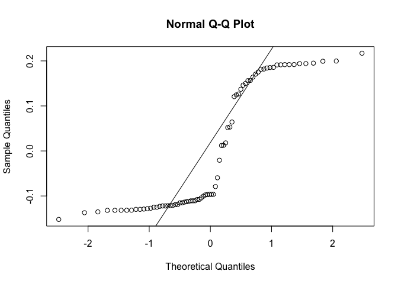

Sample Types
================
Tia Harrison
06/11/2020

# Set up

## Load the packages for analysis

``` r
# Analysis 
library(vegan)
library(ade4)
library(psy)
library(phyloseq)
library(biomformat)
library(data.table)
library(lsmeans)
library(car) 
library(lme4)
library(multcomp)
library(tidyverse)
library(MuMIn) 
require(ape)
require(cluster)
require(dplyr)
require(tibble)

# Plotting 
library(nationalparkcolors)
library(rnaturalearth)
library(rnaturalearthdata)
library(rgeos)
library(ggspatial)
library(ggthemes)
library(broom)
library(wesanderson)
library(ggpubr)
library(microbiome)
library(RColorBrewer)
```

# Metadata

Data on the population locations for all the plants sampled for nodules.

## Explore the data

``` r
# Load data for longitude and longitude data points 
map_data<-read_tsv("metadata_samples_update.tsv")

# How many populations? 
map_data %>%
  summarize(pop_n=n_distinct(population.id))
```

    ## # A tibble: 1 × 1
    ##   pop_n
    ##   <int>
    ## 1    33

``` r
 # Average nodule number 
nodule_data <- map_data %>% 
   filter(!is.na(nodule.no))
mean(nodule_data$nodule.no)
```

    ## [1] 7.560484

``` r
sd(nodule_data$nodule.no)
```

    ## [1] 3.99549

# Sequence data

Here is the ASV data associated with each plant. Nodules were pooled and
the culture samples were grown in the lab before sequencing. The field
samples did not have a growth phase in the lab and the community was
sequenced as is (lower concentration).

## Load the rarefied data

Data was rarefied in a previous R script “ASV_filtering_clean.Rmd”.

``` r
biom_rarefied<-read_rds("biom_rarefied_blast9080.rds")
biom_rarefied
```

    ## phyloseq-class experiment-level object
    ## otu_table()   OTU Table:         [ 2911 taxa and 249 samples ]
    ## sample_data() Sample Data:       [ 249 samples by 9 sample variables ]
    ## tax_table()   Taxonomy Table:    [ 2911 taxa by 7 taxonomic ranks ]
    ## phy_tree()    Phylogenetic Tree: [ 2911 tips and 2909 internal nodes ]

## Filter for matching field and culture samples

For field samples, DNA was extracted directly from crushed nodules. For
culture samples, the cells from the crushed nodules were grown up in
liquid culture. Some strains are slow growing and some are fast growing
so there is concern that the fast growing (non-rhizobia species) could
out compete the slow growing strains in the final sample.

``` r
# Filter so you only keep samples with both a culture and a field sample 
biom_pairs <- subset_samples(biom_rarefied, pair == "Yes")
```

## Population breakdown

``` r
# Get the data 
culture_pops<-data.frame(sample_data(biom_pairs))

# Get population breakdown 
culture_pops2<-culture_pops%>%
   mutate(region=case_when(latitude < 11 ~ "Tropical", 
                          latitude > 35 ~ "Temperate", 
                          latitude > 25 | latitude <33 ~ "Subtropical"))%>% 
  group_by(population.id, region, latitude)%>%
  tally()%>%
  arrange(desc(region))
culture_pops2
```

    ## # A tibble: 25 × 4
    ## # Groups:   population.id, region [25]
    ##    population.id region    latitude     n
    ##    <chr>         <chr>        <dbl> <int>
    ##  1 BG            Tropical     10.3     10
    ##  2 BI            Tropical     10.3      6
    ##  3 BJ            Tropical     10.3      2
    ##  4 BL            Tropical     10.4      8
    ##  5 BM            Tropical     10.4      4
    ##  6 BN            Tropical     10.4     10
    ##  7 BUS           Tropical      8.78     6
    ##  8 MIR           Tropical      8.68     6
    ##  9 STH           Tropical      9.48    12
    ## 10 S             Temperate    36.5      8
    ## # ℹ 15 more rows

``` r
# Correlation between latitude and sampling effort for plant number 
# Spearman compares rank of x and rank of y 
# Spearman makes no assumptions about the distribution of the values 
cor.test(culture_pops2$latitude, culture_pops2$n, method="spearman")
```

    ## 
    ##  Spearman's rank correlation rho
    ## 
    ## data:  culture_pops2$latitude and culture_pops2$n
    ## S = 3180.3, p-value = 0.2835
    ## alternative hypothesis: true rho is not equal to 0
    ## sample estimates:
    ##      rho 
    ## -0.22319

# Beta Diversity Analysis

Beta diversity measures whether the bacteria communities associated with
field and culture sample types are different. For some distance measures
may have to log the abundances in the feature table since there are a
lot of zeroes. For most cases, the logged values looked pretty much the
same as the raw values in the final PCoA plot.

## Account for abundance

Bray-Curtis takes into account abundance (counts of reads for each ASV).
Logged values look the same as the raw values so only showing the raw
value results.

``` r
# Set the colour scheme for sample type 
sampletypes2<-park_palette("RockyMountains")

# Brays-curtis distance raw values
bray_dist2 = phyloseq::distance(biom_pairs, method="bray")
bray_ordination2 = ordinate(biom_pairs, method="PCoA", distance=bray_dist2)
plot_scree(bray_ordination2) # Check how much variation is summarized on each axis 
```

<!-- -->

``` r
# Plot the PCoA 
bray_plot2<-plot_ordination(biom_pairs, bray_ordination2) + 
  theme(aspect.ratio=1) +
  geom_point(aes(fill=sample.type), size=2.2, shape=21) +
  scale_fill_manual(values=sampletypes2[c(1,3)])+
  theme_classic() +
  labs(color="Sample type") +
  theme(axis.title.x = element_text(size=18), axis.title.y = element_text(size=18), axis.text.y= element_text(size=14), axis.text.x= element_text(size=14), legend.title= element_text(size=14), legend.text=element_text(size=14))
bray_plot2
```

<!-- -->

## Presence and absence data

Using the same process as above, now calculating differences between
samples using a presence/absence dissimilarity metric rather than taking
abundance into consideration. Output looks very similar to the
Bray-Curtis output from above.

``` r
# Jaccard distance using raw values 
jaccard_dist2 = phyloseq::distance(biom_pairs, method="jaccard")
jaccard_ordination2 = ordinate(biom_pairs, method="PCoA", distance=jaccard_dist2)
plot_scree(jaccard_ordination2) # Check how much variation is summarized on each axis 
```

<!-- -->

``` r
# Plot the data 
jaccard_plot2<-plot_ordination(biom_pairs, jaccard_ordination2) + 
  theme(aspect.ratio=1) +
  geom_point(aes(fill=sample.type), size=2.2, shape=21) +
  scale_fill_manual(values=sampletypes2[c(1,3)])+
  theme_classic() +
  labs(color="Sample type") +
  theme(axis.title.x = element_text(size=12), axis.title.y = element_text(size=12), axis.text.y= element_text(size=12), axis.text.x= element_text(size=12), legend.title= element_text(size=12), legend.text=element_text(size=12))
jaccard_plot2
```

<!-- -->

## Account for phylogenetic similarity

Test out different distances between samples and put into the PCoA.
Unifrac distances take into account phylogenetic relatedness between
ASVs and might be better suited to raw data with lots of zeroes. In
these cases we will not log the abundances to get rid of the zeroes and
can keep them in instead. Unweighted unifrac distance deals with
presence/absence data and it can tell you about differences among unique
variants. Weighted unifrac distance takes into account abundance and so
is looking for differences among common variants in the sample.

``` r
# Calculate unifrac distance between samples and the PCoA 
unifrac_dist = phyloseq::distance(biom_pairs, method="unifrac")
unifrac_ordination = ordinate(biom_pairs, method="PCoA", distance=unifrac_dist)
plot_scree(unifrac_ordination) # Check how much variation is summarized on each axis 
```

<!-- -->

``` r
# Plot the PCoA 
unifrac_plot<-plot_ordination(biom_pairs, unifrac_ordination) + 
  theme(aspect.ratio=1) +
  geom_point(aes(fill=sample.type), size=2.2, shape=21) +
  scale_fill_manual(values=sampletypes2[c(1,3)])+
  theme_classic() +
  labs(color="Sample type") +
  theme(axis.title.x = element_text(size=12), axis.title.y = element_text(size=12), axis.text.y= element_text(size=12), axis.text.x= element_text(size=12), legend.title= element_text(size=12), legend.text=element_text(size=12))
unifrac_plot
```

<!-- -->

``` r
# Calculate weighted unifrac distance 
wunifrac_dist = phyloseq::distance(biom_pairs, method="wunifrac")
wunifrac_ordination = ordinate(biom_pairs, method="PCoA", distance=wunifrac_dist)
plot_scree(wunifrac_ordination) # Check how much variation is summarized on each axis 
```

<!-- -->

``` r
# Plot the PCoA 
wunifrac_plot<-plot_ordination(biom_pairs, wunifrac_ordination) + 
  theme(aspect.ratio=1) +
  geom_point(aes(fill=sample.type), size=2.2, shape=21) +
  scale_fill_manual(values=sampletypes2[c(1,3)])+
  theme_classic() +
  labs(color="Sample type") +
  theme(axis.title.x = element_text(size=12), axis.title.y = element_text(size=12), axis.text.y= element_text(size=12), axis.text.x= element_text(size=12), legend.title= element_text(size=12), legend.text=element_text(size=12))
wunifrac_plot
```

<!-- -->

# Models for differences between sample types

Take the axis that summarizes the most variation from the PCoA analysis
(axis 1) and look at the differences between the two sample types.

## Unweighted unifrac

When using the unweighted unifrac distance values this will look for
presence and absences of ASVs rather than abundances. Therefore this
distance will take into consideration the rare ASVs. Counts the fraction
of branch lengths unique to either community.

``` r
# Get the data from the ordination for unifrac dissimilarity 
unifrac_data_unweight=data.table(unifrac_plot$data)

# Prep the data 
unifrac_data_unweight <- unifrac_data_unweight %>% 
  mutate(sample.id.clean= gsub("_super", "", sample.id.clean))%>% 
  mutate(sample.id.clean= gsub("_culture", "", sample.id.clean))

# Run the model 
mod_unifrac_unweight=lmer(log10(Axis.1+5) ~ sample.type + (1|population.id) +(1|sample.id.clean), data=unifrac_data_unweight)

# Test significance
Anova(mod_unifrac_unweight, type=2) 
```

    ## Analysis of Deviance Table (Type II Wald chisquare tests)
    ## 
    ## Response: log10(Axis.1 + 5)
    ##              Chisq Df Pr(>Chisq)
    ## sample.type 0.3165  1     0.5737

``` r
summary(mod_unifrac_unweight)
```

    ## Linear mixed model fit by REML ['lmerMod']
    ## Formula: log10(Axis.1 + 5) ~ sample.type + (1 | population.id) + (1 |  
    ##     sample.id.clean)
    ##    Data: unifrac_data_unweight
    ## 
    ## REML criterion at convergence: -738.5
    ## 
    ## Scaled residuals: 
    ##     Min      1Q  Median      3Q     Max 
    ## -0.9414 -0.7394 -0.5009  0.5054  2.4259 
    ## 
    ## Random effects:
    ##  Groups          Name        Variance  Std.Dev.
    ##  sample.id.clean (Intercept) 2.174e-05 0.004663
    ##  population.id   (Intercept) 0.000e+00 0.000000
    ##  Residual                    4.081e-04 0.020202
    ## Number of obs: 154, groups:  sample.id.clean, 77; population.id, 25
    ## 
    ## Fixed effects:
    ##                   Estimate Std. Error t value
    ## (Intercept)       0.699388   0.002363 296.002
    ## sample.typefield -0.001832   0.003256  -0.563
    ## 
    ## Correlation of Fixed Effects:
    ##             (Intr)
    ## smpl.typfld -0.689
    ## optimizer (nloptwrap) convergence code: 0 (OK)
    ## boundary (singular) fit: see help('isSingular')

``` r
r.squaredGLMM(mod_unifrac_unweight)
```

    ##              R2m        R2c
    ## [1,] 0.001960005 0.05243499

``` r
# Check model assumptions 
plot(mod_unifrac_unweight)
```

<!-- -->

``` r
qqnorm(resid(mod_unifrac_unweight))
qqline(resid(mod_unifrac_unweight))
```

<!-- -->

``` r
plot(fitted(mod_unifrac_unweight), sqrt(abs(resid(mod_unifrac_unweight))), main="Scale-location")
```

<!-- -->

``` r
# Not the best fit 

# Try axis 2 since it also had a lot variation summarized 
mod_unifrac_unweight2=lmer(log10(Axis.2+5) ~ sample.type + (1|population.id) +(1|sample.id.clean), data=unifrac_data_unweight)

# Test significance
Anova(mod_unifrac_unweight2, type=2) 
```

    ## Analysis of Deviance Table (Type II Wald chisquare tests)
    ## 
    ## Response: log10(Axis.2 + 5)
    ##              Chisq Df Pr(>Chisq)    
    ## sample.type 119.94  1  < 2.2e-16 ***
    ## ---
    ## Signif. codes:  0 '***' 0.001 '**' 0.01 '*' 0.05 '.' 0.1 ' ' 1

``` r
summary(mod_unifrac_unweight2)
```

    ## Linear mixed model fit by REML ['lmerMod']
    ## Formula: log10(Axis.2 + 5) ~ sample.type + (1 | population.id) + (1 |  
    ##     sample.id.clean)
    ##    Data: unifrac_data_unweight
    ## 
    ## REML criterion at convergence: -985.4
    ## 
    ## Scaled residuals: 
    ##      Min       1Q   Median       3Q      Max 
    ## -2.02132 -0.62519 -0.02846  0.66272  2.69338 
    ## 
    ## Random effects:
    ##  Groups          Name        Variance  Std.Dev.
    ##  sample.id.clean (Intercept) 2.895e-06 0.001701
    ##  population.id   (Intercept) 1.904e-05 0.004363
    ##  Residual                    7.095e-05 0.008423
    ## Number of obs: 154, groups:  sample.id.clean, 77; population.id, 25
    ## 
    ## Fixed effects:
    ##                   Estimate Std. Error t value
    ## (Intercept)       0.705930   0.001354  521.22
    ## sample.typefield -0.014868   0.001358  -10.95
    ## 
    ## Correlation of Fixed Effects:
    ##             (Intr)
    ## smpl.typfld -0.501

``` r
r.squaredGLMM(mod_unifrac_unweight2)
```

    ##            R2m       R2c
    ## [1,] 0.3745291 0.5222283

``` r
# Check model assumptions 
plot(mod_unifrac_unweight2)
```

<!-- -->

``` r
qqnorm(resid(mod_unifrac_unweight2))
qqline(resid(mod_unifrac_unweight2))
```

<!-- -->

``` r
plot(fitted(mod_unifrac_unweight2), sqrt(abs(resid(mod_unifrac_unweight2))), main="Scale-location")
```

<!-- -->

``` r
# Fit looks great 
```

## Jaccards distance

Testing the first PCoA axes on the distance metrics without phylogenetic
relatedeness.

``` r
# Get the data from the ordination for jaccard dissimilarity 
jac_data=data.table(jaccard_plot2$data)

# Prep the data 
jac_data <- jac_data %>% 
  mutate(sample.id.clean= gsub("_super", "", sample.id.clean))%>% 
  mutate(sample.id.clean= gsub("_culture", "", sample.id.clean))

# Run the model 
mod_jac=lmer(log10(Axis.1+5) ~ sample.type + (1|population.id) +(1|sample.id.clean), data=jac_data)

# Test significance
Anova(mod_jac, type=2) 
```

    ## Analysis of Deviance Table (Type II Wald chisquare tests)
    ## 
    ## Response: log10(Axis.1 + 5)
    ##              Chisq Df Pr(>Chisq)    
    ## sample.type 138.62  1  < 2.2e-16 ***
    ## ---
    ## Signif. codes:  0 '***' 0.001 '**' 0.01 '*' 0.05 '.' 0.1 ' ' 1

``` r
summary(mod_jac)
```

    ## Linear mixed model fit by REML ['lmerMod']
    ## Formula: log10(Axis.1 + 5) ~ sample.type + (1 | population.id) + (1 |  
    ##     sample.id.clean)
    ##    Data: jac_data
    ## 
    ## REML criterion at convergence: -797.6
    ## 
    ## Scaled residuals: 
    ##      Min       1Q   Median       3Q      Max 
    ## -1.77135 -0.94233 -0.00516  0.42328  2.04666 
    ## 
    ## Random effects:
    ##  Groups          Name        Variance  Std.Dev.
    ##  sample.id.clean (Intercept) 0.000e+00 0.000000
    ##  population.id   (Intercept) 1.431e-05 0.003783
    ##  Residual                    2.791e-04 0.016708
    ## Number of obs: 154, groups:  sample.id.clean, 77; population.id, 25
    ## 
    ## Fixed effects:
    ##                   Estimate Std. Error t value
    ## (Intercept)       0.714240   0.002083  342.87
    ## sample.typefield -0.031703   0.002693  -11.77
    ## 
    ## Correlation of Fixed Effects:
    ##             (Intr)
    ## smpl.typfld -0.646
    ## optimizer (nloptwrap) convergence code: 0 (OK)
    ## boundary (singular) fit: see help('isSingular')

``` r
r.squaredGLMM(mod_jac)
```

    ##            R2m       R2c
    ## [1,] 0.4629003 0.4890871

``` r
# Check model assumptions 
plot(mod_jac)
```

<!-- -->

``` r
qqnorm(resid(mod_jac))
qqline(resid(mod_jac))
```

<!-- -->

``` r
plot(fitted(mod_jac), sqrt(abs(resid(mod_jac))), main="Scale-location")
```

<!-- -->

## Bray-Curtis

Take into account abundances (no accounting for phylogenetic distances).

``` r
# Get the data from the ordination for bray cutris dissimilarity 
bray_data=data.table(bray_plot2$data)

# Prep the data 
bray_data <- jac_data %>% 
  mutate(sample.id.clean= gsub("_super", "", sample.id.clean))%>% 
  mutate(sample.id.clean= gsub("_culture", "", sample.id.clean))

# Run the model 
mod_bray=lmer(log10(Axis.1+5) ~ sample.type + (1|population.id) +(1|sample.id.clean), data=bray_data)

# Test significance
Anova(mod_bray, type=2) 
```

    ## Analysis of Deviance Table (Type II Wald chisquare tests)
    ## 
    ## Response: log10(Axis.1 + 5)
    ##              Chisq Df Pr(>Chisq)    
    ## sample.type 138.62  1  < 2.2e-16 ***
    ## ---
    ## Signif. codes:  0 '***' 0.001 '**' 0.01 '*' 0.05 '.' 0.1 ' ' 1

``` r
summary(mod_bray)
```

    ## Linear mixed model fit by REML ['lmerMod']
    ## Formula: log10(Axis.1 + 5) ~ sample.type + (1 | population.id) + (1 |  
    ##     sample.id.clean)
    ##    Data: bray_data
    ## 
    ## REML criterion at convergence: -797.6
    ## 
    ## Scaled residuals: 
    ##      Min       1Q   Median       3Q      Max 
    ## -1.77135 -0.94233 -0.00516  0.42328  2.04666 
    ## 
    ## Random effects:
    ##  Groups          Name        Variance  Std.Dev.
    ##  sample.id.clean (Intercept) 0.000e+00 0.000000
    ##  population.id   (Intercept) 1.431e-05 0.003783
    ##  Residual                    2.791e-04 0.016708
    ## Number of obs: 154, groups:  sample.id.clean, 77; population.id, 25
    ## 
    ## Fixed effects:
    ##                   Estimate Std. Error t value
    ## (Intercept)       0.714240   0.002083  342.87
    ## sample.typefield -0.031703   0.002693  -11.77
    ## 
    ## Correlation of Fixed Effects:
    ##             (Intr)
    ## smpl.typfld -0.646
    ## optimizer (nloptwrap) convergence code: 0 (OK)
    ## boundary (singular) fit: see help('isSingular')

``` r
r.squaredGLMM(mod_bray)
```

    ##            R2m       R2c
    ## [1,] 0.4629003 0.4890871

``` r
# Check model assumptions 
plot(mod_bray)
```

<!-- -->

``` r
qqnorm(resid(mod_bray))
qqline(resid(mod_bray))
```

<!-- -->

``` r
plot(fitted(mod_bray), sqrt(abs(resid(mod_bray))), main="Scale-location")
```

<!-- -->

## Weighted unifrac

Weighted unifrac values takes into account species abundances and is
good for looking for changes in the most abundant ASVs. Weighted unifrac
uses absolute abundance differences.

``` r
# Get the data from the ordination for unifrac dissimilarity 
unifrac_data=data.table(wunifrac_plot$data)

# Need to clean up the sample id to include plant as a random effect
# Also include population.id as a random effect 
unifrac_data <- unifrac_data %>% 
  mutate(sample.id.clean= gsub("_super", "", sample.id.clean))%>% 
  mutate(sample.id.clean= gsub("_culture", "", sample.id.clean))
unifrac_data
```

    ##          Axis.1       Axis.2        sample.id sample.id.clean nodule.no
    ##   1: -0.2079760 -0.024321762    098.BI9_super             BI9        13
    ##   2: -0.2149582 -0.023262355    099.BN8_super             BN8         6
    ##   3: -0.2150083 -0.022669086     100.E5_super              E5         8
    ##   4: -0.1727541  0.035872525 101.MIR123_super          MIR123        11
    ##   5: -0.2136617 -0.020643465     102.P2_super              P2         5
    ##  ---                                                                   
    ## 150:  0.2863888 -0.009581702   356.Y4_culture              Y4        13
    ## 151:  0.2771971 -0.008406410 361.STH8_culture            STH8         7
    ## 152:  0.2861804 -0.010273031  362.U18_culture             U18         9
    ## 153:  0.2866936 -0.011675033   364.Y5_culture              Y5        10
    ## 154:  0.2902941 -0.013007636   380.Y8_culture              Y8        11
    ##      population.id  latitude longitude sample.type pair sample.id.pair
    ##   1:            BI 10.341746 -85.36498       field  Yes            BI9
    ##   2:            BN 10.444444 -84.00583       field  Yes            BN8
    ##   3:             E 28.558320 -81.63975       field  Yes             E5
    ##   4:           MIR  8.680278 -82.93639       field  Yes         MIR123
    ##   5:             P 31.463660 -81.36494       field  Yes             P2
    ##  ---                                                                  
    ## 150:             Y 38.269308 -77.20650     culture  Yes             Y4
    ## 151:           STH  9.483609 -84.14139     culture  Yes           STH8
    ## 152:             U 35.901342 -78.94629     culture  Yes            U18
    ## 153:             Y 38.269308 -77.20650     culture  Yes             Y5
    ## 154:             Y 38.269308 -77.20650     culture  Yes             Y8

``` r
# Run the model 
mod_unifrac=lmer(log10(Axis.1+5) ~ sample.type + (1|population.id) +(1|sample.id.clean), data=unifrac_data)

# Test significance
Anova(mod_unifrac, type=2) 
```

    ## Analysis of Deviance Table (Type II Wald chisquare tests)
    ## 
    ## Response: log10(Axis.1 + 5)
    ##              Chisq Df Pr(>Chisq)    
    ## sample.type 235.33  1  < 2.2e-16 ***
    ## ---
    ## Signif. codes:  0 '***' 0.001 '**' 0.01 '*' 0.05 '.' 0.1 ' ' 1

``` r
summary(mod_unifrac)
```

    ## Linear mixed model fit by REML ['lmerMod']
    ## Formula: log10(Axis.1 + 5) ~ sample.type + (1 | population.id) + (1 |  
    ##     sample.id.clean)
    ##    Data: unifrac_data
    ## 
    ## REML criterion at convergence: -896.4
    ## 
    ## Scaled residuals: 
    ##      Min       1Q   Median       3Q      Max 
    ## -2.56263 -0.38783  0.09428  0.63972  2.64657 
    ## 
    ## Random effects:
    ##  Groups          Name        Variance  Std.Dev. 
    ##  sample.id.clean (Intercept) 6.217e-07 0.0007885
    ##  population.id   (Intercept) 2.252e-05 0.0047450
    ##  Residual                    1.364e-04 0.0116785
    ## Number of obs: 154, groups:  sample.id.clean, 77; population.id, 25
    ## 
    ## Fixed effects:
    ##                   Estimate Std. Error t value
    ## (Intercept)       0.713567   0.001685  423.36
    ## sample.typefield -0.028873   0.001882  -15.34
    ## 
    ## Correlation of Fixed Effects:
    ##             (Intr)
    ## smpl.typfld -0.558

``` r
r.squaredGLMM(mod_unifrac)
```

    ##            R2m      R2c
    ## [1,] 0.5680341 0.630685

``` r
# Check model assumptions 
plot(mod_unifrac)
```

<!-- -->

``` r
qqnorm(resid(mod_unifrac))
qqline(resid(mod_unifrac))
```

<!-- -->

``` r
plot(fitted(mod_unifrac), sqrt(abs(resid(mod_unifrac))), main="Scale-location")
```

<!-- -->

# Correlation analysis

Look at the correlation between sample types for PCoA axis 1.

## Unifrac distance

Take the PCoA axis for both field and culture and look for correlation
between the two. If there is a significant correlation then that means
that both ways of sampling give you similar results. Need to reformat
the dataframe to do the new plot and analysis.

``` r
# Change the data into the proper format 
unifrac2<- unifrac_data %>%
  dplyr::select(Axis.1, sample.id.pair, sample.type, nodule.no, latitude) %>% # Select just the columns of data that I will need for the correlation 
  pivot_wider(names_from = sample.type, values_from=Axis.1)

# Plot 
pcoa1_cor<-ggplot(unifrac2, aes(x=field, y=culture)) + 
  stat_cor(method="pearson") + # prints the R2 and p value 
  geom_smooth(method="lm", colour="black") +
  geom_point(shape=16, cex=2.5, colour="black", alpha=0.6)+
  (ylab("PCoA axis 1 (culture)"))+
  (xlab("PCoA axis 1 (field)"))+
  theme_classic() +
  theme(legend.position = "none")
pcoa1_cor
```

<!-- -->

``` r
# Perform a correlation test on the data
# Spearman compares rank of x and rank of y 
# Spearman makes no assumptions about the distribution of the values 
cor.test(unifrac2$field, unifrac2$culture, method="spearman")
```

    ## 
    ##  Spearman's rank correlation rho
    ## 
    ## data:  unifrac2$field and unifrac2$culture
    ## S = 53380, p-value = 0.01848
    ## alternative hypothesis: true rho is not equal to 0
    ## sample estimates:
    ##       rho 
    ## 0.2702666

## Calculate correlation values for all distance metrics

Calculating the correlation between PCoA Axis 1 for field and culture
for all distance metrics. Plot the jaccard’s distance correlation.

``` r
# Look at the data in it's current format 
uni=data.table(unifrac_plot$data)
jac=data.table(jaccard_plot2$data)
bry=data.table(bray_plot2$data)

# Change the data into the proper format 
uni2<- uni %>%
  dplyr::select(Axis.1, sample.id.clean, sample.type) %>% 
  pivot_wider(names_from = sample.type, values_from=Axis.1)

jac2<- jac %>%
  dplyr::select(Axis.1, sample.id.clean, sample.type) %>% 
  pivot_wider(names_from = sample.type, values_from=Axis.1)

bry2<- bry %>%
  dplyr::select(Axis.1, sample.id.clean, sample.type) %>% 
  pivot_wider(names_from = sample.type, values_from=Axis.1)

# Clean up sample names and then combine samples 
uni3<- uni2 %>%
  mutate(sample.id.clean= gsub('single_', '', sample.id.clean)) %>% 
  mutate(sample.id.clean= gsub('_.*', '', sample.id.clean)) %>% 
  mutate(field= replace_na(field, 0), culture = replace_na(culture, 0)) %>% 
  group_by(sample.id.clean) %>% 
  summarise(field = sum(field), culture=sum(culture))

jac3<- jac2 %>%
  mutate(sample.id.clean= gsub('single_', '', sample.id.clean)) %>% 
  mutate(sample.id.clean= gsub('_.*', '', sample.id.clean)) %>% 
  mutate(field= replace_na(field, 0), culture = replace_na(culture, 0)) %>% 
  group_by(sample.id.clean) %>% 
  summarise(field = sum(field), culture=sum(culture))

bry3<- bry2 %>%
  mutate(sample.id.clean= gsub('single_', '', sample.id.clean)) %>% 
  mutate(sample.id.clean= gsub('_.*', '', sample.id.clean)) %>% 
  mutate(field= replace_na(field, 0), culture = replace_na(culture, 0)) %>% 
  group_by(sample.id.clean) %>% 
  summarise(field = sum(field), culture=sum(culture))

# Correlation test 
cor.test(uni3$field, uni3$culture, method="spearman")
```

    ## 
    ##  Spearman's rank correlation rho
    ## 
    ## data:  uni3$field and uni3$culture
    ## S = 54730, p-value = 0.02847
    ## alternative hypothesis: true rho is not equal to 0
    ## sample estimates:
    ##       rho 
    ## 0.2518113

``` r
cor.test(jac3$field, jac3$culture, method="spearman")
```

    ## 
    ##  Spearman's rank correlation rho
    ## 
    ## data:  jac3$field and jac3$culture
    ## S = 65665, p-value = 0.3791
    ## alternative hypothesis: true rho is not equal to 0
    ## sample estimates:
    ##       rho 
    ## 0.1023247

``` r
cor.test(bry3$field, bry3$culture, method="spearman")
```

    ## 
    ##  Spearman's rank correlation rho
    ## 
    ## data:  bry3$field and bry3$culture
    ## S = 73455, p-value = 0.9715
    ## alternative hypothesis: true rho is not equal to 0
    ## sample estimates:
    ##          rho 
    ## -0.004169543

``` r
# Colour palette 
rocky<-park_palette("RockyMountains")
rocky2<-rocky[c(5)]

# Plot the correlation for Jaccards distance 
pcoa1_cor_bray<-ggplot(jac3, aes(x=field, y=culture)) + 
  stat_cor(method="spearman") + # This prints the R and p value 
  geom_point(shape=16, cex=2.5, colour=rocky2, alpha=0.6)+
  (ylab("PCoA axis 1 (culture)"))+
  (xlab("PCoA axis 1 (field)"))+
  theme_classic() +
  theme(legend.position = "none")
pcoa1_cor_bray
```

<!-- -->

# Regression analyses

Instead of correlation, try linear regression on the data. Should put
the field on the x axis since the culture is thought to be a subset of
the whole nodule community. But this might not be completely true but
still the best case scenario to do.

What are the other factors that could influence the similarity? Iinclude
nodule number and latitude just in case to see if does have an effect or
not.

## Convert the files

``` r
# Convert the dataset 
# Unifrac
uni_pair<- uni %>%
  dplyr::select(Axis.1, sample.id.pair, sample.type, nodule.no, latitude, population.id) %>% 
  mutate(population.id=as.factor(population.id)) %>%
  pivot_wider(names_from = sample.type, values_from=Axis.1)

# weighted distance? 
wunifrac2<- unifrac_data %>%
  dplyr::select(Axis.1, sample.id.pair, sample.type, nodule.no, latitude, population.id) %>% # Select just the columns of data that I will need for the correlation 
  mutate(population.id=as.factor(population.id)) %>%
  pivot_wider(names_from = sample.type, values_from=Axis.1)

# Jaccards 
jac_pair<- jac %>%
  dplyr::select(Axis.1, sample.id.pair, sample.type, nodule.no, latitude, population.id) %>% 
  mutate(population.id=as.factor(population.id)) %>%
  pivot_wider(names_from = sample.type, values_from=Axis.1)

# Bray curtis 
bry_pair<- bry %>%
  dplyr::select(Axis.1, sample.id.pair, sample.type, nodule.no, latitude, population.id) %>% 
  mutate(population.id=as.factor(population.id)) %>%
  pivot_wider(names_from = sample.type, values_from=Axis.1)
```

## Run the models

Now run all the models for the different distances.

``` r
# Run the models 
pair_uni_mod<-lmer((1/culture)~field + (1|population.id), data= uni_pair)
plot(pair_uni_mod)
```

<!-- -->

``` r
qqnorm(resid(pair_uni_mod))
qqline(resid(pair_uni_mod))
```

<!-- -->

``` r
plot(fitted(pair_uni_mod), sqrt(abs(resid(pair_uni_mod))), main="Scale-location")
```

<!-- -->

``` r
summary(pair_uni_mod)
```

    ## Linear mixed model fit by REML ['lmerMod']
    ## Formula: (1/culture) ~ field + (1 | population.id)
    ##    Data: uni_pair
    ## 
    ## REML criterion at convergence: 715.7
    ## 
    ## Scaled residuals: 
    ##     Min      1Q  Median      3Q     Max 
    ## -8.0851 -0.0546  0.0705  0.2521  0.8317 
    ## 
    ## Random effects:
    ##  Groups        Name        Variance Std.Dev.
    ##  population.id (Intercept)  17.7     4.208  
    ##  Residual                  846.1    29.087  
    ## Number of obs: 76, groups:  population.id, 25
    ## 
    ## Fixed effects:
    ##             Estimate Std. Error t value
    ## (Intercept)   -8.663      3.476  -2.492
    ## field        -20.635     16.316  -1.265
    ## 
    ## Correlation of Fixed Effects:
    ##       (Intr)
    ## field 0.041

``` r
Anova(pair_uni_mod, type=3)
```

    ## Analysis of Deviance Table (Type III Wald chisquare tests)
    ## 
    ## Response: (1/culture)
    ##              Chisq Df Pr(>Chisq)  
    ## (Intercept) 6.2107  1     0.0127 *
    ## field       1.5996  1     0.2060  
    ## ---
    ## Signif. codes:  0 '***' 0.001 '**' 0.01 '*' 0.05 '.' 0.1 ' ' 1

``` r
# Non-significant any way you transform it and whether or not nodule or latitude is included 

# weighted 
pair_weight_mod<-lmer((culture^2)~field + (1|population.id), data= wunifrac2)
plot(pair_weight_mod)
```

<!-- -->

``` r
qqnorm(resid(pair_weight_mod))
qqline(resid(pair_weight_mod))
```

<!-- -->

``` r
plot(fitted(pair_weight_mod), sqrt(abs(resid(pair_weight_mod))), main="Scale-location")
```

<!-- -->

``` r
summary(pair_weight_mod)
```

    ## Linear mixed model fit by REML ['lmerMod']
    ## Formula: (culture^2) ~ field + (1 | population.id)
    ##    Data: wunifrac2
    ## 
    ## REML criterion at convergence: -321.7
    ## 
    ## Scaled residuals: 
    ##     Min      1Q  Median      3Q     Max 
    ## -2.3098 -0.7620  0.4465  0.6608  1.5954 
    ## 
    ## Random effects:
    ##  Groups        Name        Variance  Std.Dev.
    ##  population.id (Intercept) 7.164e-05 0.008464
    ##  Residual                  6.594e-04 0.025679
    ## Number of obs: 76, groups:  population.id, 25
    ## 
    ## Fixed effects:
    ##             Estimate Std. Error t value
    ## (Intercept) 0.064224   0.006717   9.561
    ## field       0.011986   0.035068   0.342
    ## 
    ## Correlation of Fixed Effects:
    ##       (Intr)
    ## field 0.853

``` r
Anova(pair_weight_mod, type=3)
```

    ## Analysis of Deviance Table (Type III Wald chisquare tests)
    ## 
    ## Response: (culture^2)
    ##               Chisq Df Pr(>Chisq)    
    ## (Intercept) 91.4130  1     <2e-16 ***
    ## field        0.1168  1     0.7325    
    ## ---
    ## Signif. codes:  0 '***' 0.001 '**' 0.01 '*' 0.05 '.' 0.1 ' ' 1

``` r
# jaccard
pair_jac_mod<-lmer((culture^2)~field + (1|population.id), data= jac_pair)
plot(pair_jac_mod)
```

<!-- -->

``` r
qqnorm(resid(pair_jac_mod))
qqline(resid(pair_jac_mod))
```

<!-- -->

``` r
plot(fitted(pair_jac_mod), sqrt(abs(resid(pair_jac_mod))), main="Scale-location")
```

<!-- -->

``` r
summary(pair_jac_mod)
```

    ## Linear mixed model fit by REML ['lmerMod']
    ## Formula: (culture^2) ~ field + (1 | population.id)
    ##    Data: jac_pair
    ## 
    ## REML criterion at convergence: -82.3
    ## 
    ## Scaled residuals: 
    ##     Min      1Q  Median      3Q     Max 
    ## -0.8986 -0.8020 -0.7061  1.0920  1.6273 
    ## 
    ## Random effects:
    ##  Groups        Name        Variance  Std.Dev.
    ##  population.id (Intercept) 0.0003797 0.01949 
    ##  Residual                  0.0181114 0.13458 
    ## Number of obs: 76, groups:  population.id, 25
    ## 
    ## Fixed effects:
    ##             Estimate Std. Error t value
    ## (Intercept)  0.11772    0.04908   2.398
    ## field        0.02583    0.24942   0.104
    ## 
    ## Correlation of Fixed Effects:
    ##       (Intr)
    ## field 0.945

``` r
Anova(pair_jac_mod, type=3)
```

    ## Analysis of Deviance Table (Type III Wald chisquare tests)
    ## 
    ## Response: (culture^2)
    ##              Chisq Df Pr(>Chisq)  
    ## (Intercept) 5.7519  1    0.01647 *
    ## field       0.0107  1    0.91752  
    ## ---
    ## Signif. codes:  0 '***' 0.001 '**' 0.01 '*' 0.05 '.' 0.1 ' ' 1

``` r
# bry
pair_bry_mod<-lmer((culture^2)~field + (1|population.id), data= bry_pair)
plot(pair_bry_mod)
```

<!-- -->

``` r
qqnorm(resid(pair_bry_mod))
qqline(resid(pair_bry_mod))
```

<!-- -->

``` r
plot(fitted(pair_bry_mod), sqrt(abs(resid(pair_bry_mod))), main="Scale-location")
```

<!-- -->

``` r
summary(pair_bry_mod)
```

    ## Linear mixed model fit by REML ['lmerMod']
    ## Formula: (culture^2) ~ field + (1 | population.id)
    ##    Data: bry_pair
    ## 
    ## REML criterion at convergence: -72.7
    ## 
    ## Scaled residuals: 
    ##     Min      1Q  Median      3Q     Max 
    ## -1.0742 -0.8573 -0.6821  1.1192  1.5328 
    ## 
    ## Random effects:
    ##  Groups        Name        Variance  Std.Dev.
    ##  population.id (Intercept) 0.0009443 0.03073 
    ##  Residual                  0.0200514 0.14160 
    ## Number of obs: 76, groups:  population.id, 25
    ## 
    ## Fixed effects:
    ##             Estimate Std. Error t value
    ## (Intercept)  0.13866    0.04999   2.774
    ## field        0.05180    0.22029   0.235
    ## 
    ## Correlation of Fixed Effects:
    ##       (Intr)
    ## field 0.935

``` r
Anova(pair_bry_mod, type=3)
```

    ## Analysis of Deviance Table (Type III Wald chisquare tests)
    ## 
    ## Response: (culture^2)
    ##              Chisq Df Pr(>Chisq)   
    ## (Intercept) 7.6942  1    0.00554 **
    ## field       0.0553  1    0.81411   
    ## ---
    ## Signif. codes:  0 '***' 0.001 '**' 0.01 '*' 0.05 '.' 0.1 ' ' 1

# Core microbiome analysis

Looking for the most common ASVs in the culture versus field samples and
whether they are different. How often do the most common field ASVs
occur in the culture samples?

## Relative abundance of ASV families in both sample types

Plot the abundance of different familes to show the differences in field
and culture samples.

``` r
# Plot the most abundant Family level ASVs 
family_test<-merge_samples(biom_pairs, "sample.type")

# Prepare for the bar plot 
# Clean up the taxonomy table for the family names only 
tax_table(family_test)[, colnames(tax_table(family_test))] <- gsub(tax_table(family_test)[, colnames(tax_table(family_test))],     pattern = "f__", replacement = "")

tax_table(family_test)[tax_table(family_test) [, "Family"] == "", "Family"] <- "Unclassified genus" # Edit unclassified data 
test_fam <- microbiome::aggregate_rare(family_test, "Family", detection = 50/100, prevalence=70/100, include.lowest=FALSE) # Merge at family level and merge rare families
fam_abund <- microbiome::transform(test_fam, "compositional") # Make relative abundance 

# Set the palette 
taxic_fam <- as.data.frame(fam_abund@tax_table) # help set the palette 
palette_fam <- colorRampPalette(brewer.pal(33, "Paired")) # specify the palette 
my_fam <- palette_fam(length(unique(taxic_fam$Family))) # expand the palette based on the number of genera you want to plot  


# Plot the result for the paper and powerpoint 
plot_fam <- plot_composition(fam_abund) +
  scale_fill_manual(values = my_fam) +
  theme_classic() +
  xlab("")+
  labs(fill="Taxa")+
  labs(tag = "(a)") +
 # guides(shape = guide_legend(override.aes = list(size = 0.5)))+
  theme(axis.text.y = element_text(size=10), 
        axis.text.x= element_text(size=10), 
        axis.title.y=element_text(size=10), 
        axis.title.x=element_text(size=10), 
        legend.title=element_text(size=10),
        legend.text=element_text(size=7), 
        legend.key.size = unit(0.5, 'cm'), 
        aspect.ratio = 2.5)
plot_fam
```

<!-- -->

## Finding common variants in both sample types

How often is the most common variant in the culture samples found in the
field samples? How often is the most common variant in the field samples
found in the culture samples?

These numbers for the field samples don’t quite match up to the field
samples in the latitudinal analysis because these field samples are ones
that have a matching culture sample. In the field only analysis there
are more total samples (including ones that didn’t have a cultured pair
sample).

``` r
# Prevalence table on full datasets 
# Number of samples each taxa occurs in 
prev_table <- apply(X = otu_table(biom_pairs),
                 MARGIN = 1,
                 FUN = function(x){sum(x > 0)})

prev_table <- data.frame(Prevalence = prev_table,
                      TotalAbundance = taxa_sums(biom_pairs),
                      tax_table(biom_pairs))

# Split the dataset and look for most prevalent asv in each sample type 
# Sub-sample the data to just supernatant samples "field"
field <- subset_samples(biom_pairs, sample.type == "field")

# Make the new prevalence table for field 
prev_field <- apply(X = otu_table(field),
                 MARGIN = 1,
                 FUN = function(x){sum(x > 0)})
prev_field <- data.frame(Prevalence = prev_field,
                      TotalAbundance = taxa_sums(field),
                      tax_table(field))

# Sub-sample the data for culture samples 
culture <- subset_samples(biom_pairs, sample.type == "culture")

# Prevalence table for culture samples 
prev_culture <- apply(X = otu_table(culture),
                 MARGIN = 1,
                 FUN = function(x){sum(x > 0)})
prev_culture <- data.frame(Prevalence = prev_culture,
                      TotalAbundance = taxa_sums(culture),
                      tax_table(culture))

# Rename the prevalence and abundance columns 
prev_culture2 <- prev_culture %>%
  rename(Prevalence_culture = Prevalence)%>%
  rename(TotalAbundance_culture = TotalAbundance)

prev_field2 <- prev_field %>%
  rename(Prevalence_field = Prevalence) %>%
  rename(TotalAbundance_field = TotalAbundance)

# Merge the datasets into one 
combined<- merge(prev_field2, prev_culture2, by=c("row.names", "Kingdom", "Order", "Phylum", "Class", "Genus", "Species", "Family"))

# Take a look at common ASVs in both sample types 
order <- combined %>%
  mutate(Prevalence_culture=Prevalence_culture/77) %>%  # divide by 77 to get the proportion 
  mutate(Prevalence_field=Prevalence_field/77)%>% 
  arrange(desc(Prevalence_field))

# Merge based on genus and species 
# Sort in order of culture 
order_culture <- combined %>%
  group_by(Genus, Species)%>%
  summarize(culture_sum=(sum(TotalAbundance_culture)), field_sum=sum(TotalAbundance_field))%>%
  arrange(desc(culture_sum))

# Sort in order of field 
order_field <- combined %>%
  group_by(Genus, Species)%>%
  summarize(culture_sum=(sum(TotalAbundance_culture)), field_sum=sum(TotalAbundance_field))%>%
  arrange(desc(field_sum))
```

# Figures for publication

Figures for main text of the publication Figure showing the
culture/field break down of abundances and corresponding box plot.

``` r
# Plot the result for the paper and powerpoint 
plot_fam <- plot_composition(fam_abund) +
  scale_fill_manual(values = my_fam) +
  theme_classic() +
  xlab("")+
  labs(fill="Taxa")+
  labs(tag = "(a)") +
 # guides(shape = guide_legend(override.aes = list(size = 0.5)))+
  theme(axis.text.y = element_text(size=10), 
        axis.text.x= element_text(size=10), 
        axis.title.y=element_text(size=10), 
        axis.title.x=element_text(size=10), 
        legend.title=element_text(size=10),
        legend.text=element_text(size=7), 
        legend.key.size = unit(0.5, 'cm'), 
        aspect.ratio = 2.5)
plot_fam
```

<!-- -->

``` r
# Box plots based on bray curtis values 
bray_box<-ggplot(bray_data, aes(x=sample.type, y=log(Axis.1+5), fill=sample.type)) + 
  geom_boxplot(fatten=0) +
  stat_summary(geom = "crossbar", width=0.68, fatten=0.8, color=c("grey30","grey80"), fun.data = function(x){ return(c(y=median(x), ymin=median(x), ymax=median(x))) })+ 
  ylab("PCoA Axis 1 (log)")+
  xlab("")+
  scale_fill_manual(values=sampletypes2[c(1,3)])+
  theme_classic() +
  labs(tag = "(c)") +
  theme(axis.title.x = element_text(size=10), 
        axis.title.y = element_text(size=10), 
        axis.text.y= element_text(size=10), 
        axis.text.x= element_text(size=10), 
        legend.position= "none",
        aspect.ratio = 0.8)

# Try adding in the PCoA and see how that looks 
# Plot the PCoA 
bray_plot_pub<-plot_ordination(biom_pairs, bray_ordination2) + 
  theme(aspect.ratio=1) +
  geom_point(aes(fill=sample.type), size=2.2, shape=21) +
  scale_fill_manual(values=sampletypes2[c(1,3)])+
  theme_classic() +
  ylab("PCoA Axis 2 (15.2%)")+
  xlab("PCoA Axis 1 (20.6%)")+
  labs(tag = "(b)") +
  labs(color="Sample type") +
  theme(axis.title.x = element_text(size=10), 
        axis.title.y = element_text(size=10), 
        axis.text.y= element_text(size=10), 
        axis.text.x= element_text(size=10), 
        legend.title= element_text(size=0), 
        legend.text=element_text(size=10), 
        legend.position = "top", 
        aspect.ratio = 0.8)

figure_families2<- ggarrange(bray_plot_pub, bray_box,
                            hjust=0.08,
                            ncol = 1, nrow=2, 
                            common.legend = TRUE)
figure_families2 
```

<!-- -->

## All PCoA plots for culture/field samples

Print out all the PCoA plots for the supplemental file.

``` r
# Bray
bray_plot2<-plot_ordination(biom_pairs, bray_ordination2) + 
  geom_point(aes(fill=sample.type), size=1.8, shape=21) +
  scale_fill_manual(values=sampletypes2[c(1,3)])+
  theme_classic() +
  labs(tag = "(b)") +
  labs(color="Sample type") + 
  theme(aspect.ratio=0.8)

# Jaccard
jaccard_plot2<-plot_ordination(biom_pairs, jaccard_ordination2) +
  geom_point(aes(fill=sample.type), size=1.8, shape=21) +
  scale_fill_manual(values=sampletypes2[c(1,3)])+
  theme_classic() +
  labs(tag = "(a)") +
  labs(color="Sample type") + 
  theme(aspect.ratio=0.8)

# Unifrac
unifrac_plot<-plot_ordination(biom_pairs, unifrac_ordination) + 
  geom_point(aes(fill=sample.type), size=1.8, shape=21) +
  scale_fill_manual(values=sampletypes2[c(1,3)])+
  theme_classic() +
  labs(tag = "(c)") +
  labs(color="Sample type") + 
  theme(aspect.ratio=0.8) 

# Weighted unifrac
wunifrac_plot<-plot_ordination(biom_pairs, wunifrac_ordination) + 
  geom_point(aes(fill=sample.type), size=1.8, shape=21) +
  scale_fill_manual(values=sampletypes2[c(1,3)])+
  theme_classic() +
  labs(tag = "(d)") +
  labs(color="Sample type") +
  theme(aspect.ratio=0.8) 

# Combine the figures 
pcoa_pic<- ggarrange(jaccard_plot2, bray_plot2, unifrac_plot, wunifrac_plot,
                     hjust=0.08,
                     ncol = 2, nrow=2, 
                     common.legend = TRUE)
pcoa_pic
```

<!-- -->
