Soil and nodule analysis
================
Tia Harrison
28/10/2021

# Set up

# Packages

``` r
# Analysis
library(vegan)
library(ade4)
library(phyloseq)
library(lsmeans)
library(tidyverse)
library(phylotools)
library(performance)
library(data.table)
library(car)
library(microbiome)
library(MuMIn)
library(lme4)
library(MASS)
library(ANCOMBC)

# Plotting
library(wesanderson)
library(RColorBrewer)
library(nationalparkcolors)
library(ggpubr)
library(ggforce)
library(gridExtra)
```

# Data

## Load the rarefied data from previous work

This is rarefied dataset that contains nodule (field) and soil samples.

``` r
# Load the data for analysis 
biom_soilnod <-read_rds("biom_rarefied_soilnod.rds")
biom_soilnod
```

    ## phyloseq-class experiment-level object
    ## otu_table()   OTU Table:         [ 20285 taxa and 159 samples ]
    ## sample_data() Sample Data:       [ 159 samples by 6 sample variables ]
    ## tax_table()   Taxonomy Table:    [ 20285 taxa by 7 taxonomic ranks ]
    ## phy_tree()    Phylogenetic Tree: [ 20285 tips and 20283 internal nodes ]

# Analysis

## Filter samples for paired soil and nodule data

Filter for just the samples that have both a nodule and soil sample and
clean up the sample names.

``` r
# Save the metadata 
dataset<-sample_data(biom_soilnod)

# Identify the samples that have both soil and nodule sample by counting which labels occur more than once 
n_occur<-data.frame(table(dataset$ID_clean))
n_occur[n_occur$Freq > 1,]
```

    ##    Var1 Freq
    ## 2   A11    2
    ## 3    A7    2
    ## 4    A8    2
    ## 5    A9    2
    ## 7   BG3    2
    ## 8   BG4    2
    ## 9   BG5    2
    ## 10  BG9    2
    ## 13  BI3    2
    ## 14  BI9    2
    ## 15  BJ4    2
    ## 16  BL1    2
    ## 18  BL6    2
    ## 19  BL7    2
    ## 30   D2    2
    ## 31   D3    3
    ## 32   D4    2
    ## 33   D5    2
    ## 34   E1    2
    ## 35   E2    2
    ## 36   E3    2
    ## 37   E4    2
    ## 38   E5    2
    ## 39   G1    2
    ## 42   H1    2
    ## 44   J1    2
    ## 45   K3    2
    ## 46   K4    2
    ## 48   M1    2
    ## 49   M2    2
    ## 53   N3    2
    ## 54   O1    2
    ## 56  O11    2
    ## 57   O3    2
    ## 58   O4    2
    ## 59   O6    2
    ## 60   O7    2
    ## 61   O8    2
    ## 62   O9    2
    ## 63   P2    2
    ## 65   P7    2
    ## 66   P9    2
    ## 67   Q1    2
    ## 68   Q6    2
    ## 69   Q7    2
    ## 70   Q9    2
    ## 71   R6    2
    ## 72   R7    2
    ## 74   S3    2
    ## 75   S7    2
    ## 76   S8    2
    ## 83  U11    2
    ## 84  U13    2
    ## 85  U16    2
    ## 86  U18    2
    ## 87   U6    2
    ## 89   U9    2
    ## 90   V4    2
    ## 91  X10    2
    ## 92   Y4    2
    ## 93   Y5    2
    ## 94   Y8    2
    ## 95   Z9    2

``` r
sample_list <- n_occur %>%
  filter(Freq > 1)
sample_list <- sample_list$Var1

# Subset the feature table to just the samples with both sample types 
samples_soilnod <- subset_samples(biom_soilnod, ID_clean %in% sample_list)
samples_soilnod_clean= prune_taxa(taxa_sums(samples_soilnod)>0, samples_soilnod)
# 127 samples total and 18903 asvs 

# Remove other samples that are singles 
samples_soilnod_clean2 = subset_samples(samples_soilnod_clean, sample.id != "P9_soil")
samples_soilnod_clean2 = subset_samples(samples_soilnod_clean2, sample.id != "Q6_soil")
samples_soilnod_clean2 = subset_samples(samples_soilnod_clean2, sample.id != "single_D3_nodule")
samples_soilnod_clean2 = subset_samples(samples_soilnod_clean2, sample.id != "single_P9_nodule")
samples_soilnod_clean2 = subset_samples(samples_soilnod_clean2, sample.id != "single_Q6_nodule")

# Clean the paired dataset 
samples_soilnod_clean3= prune_taxa(taxa_sums(samples_soilnod_clean2)>0, samples_soilnod_clean2)
# 122 samples of soil and matching nodule 18390 asvs! 
122/2 # 61 samples that are paired 
```

    ## [1] 61

``` r
# Save a list of the paired samples 
data_pair<-sample_data(samples_soilnod_clean3)
pair_list<-data.frame(table(data_pair$sample.id))
pair_list2<-pair_list %>%
  mutate(codes=as.character(Var1))
pair_list3<-pair_list2$codes
```

## Filter for ASVs in nodules

Look at only the ASVs that make it into the nodules in both the soil and
nodule samples.

``` r
# Get the list of asv codes for only nodule asvs 
samples_nodules <- subset_samples(biom_soilnod, Sample_type=="nodule") # Use the full dataset, not just matching samples
samples_nodules_clean= prune_taxa(taxa_sums(samples_nodules)>0, samples_nodules)
samples_nodules_clean # 1413 ASVs that are in nodules in 93 samples 
```

    ## phyloseq-class experiment-level object
    ## otu_table()   OTU Table:         [ 1413 taxa and 93 samples ]
    ## sample_data() Sample Data:       [ 93 samples by 6 sample variables ]
    ## tax_table()   Taxonomy Table:    [ 1413 taxa by 7 taxonomic ranks ]
    ## phy_tree()    Phylogenetic Tree: [ 1413 tips and 1411 internal nodes ]

``` r
samples<-data.frame(otu_table(samples_nodules_clean))
samples2<-rownames(samples)

# Filter the paired feature table with the asv codes 
soilnod_clean<-prune_taxa(samples2, samples_soilnod_clean3)
# Both soil and nodule pairs with just the asvs that are found in nodules 1042 ASVs
# These are exact matches between soil and nodule  
```

## Filter the soil samples with nodule asvs

Now look at just the soil samples with the asvs that are found in
nodules to see how much of those strains are in the natural soil sample
around the plant root system.

``` r
# Subset the whole dataset for the nodule asvs 
full_asvs<-prune_taxa(samples2, biom_soilnod)
soil_only<- subset_samples(full_asvs, Sample_type=="soil")
soil_only_clean= prune_taxa(taxa_sums(soil_only)>0, soil_only)
# Huh, interesting, there are so few strains in the soil that are also in the nodule, meaning that a bunch of stuff we found in the nodule is not being found in the soil - maybe because being swamped with other dominant strains in the soil? 
# Only 35 asvs found in all soil samples 

# And then count the total number of asvs in the soil 
soil_full_only <- subset_samples(biom_soilnod, Sample_type=="soil")
soil_full_only_clean = prune_taxa(taxa_sums(soil_full_only)>0, soil_full_only)
#soil_full_only_clean # 18907 ASVs in just soil samples 
(35/18907)*100
```

    ## [1] 0.1851166

``` r
# Here it is 0.18512 % of all soil asvs get into the nodule 
```

Since there are only 35 ASVs that are found in the soil that were also
in the nodule (even though the nodule was around 1000 asvs) we might
have to group soil asvs by genus (or sequence similarity) that are known
to get into the nodule in order to get a better full representation of
the community?

## Filter for sequence similarity in soil and nodules

Since we only got 35 ASVs when we filtered for nodule ASVs, it seems
appropriate to instead call OTUs at 97% similarity (the standard) when
looking for nodule strains in the soil. Maybe there is some genetic
change upon entering the nodule and that is why it is difficult to find
whats in the nodule in the soil. Using tip_glom the function it will
agglomerate closely related taxa. All tips on the tree that are
separated by a cophenetic distance smaller than h (default 0.2) will be
combined together. I used h=0.03 to match 97% clustering. This step was
done on the server because it took so long.

``` r
# Full dataset with nodule and soil ASVs 
biom_soilnod # 20285 ASVs
```

    ## phyloseq-class experiment-level object
    ## otu_table()   OTU Table:         [ 20285 taxa and 159 samples ]
    ## sample_data() Sample Data:       [ 159 samples by 6 sample variables ]
    ## tax_table()   Taxonomy Table:    [ 20285 taxa by 7 taxonomic ranks ]
    ## phy_tree()    Phylogenetic Tree: [ 20285 tips and 20283 internal nodes ]

``` r
# Save the R object and perform next step on the server 
saveRDS(biom_soilnod, "paired_seq.rds")

# On the server 
# Load the the data  
# paired_seq<-read_rds("paired_seq.rds")

# Set seed 
# set.seed(123)

# Merge based on phylogenetic relatedness 
# paired_seq_merge<- tip_glom(paired_seq, h=0.03) # This didn't work, not enough memory? Try in the server? also h=0.03 is 3% difference in sequences

# Save the output 
# saveRDS(paired_seq_merge, "paired_seq_merge.rds")

# Now load the new merged phylo obj and start analysis 
paired_merge <-read_rds("paired_seq_merge.rds")
# 8876 OTUs

# Take just the nodule asvs
samples_nodules_ph <- subset_samples(paired_merge, Sample_type=="nodule")
samples_nodules_ph_clean= prune_taxa(taxa_sums(samples_nodules_ph)>0, samples_nodules_ph)
# 693 ASVs total 
samples_ph<-data.frame(otu_table(samples_nodules_ph_clean))
samples_ph2<-rownames(samples_ph)

# Filter the soil asvs for asvs in the nodule
samples_soil_ph <- subset_samples(paired_merge, Sample_type=="soil") # soil only 
soil_ph<-prune_taxa(samples_ph2, samples_soil_ph)
soil_ph_clean= prune_taxa(taxa_sums(soil_ph)>0, soil_ph)
# 390 asvs in the soil that make it into the nodule  

# Get the total soil asvs
# merged_soilnod # 842 total in the soil and nodule merged 
# samples_soil_ph # Just soil samples 
soil_only= prune_taxa(taxa_sums(samples_soil_ph)>0, samples_soil_ph)
# 8573

# Proportion that gets into nodules 
(390/8573)*100
```

    ## [1] 4.549166

``` r
# 4.549166 % of soil asvs get into the nodule when merged by phylogenetic distance 
  
# Make a paired dataset with just the nodule asvs 
pairsoil_ph<-prune_taxa(samples_ph2, paired_merge)
pairsoil_ph_clean= prune_taxa(taxa_sums(pairsoil_ph)>0, pairsoil_ph)

# Remove single samples - keep only paired 
pairsoil_ph_clean2<-prune_samples(pair_list3, pairsoil_ph_clean)
pairsoil_ph_clean2 # 693 otus and 122 paired samples 
```

    ## phyloseq-class experiment-level object
    ## otu_table()   OTU Table:         [ 693 taxa and 122 samples ]
    ## sample_data() Sample Data:       [ 122 samples by 6 sample variables ]
    ## tax_table()   Taxonomy Table:    [ 693 taxa by 7 taxonomic ranks ]
    ## phy_tree()    Phylogenetic Tree: [ 693 tips and 692 internal nodes ]

## Find matching ASVs by pair

Here we want to find how many times the ASV/OTU is found in the matched
pair sample. Do we also want to break it up by region? Do the total and
the breakdown in the tropics, subtropics, and temperate? Maybe this
would be good to go with the latitude and unifrac result.

``` r
# OTUs 
pairsoil_ph_clean2 # Paired 693 but this will include 
```

    ## phyloseq-class experiment-level object
    ## otu_table()   OTU Table:         [ 693 taxa and 122 samples ]
    ## sample_data() Sample Data:       [ 122 samples by 6 sample variables ]
    ## tax_table()   Taxonomy Table:    [ 693 taxa by 7 taxonomic ranks ]
    ## phy_tree()    Phylogenetic Tree: [ 693 tips and 692 internal nodes ]

``` r
soil_ph_clean # Nodule otus but filtered to just the soil samples 390 otus
```

    ## phyloseq-class experiment-level object
    ## otu_table()   OTU Table:         [ 390 taxa and 66 samples ]
    ## sample_data() Sample Data:       [ 66 samples by 6 sample variables ]
    ## tax_table()   Taxonomy Table:    [ 390 taxa by 7 taxonomic ranks ]
    ## phy_tree()    Phylogenetic Tree: [ 390 tips and 389 internal nodes ]

``` r
# Total number of nodule OTUs found in any soil sample is therefore 390 
# Need to put this in terms of proportion - proportion of total soil asvs that are also in the nodule 
soil_only # All soil asvs
```

    ## phyloseq-class experiment-level object
    ## otu_table()   OTU Table:         [ 8573 taxa and 66 samples ]
    ## sample_data() Sample Data:       [ 66 samples by 6 sample variables ]
    ## tax_table()   Taxonomy Table:    [ 8573 taxa by 7 taxonomic ranks ]
    ## phy_tree()    Phylogenetic Tree: [ 8573 tips and 8572 internal nodes ]

``` r
(390/8573)*100 # This is proportion of of soil otus found in any nodule 
```

    ## [1] 4.549166

``` r
# Get the total list of sample names to use 
plantids<-sample_data(pairsoil_ph_clean2)$ID_clean
plantids2<-unique(plantids)

# Now I think we want to break down the paired group by sample and see how many otus are in the matched sample 
# Make a loop to make it less bad  
# Make object to contain values 

# Alternatively, make all the phyloseq objects separately and then pass them through 
A11_sample <- subset_samples(pairsoil_ph_clean2, ID_clean=="A11")
A7_sample <- subset_samples(pairsoil_ph_clean2, ID_clean=="A7")
A8_sample <- subset_samples(pairsoil_ph_clean2, ID_clean=="A8")
A9_sample <- subset_samples(pairsoil_ph_clean2, ID_clean=="A9")
BG3_sample <- subset_samples(pairsoil_ph_clean2, ID_clean=="BG3")
BG4_sample <- subset_samples(pairsoil_ph_clean2, ID_clean=="BG4")
BG5_sample <- subset_samples(pairsoil_ph_clean2, ID_clean=="BG5")
BG9_sample <- subset_samples(pairsoil_ph_clean2, ID_clean=="BG9")
BI3_sample <- subset_samples(pairsoil_ph_clean2, ID_clean=="BI3")
BI9_sample <- subset_samples(pairsoil_ph_clean2, ID_clean=="BI9")
BJ4_sample <- subset_samples(pairsoil_ph_clean2, ID_clean=="BJ4")
BL1_sample <- subset_samples(pairsoil_ph_clean2, ID_clean=="BL1")
BL6_sample <- subset_samples(pairsoil_ph_clean2, ID_clean=="BL6")
BL7_sample <- subset_samples(pairsoil_ph_clean2, ID_clean=="BL7")
D2_sample <- subset_samples(pairsoil_ph_clean2, ID_clean=="D2")
D3_sample <- subset_samples(pairsoil_ph_clean2, ID_clean=="D3")
D4_sample <- subset_samples(pairsoil_ph_clean2, ID_clean=="D4")
D5_sample <- subset_samples(pairsoil_ph_clean2, ID_clean=="D5")
E1_sample <- subset_samples(pairsoil_ph_clean2, ID_clean=="E1")
E2_sample <- subset_samples(pairsoil_ph_clean2, ID_clean=="E2")
E3_sample <- subset_samples(pairsoil_ph_clean2, ID_clean=="E3")
E4_sample <- subset_samples(pairsoil_ph_clean2, ID_clean=="E4")
E5_sample <- subset_samples(pairsoil_ph_clean2, ID_clean=="E5")
G1_sample <- subset_samples(pairsoil_ph_clean2, ID_clean=="G1")
H1_sample <- subset_samples(pairsoil_ph_clean2, ID_clean=="H1")
J1_sample <- subset_samples(pairsoil_ph_clean2, ID_clean=="J1")
K3_sample <- subset_samples(pairsoil_ph_clean2, ID_clean=="K3")
K4_sample <- subset_samples(pairsoil_ph_clean2, ID_clean=="K4")
M1_sample <- subset_samples(pairsoil_ph_clean2, ID_clean=="M1")
M2_sample <- subset_samples(pairsoil_ph_clean2, ID_clean=="M2")
N2_sample <- subset_samples(pairsoil_ph_clean2, ID_clean=="N3")
O3_sample <- subset_samples(pairsoil_ph_clean2, ID_clean=="O1")
O11_sample <- subset_samples(pairsoil_ph_clean2, ID_clean=="O11")
O3_sample <- subset_samples(pairsoil_ph_clean2, ID_clean=="O3")
O4_sample <- subset_samples(pairsoil_ph_clean2, ID_clean=="O4")
O6_sample <- subset_samples(pairsoil_ph_clean2, ID_clean=="O6")
O7_sample <- subset_samples(pairsoil_ph_clean2, ID_clean=="O7")
O8_sample <- subset_samples(pairsoil_ph_clean2, ID_clean=="O8")
O9_sample <- subset_samples(pairsoil_ph_clean2, ID_clean=="O9")
P2_sample <- subset_samples(pairsoil_ph_clean2, ID_clean=="P2")
P7_sample <- subset_samples(pairsoil_ph_clean2, ID_clean=="P7")
Q1_sample <- subset_samples(pairsoil_ph_clean2, ID_clean=="Q1")
Q7_sample <- subset_samples(pairsoil_ph_clean2, ID_clean=="Q7")
Q9_sample <- subset_samples(pairsoil_ph_clean2, ID_clean=="Q9")
R6_sample <- subset_samples(pairsoil_ph_clean2, ID_clean=="R6")
R7_sample <- subset_samples(pairsoil_ph_clean2, ID_clean=="R7")
S3_sample <- subset_samples(pairsoil_ph_clean2, ID_clean=="S3")
S7_sample <- subset_samples(pairsoil_ph_clean2, ID_clean=="S7")
S8_sample <- subset_samples(pairsoil_ph_clean2, ID_clean=="S8")
U11_sample <- subset_samples(pairsoil_ph_clean2, ID_clean=="U11")
U13_sample <- subset_samples(pairsoil_ph_clean2, ID_clean=="U13")
U16_sample <- subset_samples(pairsoil_ph_clean2, ID_clean=="U16")
U18_sample <- subset_samples(pairsoil_ph_clean2, ID_clean=="U18")
U6_sample <- subset_samples(pairsoil_ph_clean2, ID_clean=="U6")
U9_sample <- subset_samples(pairsoil_ph_clean2, ID_clean=="U9")
V4_sample <- subset_samples(pairsoil_ph_clean2, ID_clean=="V4")
X10_sample <- subset_samples(pairsoil_ph_clean2, ID_clean=="X10")
Y4_sample <- subset_samples(pairsoil_ph_clean2, ID_clean=="Y4")
Y5_sample <- subset_samples(pairsoil_ph_clean2, ID_clean=="Y5")
Y8_sample <- subset_samples(pairsoil_ph_clean2, ID_clean=="Y8")
Z9_sample <- subset_samples(pairsoil_ph_clean2, ID_clean=="Z9")

# Make a list of the phyloseq objects
plantids5<-c(A11_sample, A7_sample, A8_sample, A9_sample, BG3_sample, BG4_sample, BG5_sample, BG9_sample, BI3_sample, BI9_sample, BJ4_sample, BL1_sample, BL6_sample, BL7_sample, D2_sample, D3_sample, D4_sample, D5_sample, E1_sample, E2_sample, E3_sample, E4_sample, E5_sample, G1_sample, H1_sample, J1_sample, K3_sample, K4_sample, M1_sample, M2_sample, N2_sample, O3_sample, O11_sample, O3_sample, O4_sample, O6_sample, O7_sample, O8_sample, O9_sample, P2_sample, P7_sample, Q1_sample, Q7_sample, Q9_sample, R6_sample, R7_sample, S3_sample, S7_sample, S8_sample, U11_sample, U13_sample, U16_sample, U18_sample, U6_sample, U9_sample, V4_sample, X10_sample, Y4_sample, Y5_sample, Y8_sample, Z9_sample)

# Make a function 
asv_id_calc<- function(phylo) {
  
  # Filter the phyloseq object 
  one_sample2 = prune_taxa(taxa_sums(phylo)>0, phylo)
  one_sample_nod <- subset_samples(one_sample2, Sample_type=="nodule")
  one_sample_nod2= prune_taxa(taxa_sums(one_sample_nod)>0, one_sample_nod)

  # Make the list of asvs 
  samples_nod3<-data.frame(otu_table(one_sample_nod2))
  samples_nod4<-rownames(samples_nod3)

  # Subset the soil sample 
  one_sample_soil <- subset_samples(one_sample2, Sample_type=="soil")
  one_sample_soil2<-prune_taxa(samples_nod4, one_sample_soil)
  one_sample_soil3= prune_taxa(taxa_sums(one_sample_soil2)>0, one_sample_soil2)
  
  # Print the result 
  samples_soilasv<-data.frame(otu_table(one_sample_soil3))
  samples_soilasv2<-rownames(samples_soilasv) 
  print(samples_soilasv2)
  
}

library(purrr)
# Try it in lapply 
test_ids<-lapply(plantids5, possibly(asv_id_calc, NA))
```

    ## [1] "62d4147f25bd39507e94b6beb025033a"
    ## [1] "45e1ab14851b192fffa9f87238e7a6b0"
    ## [1] "0b683cdc13b96acd0b3856ef0575653a" "62d4147f25bd39507e94b6beb025033a"
    ## [1] "21fe61029eed5d825f6c070d487aa495" "39600480ba00be2373fb6d560e81ec06"
    ## [3] "62d4147f25bd39507e94b6beb025033a"
    ## [1] "40da42fea1ee7b7b28354b39ac8ef0bc" "421ecf95a8f532170c9073a25e05bbc4"
    ## [3] "e9c67e51b5ad818e0ea272e11eff2484" "e7cf19342b561d50500a447ec242e1bf"
    ## [5] "5d78cb43f379b9e59a3088c72612974d" "c8c0ece1db5344bb4ca9ce814b75bfe4"
    ## [7] "b7b74773e087fa9f38956132d7f76681" "0a3c17d59e65321249ff3cab82f06daa"
    ## [1] "5a746710854b10ee7786b7bb5c1dc535"
    ## [1] "038a18d81b830664de4a28d6d8630357" "b06633b311da56947ffaab47160d0498"
    ## [3] "a7d71a62340a7cd2e8db288384b390c3" "5a746710854b10ee7786b7bb5c1dc535"
    ## [5] "57bd76e60faebf47d464da77a6d5977a" "62d4147f25bd39507e94b6beb025033a"
    ## [1] "62d4147f25bd39507e94b6beb025033a"
    ##  [1] "21fe61029eed5d825f6c070d487aa495" "eaeb4c8c255a53dad508594cbbfadd85"
    ##  [3] "98208e960ee83abe6689116b74f7706f" "47fbfe8c6fc9780cb1cffe8746546bf6"
    ##  [5] "4190ec22e575ae7c223cdd0278bf9b5d" "9ed5534396cbca63ef63bd55c4d58565"
    ##  [7] "b06633b311da56947ffaab47160d0498" "12d682cdf98406b2905304e150e493b4"
    ##  [9] "057dd64a2102604f7fd7d6165a994ef0" "4413b4154d2e7fa53e0cd9add87f1d25"
    ## [11] "d3c7fe1b5878325987ea0c2141fa687d" "242134561e200758e59db752c70039fd"
    ## [13] "269bda5d8e4b212f156f11386963f03b" "5a746710854b10ee7786b7bb5c1dc535"
    ## [15] "95ba452e45e7994b4d017530bcd5adae" "4d75c339150f4800daf51d34f3ae61c4"
    ## [17] "1558abe01b2bf4af48c1728e02476fda" "62d4147f25bd39507e94b6beb025033a"
    ## [1] "e98dd1e77df626887888c32b2ea19962" "3b8271159d6ee45f86a34fca87648329"
    ## [3] "27635db437223584525b9f6023d8c3ce" "b7b74773e087fa9f38956132d7f76681"
    ## [5] "b65f1cae3b9b57157e4e549fe68b46bd" "baf54683a383fff080195a70230590ac"
    ## [7] "62d4147f25bd39507e94b6beb025033a"
    ## [1] "12e5bdf7f1ec537df509c6394566d319" "83167c6868cc47a2d85b9d07ec9c08f9"
    ## [3] "f3baf4cf860de43e3666d2d35ea667bd" "52535a4b5413afa1a9d2edbf59ec8845"
    ## [5] "ec3e6de89a2557ad9d5d4ffed67afedc" "b7b74773e087fa9f38956132d7f76681"
    ## [7] "4d75c339150f4800daf51d34f3ae61c4" "62d4147f25bd39507e94b6beb025033a"
    ## [1] "e98dd1e77df626887888c32b2ea19962" "0b3a12b18f8f6297128daa23d41a85a5"
    ## [3] "038a18d81b830664de4a28d6d8630357" "679011e0f728d49a4f478eaa478fd8b5"
    ## [5] "b7b74773e087fa9f38956132d7f76681"
    ## [1] "62d4147f25bd39507e94b6beb025033a"
    ## [1] "dd6db913be2736c0ace70f8e285bbc8e" "b06633b311da56947ffaab47160d0498"
    ## [3] "5d78cb43f379b9e59a3088c72612974d" "62d4147f25bd39507e94b6beb025033a"
    ## [1] "5a746710854b10ee7786b7bb5c1dc535"
    ## [1] "b7e545ab7060f4a8b62cd701c749410d" "baf54683a383fff080195a70230590ac"
    ## [3] "62d4147f25bd39507e94b6beb025033a"
    ## [1] "62d4147f25bd39507e94b6beb025033a"
    ## [1] "62d4147f25bd39507e94b6beb025033a"
    ## [1] "62d4147f25bd39507e94b6beb025033a"
    ## [1] "62d4147f25bd39507e94b6beb025033a"
    ## [1] "62d4147f25bd39507e94b6beb025033a"
    ## [1] "62d4147f25bd39507e94b6beb025033a"
    ## [1] "62d4147f25bd39507e94b6beb025033a"
    ## [1] "62d4147f25bd39507e94b6beb025033a"
    ## [1] "62d4147f25bd39507e94b6beb025033a"
    ## [1] "62d4147f25bd39507e94b6beb025033a"
    ## [1] "62d4147f25bd39507e94b6beb025033a"
    ## [1] "62d4147f25bd39507e94b6beb025033a"
    ## [1] "62d4147f25bd39507e94b6beb025033a"
    ## [1] "62d4147f25bd39507e94b6beb025033a"
    ## [1] "62d4147f25bd39507e94b6beb025033a"
    ## [1] "62d4147f25bd39507e94b6beb025033a"
    ## [1] "62d4147f25bd39507e94b6beb025033a"
    ## [1] "62d4147f25bd39507e94b6beb025033a"
    ## [1] "b3189470af1341b79411c5ef708beda8" "62d4147f25bd39507e94b6beb025033a"
    ## [1] "b3189470af1341b79411c5ef708beda8" "1437491fb7f587a1ebd4e978a25f2e10"
    ## [3] "0c8ac458f80a8733fc3ec38239d3f7c7" "62d4147f25bd39507e94b6beb025033a"
    ## [1] "62d4147f25bd39507e94b6beb025033a"
    ## [1] "62d4147f25bd39507e94b6beb025033a"
    ## [1] "b3189470af1341b79411c5ef708beda8" "757c6cefffe7fb9be0102a8995ec62f1"
    ## [3] "ecd766f0f4197557f9fa4fb019f0c778"
    ## [1] "e345a92e8c15822db5b537acaf8bf7a6" "62d4147f25bd39507e94b6beb025033a"
    ## [1] "b7b74773e087fa9f38956132d7f76681" "62d4147f25bd39507e94b6beb025033a"
    ## [1] "644f3d113d42140bf05ba46624d3c425" "ecd766f0f4197557f9fa4fb019f0c778"
    ## [3] "27bef44463cdf71696d7536eb59d2e58" "62d4147f25bd39507e94b6beb025033a"
    ## [1] "c48f1933643618adb0c796e989dfed1a" "7e0f903e244ca4bff818c1f2b86c1642"
    ## [3] "62d4147f25bd39507e94b6beb025033a"
    ## [1] "6c28189f331e720c5c23b34c71ac5f70" "ae730aedaec12367f50e9d351298ce4f"
    ## [3] "c48f1933643618adb0c796e989dfed1a" "7e0f903e244ca4bff818c1f2b86c1642"
    ## [5] "5d78cb43f379b9e59a3088c72612974d" "5a746710854b10ee7786b7bb5c1dc535"
    ## [7] "1c556233eb487d4fa1c589b93a758067" "62d4147f25bd39507e94b6beb025033a"
    ## [1] "098c454aba340650c0d8fa531d33412d" "62d4147f25bd39507e94b6beb025033a"
    ## [1] "62d4147f25bd39507e94b6beb025033a"
    ## [1] "b7b74773e087fa9f38956132d7f76681" "0a3c17d59e65321249ff3cab82f06daa"
    ## [3] "62d4147f25bd39507e94b6beb025033a"
    ## [1] "31ade0e4b70c3bb40650ff2a8533e49c" "5a59f9608e63f86ddfcbb0e2b8d8f9b4"
    ## [3] "b3189470af1341b79411c5ef708beda8" "3b33e982c3744864d61ea7c2911a8b96"
    ## [5] "9a4f4fb1357f5bbd3ed2d93bff763028" "b7b74773e087fa9f38956132d7f76681"
    ## [7] "62d4147f25bd39507e94b6beb025033a"
    ## [1] "233b6ebd42d68e07fdfe582429c41adf" "b3189470af1341b79411c5ef708beda8"
    ## [3] "3727c1e2665820f690ca80d848f234bf" "ad057b7270f3f62404cbd0a7bc270060"
    ## [5] "6265f5db1d58e896ea7cb1bfd4e03884" "62d4147f25bd39507e94b6beb025033a"
    ## [1] "644f3d113d42140bf05ba46624d3c425" "757c6cefffe7fb9be0102a8995ec62f1"
    ## [3] "4b9145b7988c3eeb1c7f82dd39b7c650" "db96cc362dde30f964d0b839645cd25b"
    ## [5] "62d4147f25bd39507e94b6beb025033a"
    ## [1] "6067e3a99fd7b1faca508269a4f8c48a" "5a59f9608e63f86ddfcbb0e2b8d8f9b4"
    ## [3] "b3189470af1341b79411c5ef708beda8"
    ## [1] "62d4147f25bd39507e94b6beb025033a"

``` r
test_ids2<-unlist(test_ids)
test_ids3<-as.data.frame(test_ids2)
test_ids4<-test_ids3 %>%
  filter(!is.na(test_ids2))
unique_test1<- unique(test_ids4) # Only 71 ASVs that are matched between the plant and its soil! 

# Divide by all soil asvs 
71/8573 # Really low! So we have no of asvs found in any nodule sample and no of asvs found in its matched sample 
```

    ## [1] 0.008281815

``` r
# Then do this for the exact asv matches! then will compare these two 
```

## Compare population breakdown

Look at number of samples per population in just the soil samples

``` r
# Get the data 
soil_pops<-data.frame(sample_data(pairsoil_ph_clean2))

# Get population breakdown 
soil_pops2<-soil_pops%>%
   mutate(region=case_when(Latitude < 11 ~ "Tropical", 
                          Latitude > 35 ~ "Temperate", 
                          Latitude > 25 | Latitude <33 ~ "Subtropical"))%>% 
  group_by(Pop_code, region, Latitude)%>%
  tally()%>%
  arrange(desc(region))

# Correlation between latitude and sampling effort 
cor.test(soil_pops2$Latitude, soil_pops2$n, method="spearman")
```

    ## 
    ##  Spearman's rank correlation rho
    ## 
    ## data:  soil_pops2$Latitude and soil_pops2$n
    ## S = 2118.8, p-value = 0.8319
    ## alternative hypothesis: true rho is not equal to 0
    ## sample estimates:
    ##         rho 
    ## -0.04684046

## ASV match with original phyloseq object

Use same code as before but just change out the phyloseq object

``` r
# Subset the whole dataset for the nodule asvs 
full_asvs<-prune_taxa(samples2, biom_soilnod)
soil_only<- subset_samples(full_asvs, Sample_type=="soil")
soil_only_clean= prune_taxa(taxa_sums(soil_only)>0, soil_only)
# Only 35 asvs found in all soil samples 

# And then count the total number of asvs in the soil 
soil_full_only <- subset_samples(biom_soilnod, Sample_type=="soil")
soil_full_only_clean = prune_taxa(taxa_sums(soil_full_only)>0, soil_full_only)
#soil_full_only_clean # 18907 ASVs in just soil samples 
(35/18907)*100
```

    ## [1] 0.1851166

``` r
# Here it is 0.18512 % of all soil asvs get into the nodule 

# Alternatively, make all the phyloseq objects separately and then pass them through
A11_sample1 <- subset_samples(samples_soilnod_clean3, ID_clean=="A11")
A7_sample1 <- subset_samples(samples_soilnod_clean3, ID_clean=="A7")
A8_sample1 <- subset_samples(samples_soilnod_clean3, ID_clean=="A8")
A9_sample1 <- subset_samples(samples_soilnod_clean3, ID_clean=="A9")
BG3_sample1 <- subset_samples(samples_soilnod_clean3, ID_clean=="BG3")
BG4_sample1 <- subset_samples(samples_soilnod_clean3, ID_clean=="BG4")
BG5_sample1 <- subset_samples(samples_soilnod_clean3, ID_clean=="BG5")
BG9_sample1 <- subset_samples(samples_soilnod_clean3, ID_clean=="BG9")
BI3_sample1 <- subset_samples(samples_soilnod_clean3, ID_clean=="BI3")
BI9_sample1 <- subset_samples(samples_soilnod_clean3, ID_clean=="BI9")
BJ4_sample1 <- subset_samples(samples_soilnod_clean3, ID_clean=="BJ4")
BL1_sample1 <- subset_samples(samples_soilnod_clean3, ID_clean=="BL1")
BL6_sample1 <- subset_samples(samples_soilnod_clean3, ID_clean=="BL6")
BL7_sample1 <- subset_samples(samples_soilnod_clean3, ID_clean=="BL7")
D2_sample1 <- subset_samples(samples_soilnod_clean3, ID_clean=="D2")
D3_sample1 <- subset_samples(samples_soilnod_clean3, ID_clean=="D3")
D4_sample1 <- subset_samples(samples_soilnod_clean3, ID_clean=="D4")
D5_sample1 <- subset_samples(samples_soilnod_clean3, ID_clean=="D5")
E1_sample1 <- subset_samples(samples_soilnod_clean3, ID_clean=="E1")
E2_sample1 <- subset_samples(samples_soilnod_clean3, ID_clean=="E2")
E3_sample1 <- subset_samples(samples_soilnod_clean3, ID_clean=="E3")
E4_sample1 <- subset_samples(samples_soilnod_clean3, ID_clean=="E4")
E5_sample1 <- subset_samples(samples_soilnod_clean3, ID_clean=="E5")
G1_sample1 <- subset_samples(samples_soilnod_clean3, ID_clean=="G1")
H1_sample1 <- subset_samples(samples_soilnod_clean3, ID_clean=="H1")
J1_sample1 <- subset_samples(samples_soilnod_clean3, ID_clean=="J1")
K3_sample1 <- subset_samples(samples_soilnod_clean3, ID_clean=="K3")
K4_sample1 <- subset_samples(samples_soilnod_clean3, ID_clean=="K4")
M1_sample1 <- subset_samples(samples_soilnod_clean3, ID_clean=="M1")
M2_sample1 <- subset_samples(samples_soilnod_clean3, ID_clean=="M2")
N2_sample1 <- subset_samples(samples_soilnod_clean3, ID_clean=="N3")
O3_sample1 <- subset_samples(samples_soilnod_clean3, ID_clean=="O1")
O11_sample1 <- subset_samples(samples_soilnod_clean3, ID_clean=="O11")
O3_sample1 <- subset_samples(samples_soilnod_clean3, ID_clean=="O3")
O4_sample1 <- subset_samples(samples_soilnod_clean3, ID_clean=="O4")
O6_sample1 <- subset_samples(samples_soilnod_clean3, ID_clean=="O6")
O7_sample1 <- subset_samples(samples_soilnod_clean3, ID_clean=="O7")
O8_sample1 <- subset_samples(samples_soilnod_clean3, ID_clean=="O8")
O9_sample1 <- subset_samples(samples_soilnod_clean3, ID_clean=="O9")
P2_sample1 <- subset_samples(samples_soilnod_clean3, ID_clean=="P2")
P7_sample1 <- subset_samples(samples_soilnod_clean3, ID_clean=="P7")
Q1_sample1 <- subset_samples(samples_soilnod_clean3, ID_clean=="Q1")
Q7_sample1 <- subset_samples(samples_soilnod_clean3, ID_clean=="Q7")
Q9_sample1 <- subset_samples(samples_soilnod_clean3, ID_clean=="Q9")
R6_sample1<- subset_samples(samples_soilnod_clean3, ID_clean=="R6")
R7_sample1 <- subset_samples(samples_soilnod_clean3, ID_clean=="R7")
S3_sample1 <- subset_samples(samples_soilnod_clean3, ID_clean=="S3")
S7_sample1 <- subset_samples(samples_soilnod_clean3, ID_clean=="S7")
S8_sample1 <- subset_samples(samples_soilnod_clean3, ID_clean=="S8")
U11_sample1 <- subset_samples(samples_soilnod_clean3, ID_clean=="U11")
U13_sample1 <- subset_samples(samples_soilnod_clean3, ID_clean=="U13")
U16_sample1 <- subset_samples(samples_soilnod_clean3, ID_clean=="U16")
U18_sample1 <- subset_samples(samples_soilnod_clean3, ID_clean=="U18")
U6_sample1 <- subset_samples(samples_soilnod_clean3, ID_clean=="U6")
U9_sample1 <- subset_samples(samples_soilnod_clean3, ID_clean=="U9")
V4_sample1 <- subset_samples(samples_soilnod_clean3, ID_clean=="V4")
X10_sample1 <- subset_samples(samples_soilnod_clean3, ID_clean=="X10")
Y4_sample1 <- subset_samples(samples_soilnod_clean3, ID_clean=="Y4")
Y5_sample1 <- subset_samples(samples_soilnod_clean3, ID_clean=="Y5")
Y8_sample1 <- subset_samples(samples_soilnod_clean3, ID_clean=="Y8")
Z9_sample1 <- subset_samples(samples_soilnod_clean3, ID_clean=="Z9")

# Make a list of the phyloseq objects
plantids6<-c(A11_sample1, A7_sample1, A8_sample1, A9_sample1, BG3_sample1, BG4_sample1, BG5_sample1, BG9_sample1, BI3_sample1, BI9_sample1, BJ4_sample1, BL1_sample1, BL6_sample1, BL7_sample1, D2_sample1, D3_sample1, D4_sample1, D5_sample1, E1_sample1, E2_sample1, E3_sample1, E4_sample1, E5_sample1, G1_sample1, H1_sample1, J1_sample1, K3_sample1, K4_sample1, M1_sample1, M2_sample1, N2_sample1, O3_sample1, O11_sample1, O3_sample1, O4_sample1, O6_sample1, O7_sample1, O8_sample1, O9_sample1, P2_sample1, P7_sample1, Q1_sample1, Q7_sample1, Q9_sample1, R6_sample1, R7_sample1, S3_sample1, S7_sample1, S8_sample1, U11_sample1, U13_sample1, U16_sample1, U18_sample1, U6_sample1, U9_sample1, V4_sample1, X10_sample1, Y4_sample1, Y5_sample1, Y8_sample1, Z9_sample1)

# Try it in lapply 
test_ids_asv<-lapply(plantids6, possibly(asv_id_calc, NA))
```

    ## [1] "5f464f2cae13fc0318f5896a12970900" "15634b055f4bdb24a3ef9479545e5f4d"
    ## [3] "30eb073d7c78724d4fdbf27247913d02"
    ## [1] "01c294d3f8e5c634a8ddb02db540d284"
    ## [1] "5f464f2cae13fc0318f5896a12970900"
    ## [1] "31eee1fa47692a4201722f0f48a4688f" "01c294d3f8e5c634a8ddb02db540d284"
    ## [1] "87c29d1470b5193dad1a44e8b066bad2"
    ## [1] "a151cdb9b0024a7200b4b1f0353c87a9" "404563426ac72033230e2988cc969255"
    ## [3] "08a85005af7769866d9d40e8591fed73" "6f53cd88303ea279ce78624f1b0b13fb"
    ## [1] "ec66a9b18e580adf9ce0248c57916519"
    ## [1] "08a85005af7769866d9d40e8591fed73" "6f53cd88303ea279ce78624f1b0b13fb"
    ## [1] "404563426ac72033230e2988cc969255"
    ## [1] "a151cdb9b0024a7200b4b1f0353c87a9" "404563426ac72033230e2988cc969255"
    ## [3] "08a85005af7769866d9d40e8591fed73" "ba92ede395796db6bba074510d44eb08"
    ## [5] "ec66a9b18e580adf9ce0248c57916519" "6f53cd88303ea279ce78624f1b0b13fb"
    ## [1] "edec7e16bb64e61ba33c77b3557bf7c3" "404563426ac72033230e2988cc969255"
    ## [1] "edec7e16bb64e61ba33c77b3557bf7c3"
    ## [1] "404563426ac72033230e2988cc969255" "ec66a9b18e580adf9ce0248c57916519"
    ## [3] "87c29d1470b5193dad1a44e8b066bad2" "34f2103c7ec6ab0b88d7d37e999a6099"
    ## [1] "08a85005af7769866d9d40e8591fed73"
    ## [1] "1cfa88293b413e20f86ced860aa1bda4"
    ## [1] "6f53cd88303ea279ce78624f1b0b13fb"
    ## [1] "08a85005af7769866d9d40e8591fed73"
    ## [1] "404563426ac72033230e2988cc969255" "ec66a9b18e580adf9ce0248c57916519"

``` r
test_ids_asv2<-unlist(test_ids_asv)
test_ids_asv3<-as.data.frame(test_ids_asv2)
test_ids_asv4<-test_ids_asv3 %>%
  filter(!is.na(test_ids_asv2))
unique(test_ids_asv4) # 15 ASVs! 
```

    ##                       test_ids_asv2
    ## 1  5f464f2cae13fc0318f5896a12970900
    ## 2  15634b055f4bdb24a3ef9479545e5f4d
    ## 3  30eb073d7c78724d4fdbf27247913d02
    ## 4  01c294d3f8e5c634a8ddb02db540d284
    ## 6  31eee1fa47692a4201722f0f48a4688f
    ## 8  87c29d1470b5193dad1a44e8b066bad2
    ## 9  a151cdb9b0024a7200b4b1f0353c87a9
    ## 10 404563426ac72033230e2988cc969255
    ## 11 08a85005af7769866d9d40e8591fed73
    ## 12 6f53cd88303ea279ce78624f1b0b13fb
    ## 13 ec66a9b18e580adf9ce0248c57916519
    ## 20 ba92ede395796db6bba074510d44eb08
    ## 23 edec7e16bb64e61ba33c77b3557bf7c3
    ## 29 34f2103c7ec6ab0b88d7d37e999a6099
    ## 31 1cfa88293b413e20f86ced860aa1bda4

## Make plot of the matched and unmatched asvs/otus

Make the dataframe with the numbers and proportions and make a bar plot

``` r
# Make the dataframe and calculate proportions 
soil_matches<- data.frame(ASV=c("OTU", "OTU", "ASV", "ASV"), 
                          type=c("sample", "any", "sample", "any"), 
                          count=c(71, 390, 15, 35), 
                          total=c(8573, 8573, 18907, 18907))

soil_matches2 <- soil_matches %>%
  mutate(prop=(count/total)*100)

# Colour palette
grey_col<- brewer.pal(9, "Greys") 

# Plot the matches in a bar graph 
match_plot<-ggplot(soil_matches2, aes(x=as.factor(ASV), y=prop, fill=as.factor(type))) + 
  geom_bar(stat="identity", position="dodge", color="black") +
  (ylab("% soil taxa represented in nodules"))+
  (xlab(""))+
  # labs(tag = "(b)") +
  scale_fill_manual(values = c(any=grey_col[7], sample=grey_col[2]), labels=c("any nodule sample", "matched nodule sample")) +
  theme_classic() + 
  theme(legend.title=element_blank(),
        axis.title = element_text(size=13), 
        axis.text = element_text(size=12), 
        legend.text=element_text(size=10), 
        aspect.ratio=1.2,
        legend.position = "top",
        legend.direction = "vertical")
match_plot
```

<!-- -->

## Split communities into rhizobia and non-rhizobia OTUs

Identify rhizobia and non-rhizobia for the soil OTU dataset.

``` r
# Make tree for inspection of rhizobia 

# Get tip names for putting on tree 
soil_phy_tree<- phy_tree(soil_ph_clean)
soil_phy_names<- tax_table(soil_ph_clean)
soil_phy_names<- as.data.frame(soil_phy_names)

# Try renaming the tip labels 
soil_phy_names1<- soil_phy_names%>%
  rownames_to_column("tips")
soil_phy_names2<-soil_phy_names1%>%
  unite("Name", tips:Species, remove=FALSE)
soil_phy_names3<- soil_phy_names2%>%
  dplyr::select(tips, Name)

# Save the tree to look at in iTOL 
soil_phy_tree2<- sub.taxa.label(soil_phy_tree, soil_phy_names3)
write.tree(soil_phy_tree2, file="ASV_tree_soil_phy.txt")
```

## Filter rhizobia and non-rhizobia

Taking the list of rhizobia and non-rhizobia codes from the tree, filter
the phyloseq objects for the different types of ASVs.

``` r
# load the rhizobia codes 
rhiz_phy_codes<- read_csv("soil_asv_rcodes_phy.csv")
rhiz_phy_codes2<-rhiz_phy_codes$Codes
rhiz_asv_codes<-taxa_names(soil_ph_clean)

# Filter this for the main rhizobia ASVs 
rhiz_soil_ph<-prune_taxa(rhiz_phy_codes2, soil_ph_clean)
# 61 rhizobia ASVs 

# Get list of nonrhizobia asvs 
nonrhiz_soil_codes_ph<- rhiz_asv_codes[!(rhiz_asv_codes %in% rhiz_phy_codes2)] # remove rhiz asvs from big list of asvs 

# Filter for just the non-rhizobia asvs 
nonrhiz_soil_ph<-prune_taxa(nonrhiz_soil_codes_ph, soil_ph_clean)
# 329 taxa 
```

## Plot the relationship with latitude

``` r
# Full dataset 
full_ph_plot<-plot_richness(soil_ph_clean, x="Latitude", measures=c("Observed", "Shannon", "Simpson")) +
  geom_smooth(method="lm") +
  (xlab("Latitude"))+
  theme_classic() +
  theme(axis.title.x = element_text(size=15), 
        axis.title.y = element_text(size=15), 
        axis.text.y=   element_text(size=14), 
        axis.text.x= element_text(size=14), 
        legend.title= element_text(size=14),   
        legend.text=element_text(size=14), 
        strip.text.x = element_text(size = 14))
full_ph_plot
```

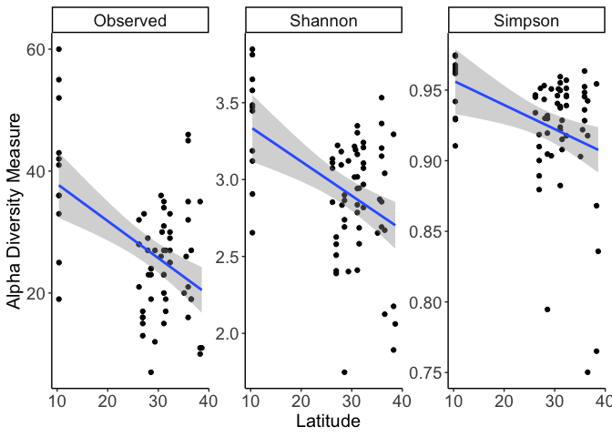<!-- -->

``` r
# Rhizobia only plot 
rhiz_ph_plot<-plot_richness(rhiz_soil_ph, x="Latitude", measures=c("Observed", "Shannon", "Simpson")) +
  geom_smooth(method="lm") +
  (xlab("Latitude"))+
  theme_classic() +
  theme(axis.title.x = element_text(size=15), 
        axis.title.y = element_text(size=15), 
        axis.text.y=   element_text(size=14), 
        axis.text.x= element_text(size=14), 
        legend.title= element_text(size=14),   
        legend.text=element_text(size=14), 
        strip.text.x = element_text(size = 14))
rhiz_ph_plot
```

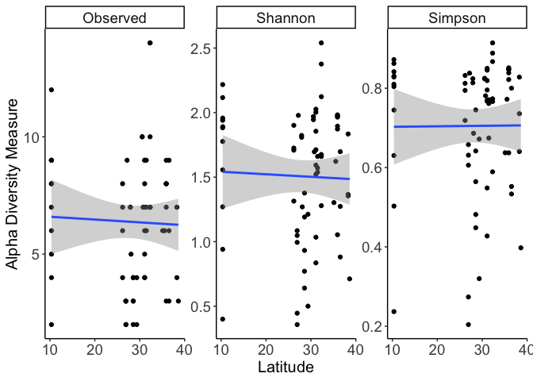<!-- -->

``` r
# There could be a pattern with rhizobia and latitude but not too strong 

# Nonrhizobia plot 
nonrhiz_ph_plot<-plot_richness(nonrhiz_soil_ph, x="Latitude", measures=c("Observed", "Shannon", "Simpson")) +
  geom_smooth(method="lm") +
  (xlab("Latitude"))+
  theme_classic() +
  theme(axis.title.x = element_text(size=15), 
        axis.title.y = element_text(size=15), 
        axis.text.y=   element_text(size=14), 
        axis.text.x= element_text(size=14), 
        legend.title= element_text(size=14),   
        legend.text=element_text(size=14), 
        strip.text.x = element_text(size = 14))
nonrhiz_ph_plot
```

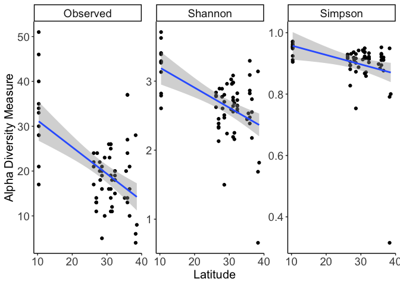<!-- -->

``` r
# This looks like the pattern I would expect where there is higher diversity in the tropics than in the temperate zone - this looks pretty strong in the non-rhizobia 
```

## Linear models for soil latitudinal gradients

Test for significance relationships between latitude and OTU richness.

``` r
# Rhizobia only data 
# Save the data for analysis 
rhiz_alpha_ph=data.table(rhiz_ph_plot$data)
rhiz_obs_ph=rhiz_alpha_ph[(variable == "Observed")]
hist(rhiz_obs_ph$value) # looks not too bad
```

<!-- -->

``` r
rhiz_obs_ph <- rhiz_obs_ph %>%
  mutate(sample.id=as.factor(sample.id)) # Change to factor just in case for overdispersion 

# Test the relationship
# Run the model 
soil_rhiz_model_ph=lm(value ~ Latitude, data=rhiz_obs_ph)

# Inspect model fit 
plot(soil_rhiz_model_ph) # Raw data looks pretty good actually 
```

<!-- --><!-- --><!-- --><!-- -->

``` r
# Test significance
summary(soil_rhiz_model_ph)
```

    ## 
    ## Call:
    ## lm(formula = value ~ Latitude, data = rhiz_obs_ph)
    ## 
    ## Residuals:
    ##     Min      1Q  Median      3Q     Max 
    ## -4.5906 -2.3689  0.6106  1.7172  7.6738 
    ## 
    ## Coefficients:
    ##             Estimate Std. Error t value Pr(>|t|)    
    ## (Intercept)  6.71520    1.18819   5.652 3.96e-07 ***
    ## Latitude    -0.01204    0.04068  -0.296    0.768    
    ## ---
    ## Signif. codes:  0 '***' 0.001 '**' 0.01 '*' 0.05 '.' 0.1 ' ' 1
    ## 
    ## Residual standard error: 2.825 on 64 degrees of freedom
    ## Multiple R-squared:  0.001368,   Adjusted R-squared:  -0.01424 
    ## F-statistic: 0.08767 on 1 and 64 DF,  p-value: 0.7681

``` r
Anova(soil_rhiz_model_ph, type=3) 
```

    ## Anova Table (Type III tests)
    ## 
    ## Response: value
    ##             Sum Sq Df F value    Pr(>F)    
    ## (Intercept) 254.94  1 31.9410 3.956e-07 ***
    ## Latitude      0.70  1  0.0877    0.7681    
    ## Residuals   510.83 64                      
    ## ---
    ## Signif. codes:  0 '***' 0.001 '**' 0.01 '*' 0.05 '.' 0.1 ' ' 1

``` r
# Not significant and the plot does sort of match this 

# Nonrhizobia data 
# Save the data for analysis 
nonrhiz_alpha_ph=data.table(nonrhiz_ph_plot$data)
nonrhiz_obs_ph=nonrhiz_alpha_ph[(variable == "Observed")]
hist(nonrhiz_obs_ph$value) # looks very normal 
```

<!-- -->

``` r
nonrhiz_obs_ph <- nonrhiz_obs_ph %>%
  mutate(sample.id=as.factor(sample.id)) # Change to factor just in case for overdispersion 

# Test the relationship
# Run the model 
soil_nonrhiz_model_ph=lm(value ~ Latitude, data=nonrhiz_obs_ph)

# Inspect model fit 
plot(soil_nonrhiz_model_ph) # Looks very good!
```

<!-- --><!-- --><!-- --><!-- -->

``` r
# Test significance
summary(soil_nonrhiz_model_ph)
```

    ## 
    ## Call:
    ## lm(formula = value ~ Latitude, data = nonrhiz_obs_ph)
    ## 
    ## Residuals:
    ##      Min       1Q   Median       3Q      Max 
    ## -15.2330  -4.7020  -0.3672   3.1593  21.1438 
    ## 
    ## Coefficients:
    ##             Estimate Std. Error t value Pr(>|t|)    
    ## (Intercept)  37.2550     3.2466  11.475  < 2e-16 ***
    ## Latitude     -0.5960     0.1111  -5.363  1.2e-06 ***
    ## ---
    ## Signif. codes:  0 '***' 0.001 '**' 0.01 '*' 0.05 '.' 0.1 ' ' 1
    ## 
    ## Residual standard error: 7.72 on 64 degrees of freedom
    ## Multiple R-squared:  0.3101, Adjusted R-squared:  0.2993 
    ## F-statistic: 28.76 on 1 and 64 DF,  p-value: 1.202e-06

``` r
Anova(soil_nonrhiz_model_ph, type=3) 
```

    ## Anova Table (Type III tests)
    ## 
    ## Response: value
    ##             Sum Sq Df F value    Pr(>F)    
    ## (Intercept) 7846.9  1 131.679 < 2.2e-16 ***
    ## Latitude    1713.9  1  28.762 1.202e-06 ***
    ## Residuals   3813.8 64                      
    ## ---
    ## Signif. codes:  0 '***' 0.001 '**' 0.01 '*' 0.05 '.' 0.1 ' ' 1

``` r
# Significant and that is what the plot shows 

# Full dataset 
# Save the data for analysis 
full_alpha_ph=data.table(full_ph_plot$data)
full_obs_ph=full_alpha_ph[(variable == "Observed")]
hist(full_obs_ph$value) # looks not too bad
```

<!-- -->

``` r
full_obs_ph <- full_obs_ph %>%
  mutate(sample.id=as.factor(sample.id)) # Change to factor just in case for overdispersion 

# Test the relationship
# Run the model 
soil_full_model_ph=lm(value ~ Latitude, data=full_obs_ph)

# Inspect model fit 
plot(soil_full_model_ph) # Raw data looks pretty good actually 
```

<!-- --><!-- --><!-- --><!-- -->

``` r
# Test significance
summary(soil_full_model_ph)
```

    ## 
    ## Call:
    ## lm(formula = value ~ Latitude, data = full_obs_ph)
    ## 
    ## Residuals:
    ##      Min       1Q   Median       3Q      Max 
    ## -19.6043  -6.0637  -0.0497   5.1078  23.8609 
    ## 
    ## Coefficients:
    ##             Estimate Std. Error t value Pr(>|t|)    
    ## (Intercept)  43.9702     4.0110  10.963 2.49e-16 ***
    ## Latitude     -0.6081     0.1373  -4.429 3.78e-05 ***
    ## ---
    ## Signif. codes:  0 '***' 0.001 '**' 0.01 '*' 0.05 '.' 0.1 ' ' 1
    ## 
    ## Residual standard error: 9.537 on 64 degrees of freedom
    ## Multiple R-squared:  0.2346, Adjusted R-squared:  0.2226 
    ## F-statistic: 19.61 on 1 and 64 DF,  p-value: 3.781e-05

``` r
Anova(soil_full_model_ph, type=3) 
```

    ## Anova Table (Type III tests)
    ## 
    ## Response: value
    ##              Sum Sq Df F value    Pr(>F)    
    ## (Intercept) 10930.6  1 120.177 2.493e-16 ***
    ## Latitude     1783.9  1  19.613 3.781e-05 ***
    ## Residuals    5821.1 64                      
    ## ---
    ## Signif. codes:  0 '***' 0.001 '**' 0.01 '*' 0.05 '.' 0.1 ' ' 1

``` r
# Significant here and that is what the plot looks like 
```

## Rhizobia geographic zones

Repeat analysis for the three geographic regions instead of a continuous
gradient.

``` r
# Alternative is to test the three categories 
rhiz_obs_ph_reg <- rhiz_obs_ph %>%
  mutate(region=case_when(Latitude < 11 ~ "Tropical", 
                          Latitude > 35 ~ "Temperate", 
                          Latitude > 25 | Latitude <33 ~ "Subtropical")) %>%
  mutate(region=as.factor(region))

# Run the model 
rhiz_ph_3=lm(value~region, data=rhiz_obs_ph_reg)
plot(rhiz_ph_3) # excellent 
```

<!-- --><!-- --><!-- --><!-- -->

``` r
summary(rhiz_ph_3)
```

    ## 
    ## Call:
    ## lm(formula = value ~ region, data = rhiz_obs_ph_reg)
    ## 
    ## Residuals:
    ##     Min      1Q  Median      3Q     Max 
    ## -5.1818 -2.2000  0.7333  1.7833  7.8000 
    ## 
    ## Coefficients:
    ##                 Estimate Std. Error t value Pr(>|t|)    
    ## (Intercept)      6.20000    0.44676  13.878   <2e-16 ***
    ## regionTemperate  0.06667    0.85547   0.078    0.938    
    ## regionTropical   0.98182    0.96197   1.021    0.311    
    ## ---
    ## Signif. codes:  0 '***' 0.001 '**' 0.01 '*' 0.05 '.' 0.1 ' ' 1
    ## 
    ## Residual standard error: 2.826 on 63 degrees of freedom
    ## Multiple R-squared:  0.01674,    Adjusted R-squared:  -0.01448 
    ## F-statistic: 0.5361 on 2 and 63 DF,  p-value: 0.5877

``` r
Anova(rhiz_ph_3, type=3) # Not significant, again matches the full gradient model 
```

    ## Anova Table (Type III tests)
    ## 
    ## Response: value
    ##              Sum Sq Df  F value Pr(>F)    
    ## (Intercept) 1537.60  1 192.5937 <2e-16 ***
    ## region         8.56  2   0.5361 0.5877    
    ## Residuals    502.97 63                    
    ## ---
    ## Signif. codes:  0 '***' 0.001 '**' 0.01 '*' 0.05 '.' 0.1 ' ' 1

## Non rhizobia geographic zones

``` r
# Alternative is to test the three categories 
nonrhiz_obs_ph_reg <- nonrhiz_obs_ph %>%
  mutate(region=case_when(Latitude < 11 ~ "Tropical", 
                          Latitude > 35 ~ "Temperate", 
                          Latitude > 25 | Latitude <33 ~ "Subtropical")) %>%
  mutate(region=as.factor(region))

# Run the model 
nonrhiz_ph_3=lm(value~region, data=nonrhiz_obs_ph_reg)
plot(nonrhiz_ph_3) # excellent 
```

<!-- --><!-- --><!-- --><!-- -->

``` r
summary(nonrhiz_ph_3)
```

    ## 
    ## Call:
    ## lm(formula = value ~ region, data = nonrhiz_obs_ph_reg)
    ## 
    ## Residuals:
    ##    Min     1Q Median     3Q    Max 
    ## -16.00  -4.95   0.05   4.05  18.40 
    ## 
    ## Coefficients:
    ##                 Estimate Std. Error t value Pr(>|t|)    
    ## (Intercept)       17.950      1.178  15.241  < 2e-16 ***
    ## regionTemperate    0.650      2.255   0.288    0.774    
    ## regionTropical    15.050      2.536   5.935 1.37e-07 ***
    ## ---
    ## Signif. codes:  0 '***' 0.001 '**' 0.01 '*' 0.05 '.' 0.1 ' ' 1
    ## 
    ## Residual standard error: 7.449 on 63 degrees of freedom
    ## Multiple R-squared:  0.3676, Adjusted R-squared:  0.3476 
    ## F-statistic: 18.31 on 2 and 63 DF,  p-value: 5.373e-07

``` r
Anova(nonrhiz_ph_3, type=3) # Significant! 
```

    ## Anova Table (Type III tests)
    ## 
    ## Response: value
    ##              Sum Sq Df F value    Pr(>F)    
    ## (Intercept) 12888.1  1 232.285 < 2.2e-16 ***
    ## region       2032.3  2  18.314 5.373e-07 ***
    ## Residuals    3495.5 63                      
    ## ---
    ## Signif. codes:  0 '***' 0.001 '**' 0.01 '*' 0.05 '.' 0.1 ' ' 1

``` r
# Tukey test 
nonrhiz_av_soil <- aov(nonrhiz_ph_3)
summary(nonrhiz_av_soil)
```

    ##             Df Sum Sq Mean Sq F value   Pr(>F)    
    ## region       2   2032  1016.1   18.31 5.37e-07 ***
    ## Residuals   63   3496    55.5                     
    ## ---
    ## Signif. codes:  0 '***' 0.001 '**' 0.01 '*' 0.05 '.' 0.1 ' ' 1

``` r
TukeyHSD(nonrhiz_av_soil) 
```

    ##   Tukey multiple comparisons of means
    ##     95% family-wise confidence level
    ## 
    ## Fit: aov(formula = nonrhiz_ph_3)
    ## 
    ## $region
    ##                        diff       lwr       upr     p adj
    ## Temperate-Subtropical  0.65 -4.763277  6.063277 0.9552735
    ## Tropical-Subtropical  15.05  8.962860 21.137140 0.0000004
    ## Tropical-Temperate    14.40  7.302601 21.497399 0.0000232

``` r
# Tropical is different from the other groups, but no difference between sub and temperate

# Plot the three categories 
library(ggsignif)
# Colour palette 
region_col<-wes_palette("Zissou1")

# Draw the plot 
three_groups_soil <-ggplot(nonrhiz_obs_ph_reg, aes(x=region, y=value, color=region))+ 
  geom_boxplot() +
  (ylab("Total soil OTUs"))+
  (xlab(""))+
  scale_x_discrete(limits=c("Tropical", "Subtropical", "Temperate")) +
  geom_signif(comparisons=list(c("Tropical", "Subtropical"), c("Tropical", "Temperate")), annotations="***", map_signif_level = TRUE, y_position = c(52, 56), color="black") +
  scale_color_manual(values=region_col[c(3,1,5)])+
  theme_classic()+ 
  theme(legend.title=element_blank(),
        axis.title = element_text(size=13), 
        axis.text = element_text(size=12), 
        legend.text=element_text(size=10), 
        aspect.ratio=1.2,
        legend.position = "none")
three_groups_soil
```

<!-- -->

## Visualizing asvs in soil that make it into the nodule

We did a bar plot earlier of the total proteobacteria community - how
does the nodule community look across latitude in a bar plot

Make the same abundance plot but for the phylogenetic merged samples
Here I am using the exact same code as above just changing the initial
input so would need to change all these labels.

``` r
# Background colour 
background<-park_palette("Yellowstone")

# Save copy for plotting 
soil_gens2<- soil_ph_clean

# Clean up the data for plotting later 
tax_table(soil_gens2)[, colnames(tax_table(soil_gens2))] <- gsub(tax_table(soil_gens2)[, colnames(tax_table(soil_gens2))],     pattern = "f__", replacement = "")
tax_table(soil_gens2)[tax_table(soil_gens2) [, "Family"] == "", "Family"] <- "Unclassified family" # Edit unclassified data 

# Need to nail down what this grouping does 
soil_gen_fam <- microbiome::aggregate_rare(soil_gens2, "Family", detection = 0.1/100, prevalence=50/100) # This gives 18 families 
soil_gen_fam_abund <- microbiome::transform(soil_gen_fam, "compositional") # Make relative abundance 

# Set the palette 
soil_taxa <- as.data.frame(soil_gen_fam_abund@tax_table) # help set the palette 
palette_fam1 <- colorRampPalette(brewer.pal(12, "Paired")) # specify the palette 
palette_fam2 <- palette_fam1(length(unique(soil_taxa$Family))) # expand the palette based on the number of genera you want to plot  

# Plot the result 
soil_plot_test <- plot_composition(soil_gen_fam_abund, sample.sort="Latitude") +
  scale_fill_manual(values = palette_fam2) +
  theme_classic() + 
  theme(legend.position = "none") 

# To customize save the data from the plot 
soil_plot_data<-soil_plot_test$data

# Merge dataset with latitude values for plotting 
lat_data<- data.frame(sample_data(soil_gen_fam_abund))
lat_data2<-lat_data %>%
  rename(Sample=sample.id)
custom_data<-full_join(soil_plot_data, lat_data2, by="Sample")

# Make groups of tropical subtropical and temperate for the plot 
custom_data2<-custom_data %>%
  mutate(region=case_when(Latitude < 11 ~ "Tropical", 
                          Latitude > 35 ~ "Temperate", 
                          Latitude > 25 | Latitude <33 ~ "Subtropical"))
# Change order of levels 
custom_data2$region<-factor(custom_data2$region, levels=c("Tropical", "Subtropical","Temperate"))

library(ggforce)
# Background colour 
background<-park_palette("Yellowstone")

soil_custom <- ggplot(custom_data2, aes(x= Sample, y=Abundance, fill=Tax)) +
  geom_bar(position="stack", stat="identity", size=0.1, colour="white") +
  facet_grid(~ region, space="free", scales="free", switch="both") +
  scale_x_discrete(labels = soil_plot_data$xlabel, breaks = soil_plot_data$Sample) +
  scale_fill_manual(values = (palette_fam2)) +
  theme_classic() + 
  guides(fill=guide_legend(ncol=1))+ # Make legend one column
  theme(axis.title.x = element_text(size=11), 
        axis.title.y = element_text(size=11), 
        axis.text.y= element_text(size=10), 
        axis.text.x= element_text(size=6, angle=90),
        legend.text=element_text(size=7), 
        legend.title=element_text(size=0),
        legend.position = "right", 
        legend.key.size = unit(0.35, 'cm'),# Change size of the legend boxes
        strip.background =element_rect(fill="white")
        ) # aspect ratio- maybe not needed here 
soil_custom
```

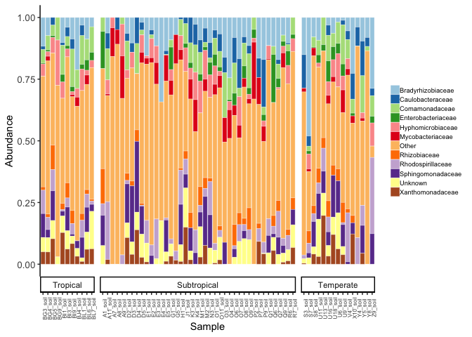<!-- -->

``` r
## Hmm way more Burkholderia in temperate area???? This could involve some nodulating genera 
```

## Plot the top otus for nodule and soil paired samples

For matched soil and nodule, plot the most common families in the
sample. Remaining families refers to the sum of all families that were
individually less than 15% of total sequences

``` r
soil_pair_gen <- pairsoil_ph_clean2
# pair_soil_gens3 # is the genus level matched asvs 
# pairsoil_ph_clean2 # is the merged asvs based on phylogeny 

# Clean up the data for plotting later 
tax_table(soil_pair_gen)[, colnames(tax_table(soil_pair_gen))] <- gsub(tax_table(soil_pair_gen)[, colnames(tax_table(soil_pair_gen))],     pattern = "f__", replacement = "")
tax_table(soil_pair_gen)[tax_table(soil_pair_gen) [, "Family"] == "", "Family"] <- "Unclassified families" # Edit unclassified data 

# Detection - how much is in the sample? If it is there then it counts so detection can be really low 
# Prevalence - how frequent in the samples. Here 5/100 means greater than 5% prevalence 
soil_gen_fam <- microbiome::aggregate_rare(soil_pair_gen, "Family", detection = 0.1/100, prevalence=15/100) # This gives 22 families
soil_gen_fam_abund <- microbiome::transform(soil_gen_fam, "compositional") # Make relative abundance 

# Set the palette 
soil_taxa <- as.data.frame(soil_gen_fam_abund@tax_table) # help set the palette 
palette_fam1 <- colorRampPalette(brewer.pal(12, "Paired")) # specify the palette 
palette_fam2 <- palette_fam1(length(unique(soil_taxa$Family))) # expand the palette based on the number of genera you want to plot  

# Plot the result 
soil_plot_test <- plot_composition(soil_gen_fam_abund, sample.sort="Latitude") +
  scale_fill_manual(values = palette_fam2) +
  theme_classic() + 
  theme(legend.position = "none") 

# To customize save the data from the plot 
soil_plot_data<-soil_plot_test$data

# Merge dataset with latitude values for plotting 
lat_data<- data.frame(sample_data(soil_gen_fam_abund))
lat_data2<-lat_data %>%
  rename(Sample=sample.id)
custom_data<-full_join(soil_plot_data, lat_data2, by="Sample")

# Make groups of tropical subtropical and temperate for the plot 
custom_data2<-custom_data %>%
  mutate(region=case_when(Latitude < 11 ~ "Tropical", 
                          Latitude > 35 ~ "Temperate", 
                          Latitude > 25 | Latitude <33 ~ "Subtropical"))

# Change order of levels and clean up 
custom_data2$region<-factor(custom_data2$region, levels=c("Tropical", "Subtropical","Temperate"))
custom_data2$Tax <- gsub("Unknown", "Unclassified families", custom_data2$Tax)
custom_data2$Tax <- gsub("Other", "Remaining families", custom_data2$Tax)
custom_data2$Tax<-factor(custom_data2$Tax, levels=c("[Chthoniobacteraceae]", "Acidobacteriaceae", "Bacillaceae", "Bradyrhizobiaceae", "Burkholderiaceae", "Caulobacteraceae", "Chitinophagaceae", "Comamonadaceae", "Enterobacteriaceae", "Gaiellaceae", "Hyphomicrobiaceae", "Micromonosporaceae", "Mycobacteriaceae", "Oxalobacteraceae", "Pseudomonadaceae", "Rhizobiaceae", "Rhodospirillaceae", "Sinobacteraceae", "Sphingomonadaceae", "Streptomycetaceae", "Xanthomonadaceae", "Unclassified families", "Remaining families"))

# Colour 
grey_col<- brewer.pal(9, "Greys")

# Plot 
soil_custom <- ggplot(custom_data2, aes(x= ID_clean, y=Abundance, fill=Tax)) +
  geom_bar(position="stack", stat="identity", size=0.1, colour="white") +
  facet_grid(Sample_type ~ region, space = "free", scales="free", switch="x") +
  scale_x_discrete(breaks = soil_plot_data$ID_clean) +
  xlab("")+
  scale_fill_manual(values = (palette_fam2)) +
  theme_classic() + 
  guides(fill=guide_legend(ncol=1))+ # Make legend one column
  theme(axis.title.x = element_text(size=11), 
        axis.title.y = element_text(size=11), 
        axis.text.y= element_text(size=10), 
        axis.text.x= element_text(size=6, angle=90),
        legend.text=element_text(size=6), 
        legend.title=element_text(size=0),
        legend.position = "right", 
        legend.key.size = unit(0.35, 'cm'),# Change size of the legend boxes
        strip.background =element_rect(fill=grey_col[2]),
        ) # aspect ratio- maybe not needed here 
soil_custom
```

<!-- -->

``` r
# Maybe this goes as its own plot in the supplement 

#jpeg(file="barplot.jpeg", units="in", res=600, width=6, height=4)
soil_custom
```

<!-- -->

``` r
#dev.off()
```

# Does soil richness predict nodule richness at genus level data

Do soil asvs predict the nodule asvs (diversity). Would this be a model
where we have both latitude and soil diversity predicting the nodule
diversity?

Would there be an interaction between latitude and soil diversity? Do we
expect that the relationship between latitude and nodule diversity would
change depending on the soil diversity? I think just two separate
covariates in the model for this model

## Beta metrics at h=0.03

Does the soil community predict the nodule community Here we want to use
population as a random effect I think Now do the beta diversity
measures, take the scores and plot them against each other in a
regression

``` r
data_input <- pairsoil_ph_clean2

# Brays-curtis distance 
bray_soilnod = phyloseq::distance(data_input, method="bray")
bray_ord_soilnod = ordinate(data_input, method="PCoA", distance=bray_soilnod)

# Weighted unifrac distance 
wun_soilnod = phyloseq::distance(data_input, method="wunifrac")
wun_ord_soilnod = ordinate(data_input, method="PCoA", distance=wun_soilnod)

# jaccard distance 
jac_soilnod = phyloseq::distance(data_input, method="jaccard")
jac_ord_soilnod = ordinate(data_input, method="PCoA", distance=jac_soilnod)

# unweighted 
un_soilnod = phyloseq::distance(data_input, method="unifrac")
un_ord_soilnod = ordinate(data_input, method="PCoA", distance=un_soilnod)
```

## Plot the pcoas for h=0.03

``` r
soils<-park_palette("Zion")
sampletypes2<-park_palette("RockyMountains")
soils_pallete<-c(sampletypes2[3], soils[3])

bray_plot2<-plot_ordination(data_input, bray_ord_soilnod) + 
  geom_point(aes(fill=Sample_type), size=1.8, shape=21) +
  scale_fill_manual(values=soils_pallete)+
  theme_classic() +
  labs(tag = "(b)") +
  labs(color="Sample type") + 
  theme(aspect.ratio=0.8)

jaccard_plot2<-plot_ordination(data_input, jac_ord_soilnod) +
  geom_point(aes(fill=Sample_type), size=1.8, shape=21) +
  scale_fill_manual(values=soils_pallete)+
  theme_classic() +
  labs(tag = "(a)") +
  labs(color="Sample type") + 
  theme(aspect.ratio=0.8)

unifrac_plot<-plot_ordination(data_input, un_ord_soilnod) + 
  geom_point(aes(fill=Sample_type), size=1.8, shape=21) +
  scale_fill_manual(values=soils_pallete)+
  theme_classic() +
  labs(tag = "(c)") +
  labs(color="Sample type") + 
  theme(aspect.ratio=0.8) 

# Plot the PCoA 
wunifrac_plot<-plot_ordination(data_input, wun_ord_soilnod) + 
  geom_point(aes(fill=Sample_type), size=1.8, shape=21) +
  scale_fill_manual(values=soils_pallete)+
  theme_classic() +
  labs(tag = "(d)") +
  labs(color="Sample type") +
  theme(aspect.ratio=0.8) 

# Combine the figures 
pcoa_pic<- ggarrange(jaccard_plot2, bray_plot2, unifrac_plot, wunifrac_plot,
                     hjust=0.08,
                     ncol = 2, nrow=2, 
                     common.legend = TRUE)
pcoa_pic
```

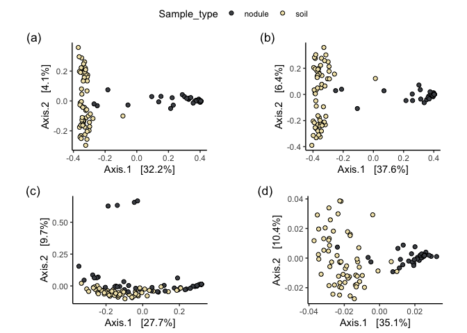<!-- -->

## Regression on the pcoa scores

Here taking the pcoa SCORES against nodules and soil matching samples
Looking for how similar the samples are in multivariate space - if well
matched there should be a nice 1:1 correlation

Go beyond axis 1. Could try up to 5 axes and plot 5 regressions on same
plot to see the changes. Look for any significance. Although, the
original soil otus were filtered for nodule ones so we might not expect
too great of a difference even on axis 1. If it was just regular soil
community compared to nodule community I would expect axis 1 to be
different (but we filtered).

### Unifrac

``` r
# Get the data from the ordination for unifrac dissimilarity 
unifrac_data=data.table(unifrac_plot$data)

# Change the data so that for each sample have a soil diversity and nodule diversity
unifrac_data_pair1<- unifrac_data %>%
  spread(Sample_type, Axis.1) %>%
  dplyr::select(ID_clean, Latitude, Longitude, nodule, soil, Pop_code) %>%
  group_by(ID_clean) %>%
  summarise(Latitude=Latitude, Longitude=Longitude, nodule=max(nodule, na.rm=T), soil=max(soil, na.rm=T), Population=Pop_code)%>%
  unique()%>%
  mutate(ID_clean=as.factor(ID_clean)) %>%
  mutate(nodule1=nodule,
         soil1=soil) %>%
  dplyr::select(ID_clean, Latitude, Longitude, Population, nodule1, soil1)
unifrac_data_pair1
```

    ## # A tibble: 61  6
    ## # Groups:   ID_clean [61]
    ##    ID_clean Latitude Longitude Population nodule1    soil1
    ##    <fct>       <dbl>     <dbl> <chr>        <dbl>    <dbl>
    ##  1 A11          26.9     -82.3 A           0.320  -0.0579 
    ##  2 A7           26.9     -82.3 A           0.238   0.0111 
    ##  3 A8           26.9     -82.3 A           0.320  -0.00489
    ##  4 A9           26.9     -82.3 A           0.285  -0.0829 
    ##  5 BG3          10.3     -85.3 BG         -0.138  -0.248  
    ##  6 BG4          10.3     -85.3 BG          0.117  -0.334  
    ##  7 BG5          10.3     -85.3 BG         -0.320  -0.258  
    ##  8 BG9          10.3     -85.3 BG         -0.103  -0.147  
    ##  9 BI3          10.3     -85.4 BI         -0.243  -0.305  
    ## 10 BI9          10.3     -85.4 BI         -0.0456 -0.269  
    ## #  51 more rows

``` r
# axis 2 
unifrac_data_pair2<- unifrac_data %>%
  spread(Sample_type, Axis.2) %>%
  dplyr::select(ID_clean, Latitude, Longitude, nodule, soil, Pop_code) %>%
  group_by(ID_clean) %>%
  summarise(Latitude=Latitude, Longitude=Longitude, nodule=max(nodule, na.rm=T), soil=max(soil, na.rm=T), Population=Pop_code)%>%
  unique()%>%
  mutate(ID_clean=as.factor(ID_clean)) %>%
  mutate(nodule2=nodule,
         soil2=soil) %>%
  dplyr::select(ID_clean, Latitude, Longitude, Population, nodule2, soil2)
unifrac_data_pair2
```

    ## # A tibble: 61  6
    ## # Groups:   ID_clean [61]
    ##    ID_clean Latitude Longitude Population  nodule2    soil2
    ##    <fct>       <dbl>     <dbl> <chr>         <dbl>    <dbl>
    ##  1 A11          26.9     -82.3 A           0.0132  -0.0925 
    ##  2 A7           26.9     -82.3 A          -0.0247  -0.0245 
    ##  3 A8           26.9     -82.3 A           0.0132  -0.0531 
    ##  4 A9           26.9     -82.3 A          -0.00440 -0.0542 
    ##  5 BG3          10.3     -85.3 BG          0.633    0.00200
    ##  6 BG4          10.3     -85.3 BG          0.00447  0.0210 
    ##  7 BG5          10.3     -85.3 BG          0.0453  -0.0278 
    ##  8 BG9          10.3     -85.3 BG          0.0334  -0.00104
    ##  9 BI3          10.3     -85.4 BI          0.0697  -0.0235 
    ## 10 BI9          10.3     -85.4 BI          0.657   -0.0122 
    ## #  51 more rows

``` r
# Merge the datasets 
unifrac_soil_nod<-left_join(unifrac_data_pair1, unifrac_data_pair2, by=c("ID_clean", "Population", "Latitude", "Longitude"))
unifrac_soil_nod
```

    ## # A tibble: 61  8
    ## # Groups:   ID_clean [61]
    ##    ID_clean Latitude Longitude Population nodule1    soil1  nodule2    soil2
    ##    <fct>       <dbl>     <dbl> <chr>        <dbl>    <dbl>    <dbl>    <dbl>
    ##  1 A11          26.9     -82.3 A           0.320  -0.0579   0.0132  -0.0925 
    ##  2 A7           26.9     -82.3 A           0.238   0.0111  -0.0247  -0.0245 
    ##  3 A8           26.9     -82.3 A           0.320  -0.00489  0.0132  -0.0531 
    ##  4 A9           26.9     -82.3 A           0.285  -0.0829  -0.00440 -0.0542 
    ##  5 BG3          10.3     -85.3 BG         -0.138  -0.248    0.633    0.00200
    ##  6 BG4          10.3     -85.3 BG          0.117  -0.334    0.00447  0.0210 
    ##  7 BG5          10.3     -85.3 BG         -0.320  -0.258    0.0453  -0.0278 
    ##  8 BG9          10.3     -85.3 BG         -0.103  -0.147    0.0334  -0.00104
    ##  9 BI3          10.3     -85.4 BI         -0.243  -0.305    0.0697  -0.0235 
    ## 10 BI9          10.3     -85.4 BI         -0.0456 -0.269    0.657   -0.0122 
    ## #  51 more rows

``` r
# Run the model on axis1 
# I think we want population as a random effect because in some populations those plants might be more closely related 
mod_unifrac=lmer(nodule1 ~ soil1 + (1|Population), data=unifrac_soil_nod)

# Check model assumptions 
plot(mod_unifrac)
```

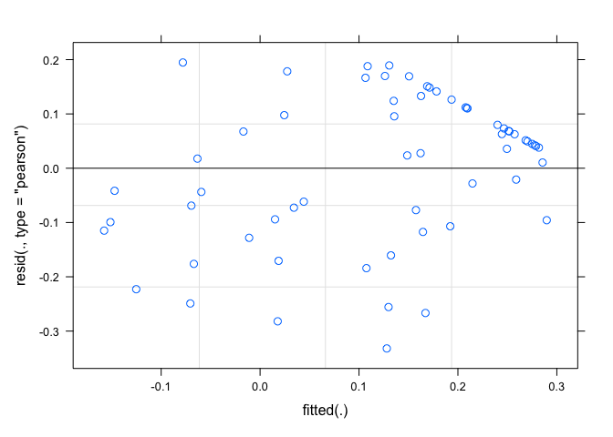<!-- -->

``` r
qqnorm(resid(mod_unifrac))
qqline(resid(mod_unifrac))
```

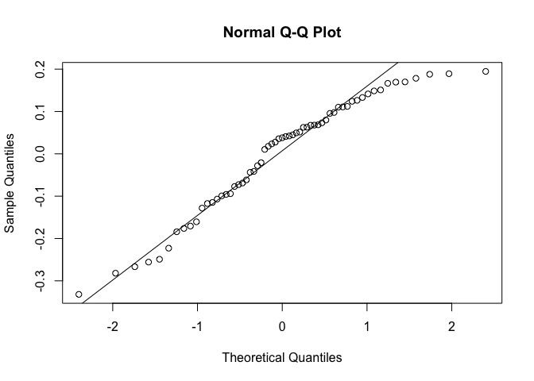<!-- -->

``` r
plot(fitted(mod_unifrac), sqrt(abs(resid(mod_unifrac))), main="Scale-location")
```

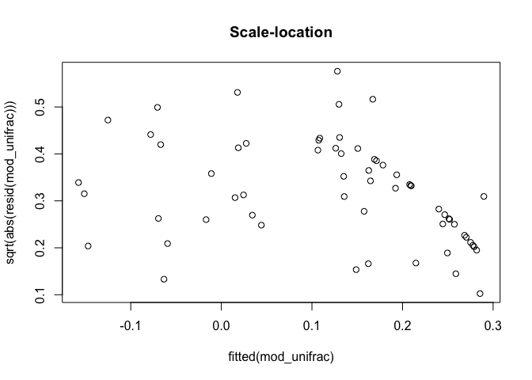<!-- -->

``` r
# It's good!  

# Test significance
Anova(mod_unifrac, type=3) # Here soil is not predictive 
```

    ## Analysis of Deviance Table (Type III Wald chisquare tests)
    ## 
    ## Response: nodule1
    ##              Chisq Df Pr(>Chisq)  
    ## (Intercept) 6.0902  1    0.01359 *
    ## soil1       0.2135  1    0.64402  
    ## ---
    ## Signif. codes:  0 '***' 0.001 '**' 0.01 '*' 0.05 '.' 0.1 ' ' 1

``` r
summary(mod_unifrac)
```

    ## Linear mixed model fit by REML ['lmerMod']
    ## Formula: nodule1 ~ soil1 + (1 | Population)
    ##    Data: unifrac_soil_nod
    ## 
    ## REML criterion at convergence: -21.6
    ## 
    ## Scaled residuals: 
    ##     Min      1Q  Median      3Q     Max 
    ## -2.1068 -0.6077  0.2413  0.6995  1.2357 
    ## 
    ## Random effects:
    ##  Groups     Name        Variance Std.Dev.
    ##  Population (Intercept) 0.02406  0.1551  
    ##  Residual               0.02483  0.1576  
    ## Number of obs: 61, groups:  Population, 23
    ## 
    ## Fixed effects:
    ##             Estimate Std. Error t value
    ## (Intercept)  0.11704    0.04742   2.468
    ## soil1        0.09936    0.21503   0.462
    ## 
    ## Correlation of Fixed Effects:
    ##       (Intr)
    ## soil1 0.543

``` r
r.squaredGLMM(mod_unifrac)
```

    ##              R2m       R2c
    ## [1,] 0.002769482 0.4936112

``` r
# Run the model on axis 2
mod_unifrac2=lmer(nodule2 ~ soil2 + (1|Population), data=unifrac_soil_nod)

# Check model assumptions 
plot(mod_unifrac2)
```

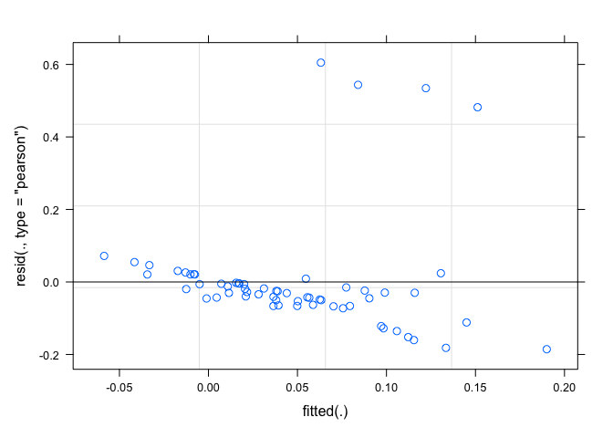<!-- -->

``` r
qqnorm(resid(mod_unifrac2))
qqline(resid(mod_unifrac2))
```

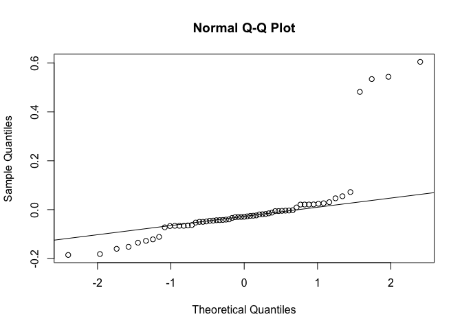<!-- -->

``` r
plot(fitted(mod_unifrac2), sqrt(abs(resid(mod_unifrac2))), main="Scale-location")
```

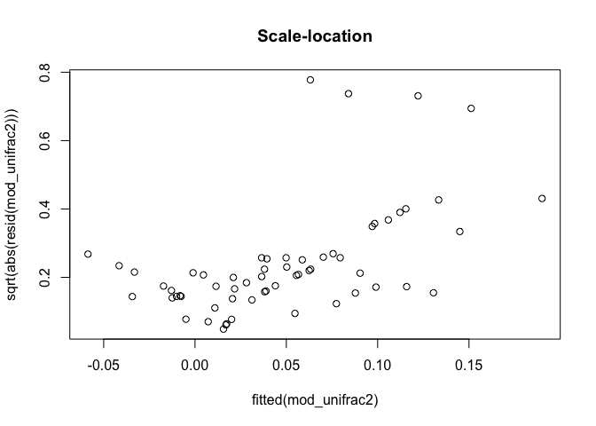<!-- -->

``` r
# Meh

# Test significance
Anova(mod_unifrac2, type=3) # On axis 2 there is some predictive ability of the soil community!!! What to do about this result? 
```

    ## Analysis of Deviance Table (Type III Wald chisquare tests)
    ## 
    ## Response: nodule2
    ##               Chisq Df Pr(>Chisq)    
    ## (Intercept) 11.8145  1  0.0005877 ***
    ## soil2        6.8013  1  0.0091091 ** 
    ## ---
    ## Signif. codes:  0 '***' 0.001 '**' 0.01 '*' 0.05 '.' 0.1 ' ' 1

``` r
summary(mod_unifrac2)
```

    ## Linear mixed model fit by REML ['lmerMod']
    ## Formula: nodule2 ~ soil2 + (1 | Population)
    ##    Data: unifrac_soil_nod
    ## 
    ## REML criterion at convergence: -50.9
    ## 
    ## Scaled residuals: 
    ##     Min      1Q  Median      3Q     Max 
    ## -1.1897 -0.3397 -0.1883 -0.0151  3.8783 
    ## 
    ## Random effects:
    ##  Groups     Name        Variance Std.Dev.
    ##  Population (Intercept) 0.00000  0.000   
    ##  Residual               0.02433  0.156   
    ## Number of obs: 61, groups:  Population, 23
    ## 
    ## Fixed effects:
    ##             Estimate Std. Error t value
    ## (Intercept)   0.1471     0.0428   3.437
    ## soil2         2.0403     0.7823   2.608
    ## 
    ## Correlation of Fixed Effects:
    ##       (Intr)
    ## soil2 0.884 
    ## optimizer (nloptwrap) convergence code: 0 (OK)
    ## boundary (singular) fit: see help('isSingular')

``` r
r.squaredGLMM(mod_unifrac2)
```

    ##            R2m       R2c
    ## [1,] 0.1018141 0.1018141

### Weighted unifrac

``` r
# Get the data from the ordination for unifrac dissimilarity 
wunifrac_data=data.table(wunifrac_plot$data)

# Change the data so that for each sample have a soil diversity and nodule diversity
wunifrac_data_pair1<- wunifrac_data %>%
  spread(Sample_type, Axis.1) %>%
  dplyr::select(ID_clean, Latitude, Longitude, nodule, soil, Pop_code) %>%
  group_by(ID_clean) %>%
  summarise(Latitude=Latitude, Longitude=Longitude, nodule=max(nodule, na.rm=T), soil=max(soil, na.rm=T), Population=Pop_code)%>%
  unique()%>%
  mutate(ID_clean=as.factor(ID_clean)) %>%
  mutate(nodule1=nodule,
         soil1=soil) %>%
  dplyr::select(ID_clean, Latitude, Longitude, Population, nodule1, soil1)
wunifrac_data_pair1
```

    ## # A tibble: 61  6
    ## # Groups:   ID_clean [61]
    ##    ID_clean Latitude Longitude Population nodule1   soil1
    ##    <fct>       <dbl>     <dbl> <chr>        <dbl>   <dbl>
    ##  1 A11          26.9     -82.3 A          0.0255  -0.0115
    ##  2 A7           26.9     -82.3 A          0.0251  -0.0235
    ##  3 A8           26.9     -82.3 A          0.0255  -0.0181
    ##  4 A9           26.9     -82.3 A          0.0250  -0.0308
    ##  5 BG3          10.3     -85.3 BG         0.0262  -0.0197
    ##  6 BG4          10.3     -85.3 BG         0.0250  -0.0347
    ##  7 BG5          10.3     -85.3 BG         0.0165  -0.0137
    ##  8 BG9          10.3     -85.3 BG         0.0104  -0.0227
    ##  9 BI3          10.3     -85.4 BI         0.00751 -0.0256
    ## 10 BI9          10.3     -85.4 BI         0.0292  -0.0282
    ## #  51 more rows

``` r
# axis 2
wunifrac_data_pair2<- wunifrac_data %>%
  spread(Sample_type, Axis.2) %>%
  dplyr::select(ID_clean, Latitude, Longitude, nodule, soil, Pop_code) %>%
  group_by(ID_clean) %>%
  summarise(Latitude=Latitude, Longitude=Longitude, nodule=max(nodule, na.rm=T), soil=max(soil, na.rm=T), Population=Pop_code)%>%
  unique()%>%
  mutate(ID_clean=as.factor(ID_clean)) %>%
  mutate(nodule2=nodule,
         soil2=soil) %>%
  dplyr::select(ID_clean, Latitude, Longitude, Population, nodule2, soil2)
wunifrac_data_pair2
```

    ## # A tibble: 61  6
    ## # Groups:   ID_clean [61]
    ##    ID_clean Latitude Longitude Population  nodule2    soil2
    ##    <fct>       <dbl>     <dbl> <chr>         <dbl>    <dbl>
    ##  1 A11          26.9     -82.3 A           0.00192 -0.00609
    ##  2 A7           26.9     -82.3 A           0.00226  0.0299 
    ##  3 A8           26.9     -82.3 A           0.00192  0.0178 
    ##  4 A9           26.9     -82.3 A           0.00187  0.0204 
    ##  5 BG3          10.3     -85.3 BG          0.00399 -0.0165 
    ##  6 BG4          10.3     -85.3 BG          0.00106  0.00241
    ##  7 BG5          10.3     -85.3 BG         -0.00199 -0.0183 
    ##  8 BG9          10.3     -85.3 BG          0.00655 -0.0250 
    ##  9 BI3          10.3     -85.4 BI         -0.00920 -0.0182 
    ## 10 BI9          10.3     -85.4 BI          0.00120 -0.00575
    ## #  51 more rows

``` r
# Merge the datasets 
wunifrac_soil_nod<-left_join(wunifrac_data_pair1, wunifrac_data_pair2, by=c("ID_clean", "Population", "Latitude", "Longitude"))

# Run the model 
mod_wunifrac=lmer(log10(nodule1+1) ~ soil1 + (1|Population), data=wunifrac_soil_nod)
mod_wunifrac=lmer((nodule1) ~ soil1 + (1|Population), data=wunifrac_soil_nod)

# Test significance
Anova(mod_wunifrac, type=3) # Not significant 0.3728 
```

    ## Analysis of Deviance Table (Type III Wald chisquare tests)
    ## 
    ## Response: (nodule1)
    ##               Chisq Df Pr(>Chisq)    
    ## (Intercept) 22.6618  1  1.932e-06 ***
    ## soil1        0.7748  1     0.3787    
    ## ---
    ## Signif. codes:  0 '***' 0.001 '**' 0.01 '*' 0.05 '.' 0.1 ' ' 1

``` r
summary(mod_wunifrac)
```

    ## Linear mixed model fit by REML ['lmerMod']
    ## Formula: (nodule1) ~ soil1 + (1 | Population)
    ##    Data: wunifrac_soil_nod
    ## 
    ## REML criterion at convergence: -378.2
    ## 
    ## Scaled residuals: 
    ##     Min      1Q  Median      3Q     Max 
    ## -2.8420 -0.1468  0.1545  0.2843  1.5377 
    ## 
    ## Random effects:
    ##  Groups     Name        Variance  Std.Dev.
    ##  Population (Intercept) 1.296e-04 0.011383
    ##  Residual               4.812e-05 0.006937
    ## Number of obs: 61, groups:  Population, 23
    ## 
    ## Fixed effects:
    ##              Estimate Std. Error t value
    ## (Intercept)  0.016286   0.003421    4.76
    ## soil1       -0.098713   0.112144   -0.88
    ## 
    ## Correlation of Fixed Effects:
    ##       (Intr)
    ## soil1 0.650

``` r
r.squaredGLMM(mod_wunifrac) # R2m = 0.005130586
```

    ##              R2m       R2c
    ## [1,] 0.005126538 0.7305876

``` r
# Check model assumptions 
plot(mod_wunifrac)
```

<!-- -->

``` r
qqnorm(resid(mod_wunifrac))
qqline(resid(mod_wunifrac))
```

<!-- -->

``` r
plot(fitted(mod_wunifrac), sqrt(abs(resid(mod_wunifrac))), main="Scale-location")
```

<!-- -->

``` r
# It's better and still non significant 

# Axis 2 
mod_wunifrac2=lmer(nodule2 ~ soil2 + (1|Population), data=wunifrac_soil_nod)

# Test significance
Anova(mod_wunifrac2, type=3) # Also significant, hmmmmm..... 
```

    ## Analysis of Deviance Table (Type III Wald chisquare tests)
    ## 
    ## Response: nodule2
    ##              Chisq Df Pr(>Chisq)   
    ## (Intercept) 9.8088  1   0.001737 **
    ## soil2       5.8456  1   0.015616 * 
    ## ---
    ## Signif. codes:  0 '***' 0.001 '**' 0.01 '*' 0.05 '.' 0.1 ' ' 1

``` r
summary(mod_wunifrac2)
```

    ## Linear mixed model fit by REML ['lmerMod']
    ## Formula: nodule2 ~ soil2 + (1 | Population)
    ##    Data: wunifrac_soil_nod
    ## 
    ## REML criterion at convergence: -522.6
    ## 
    ## Scaled residuals: 
    ##     Min      1Q  Median      3Q     Max 
    ## -3.2675 -0.3459  0.0517  0.4600  2.3178 
    ## 
    ## Random effects:
    ##  Groups     Name        Variance  Std.Dev.
    ##  Population (Intercept) 0.000e+00 0.000000
    ##  Residual               8.316e-06 0.002884
    ## Number of obs: 61, groups:  Population, 23
    ## 
    ## Fixed effects:
    ##             Estimate Std. Error t value
    ## (Intercept) 0.001159   0.000370   3.132
    ## soil2       0.051681   0.021375   2.418
    ## 
    ## Correlation of Fixed Effects:
    ##       (Intr)
    ## soil2 0.064 
    ## optimizer (nloptwrap) convergence code: 0 (OK)
    ## boundary (singular) fit: see help('isSingular')

``` r
r.squaredGLMM(mod_wunifrac2)
```

    ##             R2m        R2c
    ## [1,] 0.08877678 0.08877678

``` r
# Get the data from the ordination for bray curtis  
bry_data=data.table(bray_plot2$data)

bry_data_pair1<- bry_data %>%
  spread(Sample_type, Axis.1) %>%
  dplyr::select(ID_clean, Latitude, Longitude, nodule, soil, Pop_code) %>%
  group_by(ID_clean) %>%
  summarise(Latitude=Latitude, Longitude=Longitude, nodule=max(nodule, na.rm=T), soil=max(soil, na.rm=T), Population=Pop_code)%>%
  unique()%>%
  mutate(ID_clean=as.factor(ID_clean)) %>%
  mutate(nodule1=nodule,
         soil1=soil) %>%
  dplyr::select(ID_clean, Latitude, Longitude, Population, nodule1, soil1)

bry_data_pair2<- bry_data %>%
  spread(Sample_type, Axis.2) %>%
  dplyr::select(ID_clean, Latitude, Longitude, nodule, soil, Pop_code) %>%
  group_by(ID_clean) %>%
  summarise(Latitude=Latitude, Longitude=Longitude, nodule=max(nodule, na.rm=T), soil=max(soil, na.rm=T), Population=Pop_code)%>%
  unique()%>%
  mutate(ID_clean=as.factor(ID_clean)) %>%
  mutate(nodule2=nodule,
         soil2=soil) %>%
  dplyr::select(ID_clean, Latitude, Longitude, Population, nodule2, soil2)

# Combine the datasets 
bry_soil_nod<-left_join(bry_data_pair1, bry_data_pair2, by=c("ID_clean", "Population", "Latitude", "Longitude"))

# Run the model 
mod_bry1=lmer((nodule1) ~ soil1 + (1|Population), data=bry_soil_nod)

# Test significance
Anova(mod_bry1, type=3) # Not significant 
```

    ## Analysis of Deviance Table (Type III Wald chisquare tests)
    ## 
    ## Response: (nodule1)
    ##              Chisq Df Pr(>Chisq)  
    ## (Intercept) 4.4419  1    0.03507 *
    ## soil1       1.2617  1    0.26132  
    ## ---
    ## Signif. codes:  0 '***' 0.001 '**' 0.01 '*' 0.05 '.' 0.1 ' ' 1

``` r
summary(mod_bry1)
```

    ## Linear mixed model fit by REML ['lmerMod']
    ## Formula: (nodule1) ~ soil1 + (1 | Population)
    ##    Data: bry_soil_nod
    ## 
    ## REML criterion at convergence: -70.9
    ## 
    ## Scaled residuals: 
    ##     Min      1Q  Median      3Q     Max 
    ## -4.0715  0.0397  0.1330  0.2729  1.7572 
    ## 
    ## Random effects:
    ##  Groups     Name        Variance Std.Dev.
    ##  Population (Intercept) 0.01320  0.1149  
    ##  Residual               0.01027  0.1013  
    ## Number of obs: 61, groups:  Population, 23
    ## 
    ## Fixed effects:
    ##             Estimate Std. Error t value
    ## (Intercept)   0.2164     0.1027   2.108
    ## soil1        -0.3198     0.2847  -1.123
    ## 
    ## Correlation of Fixed Effects:
    ##       (Intr)
    ## soil1 0.961

``` r
r.squaredGLMM(mod_bry1)
```

    ##             R2m       R2c
    ## [1,] 0.01381366 0.5685784

``` r
# Check model assumptions 
plot(mod_bry1)
```

<!-- -->

``` r
qqnorm(resid(mod_bry1))
qqline(resid(mod_bry1))
```

<!-- -->

``` r
plot(fitted(mod_bry1), sqrt(abs(resid(mod_bry1))), main="Scale-location")
```

<!-- -->

``` r
# A little better 

# try axiss 2 
# Run the model 
mod_bry2=lmer((nodule2) ~ soil2 + (1|Population), data=bry_soil_nod)

# Test significance
Anova(mod_bry2, type=3) # Significant! 
```

    ## Analysis of Deviance Table (Type III Wald chisquare tests)
    ## 
    ## Response: (nodule2)
    ##              Chisq Df Pr(>Chisq)   
    ## (Intercept) 1.0788  1   0.298971   
    ## soil2       8.8498  1   0.002931 **
    ## ---
    ## Signif. codes:  0 '***' 0.001 '**' 0.01 '*' 0.05 '.' 0.1 ' ' 1

``` r
summary(mod_bry2)
```

    ## Linear mixed model fit by REML ['lmerMod']
    ## Formula: (nodule2) ~ soil2 + (1 | Population)
    ##    Data: bry_soil_nod
    ## 
    ## REML criterion at convergence: -284.1
    ## 
    ## Scaled residuals: 
    ##      Min       1Q   Median       3Q      Max 
    ## -3.00517 -0.29634 -0.01671  0.47836  2.53950 
    ## 
    ## Random effects:
    ##  Groups     Name        Variance  Std.Dev.
    ##  Population (Intercept) 0.0002471 0.01572 
    ##  Residual               0.0002988 0.01729 
    ## Number of obs: 61, groups:  Population, 23
    ## 
    ## Fixed effects:
    ##              Estimate Std. Error t value
    ## (Intercept) -0.004306   0.004146  -1.039
    ## soil2        0.053511   0.017988   2.975
    ## 
    ## Correlation of Fixed Effects:
    ##       (Intr)
    ## soil2 -0.036

``` r
r.squaredGLMM(mod_bry2)
```

    ##            R2m       R2c
    ## [1,] 0.1919037 0.5576786

``` r
# Check model assumptions 
plot(mod_bry2)
```

<!-- -->

``` r
qqnorm(resid(mod_bry2))
qqline(resid(mod_bry2))
```

<!-- -->

``` r
plot(fitted(mod_bry2), sqrt(abs(resid(mod_bry2))), main="Scale-location")
```

<!-- -->

``` r
# Looks great 
```

### Jaccards

``` r
# Get the data from the ordination for jaccard dissimilarity 
jac_data=data.table(jaccard_plot2$data)

# Axis 1
jac_data_pair1<- jac_data %>%
  spread(Sample_type, Axis.1) %>%
  dplyr::select(ID_clean, Latitude, Longitude, nodule, soil, Pop_code) %>%
  group_by(ID_clean) %>%
  summarise(Latitude=Latitude, Longitude=Longitude, nodule=max(nodule, na.rm=T), soil=max(soil, na.rm=T), Population=Pop_code)%>%
  unique()%>%
  mutate(ID_clean=as.factor(ID_clean)) %>%
  mutate(nodule1=nodule,
         soil1=soil) %>%
  dplyr::select(ID_clean, Latitude, Longitude, Population, nodule1, soil1)

# Axis 2
jac_data_pair2<- jac_data %>%
  spread(Sample_type, Axis.2) %>%
  dplyr::select(ID_clean, Latitude, Longitude, nodule, soil, Pop_code) %>%
  group_by(ID_clean) %>%
  summarise(Latitude=Latitude, Longitude=Longitude, nodule=max(nodule, na.rm=T), soil=max(soil, na.rm=T), Population=Pop_code)%>%
  unique()%>%
  mutate(ID_clean=as.factor(ID_clean)) %>%
  mutate(nodule2=nodule,
         soil2=soil) %>%
  dplyr::select(ID_clean, Latitude, Longitude, Population, nodule2, soil2)

# Combine the datasets 
jac_soil_nod<-left_join(jac_data_pair1, jac_data_pair2, by=c("ID_clean", "Population", "Latitude", "Longitude"))

# Run the model 
mod_jac=lmer((nodule1) ~ soil1 + (1|Population), data=jac_soil_nod)

# Test significance
Anova(mod_jac, type=3) 
```

    ## Analysis of Deviance Table (Type III Wald chisquare tests)
    ## 
    ## Response: (nodule1)
    ##              Chisq Df Pr(>Chisq)
    ## (Intercept) 1.4967  1     0.2212
    ## soil1       0.3612  1     0.5479

``` r
summary(mod_jac)
```

    ## Linear mixed model fit by REML ['lmerMod']
    ## Formula: (nodule1) ~ soil1 + (1 | Population)
    ##    Data: jac_soil_nod
    ## 
    ## REML criterion at convergence: -54.5
    ## 
    ## Scaled residuals: 
    ##     Min      1Q  Median      3Q     Max 
    ## -3.4214  0.0649  0.2061  0.3392  1.7067 
    ## 
    ## Random effects:
    ##  Groups     Name        Variance Std.Dev.
    ##  Population (Intercept) 0.01675  0.1294  
    ##  Residual               0.01400  0.1183  
    ## Number of obs: 61, groups:  Population, 23
    ## 
    ## Fixed effects:
    ##             Estimate Std. Error t value
    ## (Intercept)   0.2056     0.1680   1.223
    ## soil1        -0.3019     0.5024  -0.601
    ## 
    ## Correlation of Fixed Effects:
    ##       (Intr)
    ## soil1 0.981

``` r
r.squaredGLMM(mod_jac)
```

    ##              R2m       R2c
    ## [1,] 0.004040652 0.5465863

``` r
# Check model assumptions 
plot(mod_jac)
```

<!-- -->

``` r
qqnorm(resid(mod_jac))
qqline(resid(mod_jac))
```

<!-- -->

``` r
plot(fitted(mod_jac), sqrt(abs(resid(mod_jac))), main="Scale-location")
```

<!-- -->

``` r
# its alright  

# Run the model for axis 2 
mod_jac2=lmer((nodule2) ~ soil2 + (1|Population), data=jac_soil_nod)

# Test significance
Anova(mod_jac2, type=3) 
```

    ## Analysis of Deviance Table (Type III Wald chisquare tests)
    ## 
    ## Response: (nodule2)
    ##              Chisq Df Pr(>Chisq)   
    ## (Intercept) 0.5999  1   0.438599   
    ## soil2       7.9241  1   0.004878 **
    ## ---
    ## Signif. codes:  0 '***' 0.001 '**' 0.01 '*' 0.05 '.' 0.1 ' ' 1

``` r
summary(mod_jac2)
```

    ## Linear mixed model fit by REML ['lmerMod']
    ## Formula: (nodule2) ~ soil2 + (1 | Population)
    ##    Data: jac_soil_nod
    ## 
    ## REML criterion at convergence: -326.7
    ## 
    ## Scaled residuals: 
    ##      Min       1Q   Median       3Q      Max 
    ## -2.54725 -0.41947 -0.00152  0.28747  2.89370 
    ## 
    ## Random effects:
    ##  Groups     Name        Variance  Std.Dev.
    ##  Population (Intercept) 0.0001325 0.01151 
    ##  Residual               0.0001421 0.01192 
    ## Number of obs: 61, groups:  Population, 23
    ## 
    ## Fixed effects:
    ##             Estimate Std. Error t value
    ## (Intercept) 0.002305   0.002976   0.775
    ## soil2       0.043193   0.015344   2.815
    ## 
    ## Correlation of Fixed Effects:
    ##       (Intr)
    ## soil2 0.038

``` r
r.squaredGLMM(mod_jac2)
```

    ##            R2m       R2c
    ## [1,] 0.1763219 0.5736709

``` r
# Check model assumptions 
plot(mod_jac2)
```

<!-- -->

``` r
qqnorm(resid(mod_jac2))
qqline(resid(mod_jac2))
```

<!-- -->

``` r
plot(fitted(mod_jac2), sqrt(abs(resid(mod_jac2))), main="Scale-location")
```

<!-- -->

``` r
# pretty good here 
```

# Unifrac against latitude

``` r
# Make a function to get the data in the proper format for assessing differences between the matched nodule and soil sample for later analysis 
lat_function<- function(dist_matrix){

  # Plot unifrac against latitude 
dis_soilnod2<-as.data.frame(as.matrix(dist_matrix))
dis_soilnod3<- dis_soilnod2 %>%
  rownames_to_column("Soil") %>%
  filter(!grepl('nodule', Soil)) %>%  # Remove the nodule samples from the first column 
  dplyr::select(Soil | -contains("soil")) # Remove the soil samples 
  #column_to_rownames("Soil")

# Get the diagonal
test_matrix<-as.matrix(dis_soilnod3[, -1])
dis_soilnod4<-as.data.frame(diag(test_matrix)) %>%
  mutate(dist=diag(test_matrix)) %>%
  dplyr::select(dist)

# Clean 
rows_nam<-dis_soilnod3 %>%
  mutate(sample.id=Soil) %>%
  dplyr::select(sample.id)

# Bind 
dist_data<-cbind(rows_nam, dis_soilnod4)

# Get the metadata
dist_meta<-sample_data(data_input)

# Join the data 
dist_data2<-left_join(dist_data, dist_meta, by="sample.id")
return(dist_data2)

}

# Weighted unifrac distance 
unifrac_dist2<-lat_function(wun_soilnod)

# Plot it out to see 
wuni_lat<-ggplot(unifrac_dist2, aes(x=Latitude, y=dist)) + 
  geom_smooth(method="lm", colour="black") + 
  geom_point(alpha=0.6)+
  (ylab("Unifrac distance"))+
  (xlab("Latitude"))+
  theme_classic() +
  theme(axis.title.x = element_text(size=14), 
        axis.title.y = element_text(size=14), 
        axis.text.y=   element_text(size=12), 
        axis.text.x= element_text(size=12), 
        legend.title= element_text(size=12),   
        legend.text=element_text(size=12))
wuni_lat # This is different for weighted versus unifrac???  
```

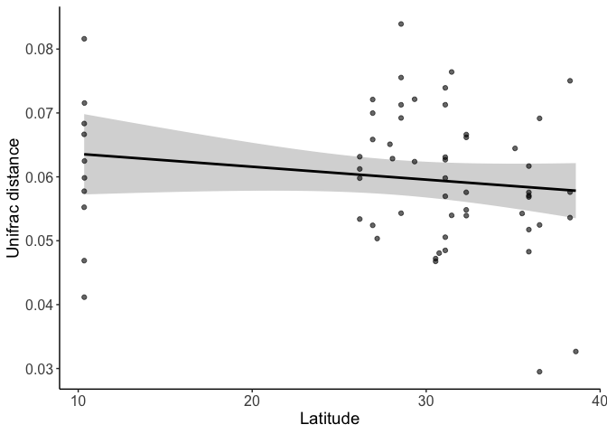<!-- -->

``` r
# Try the model 
model_dist<-lm(dist ~ Latitude, data=unifrac_dist2)
plot(model_dist)
```

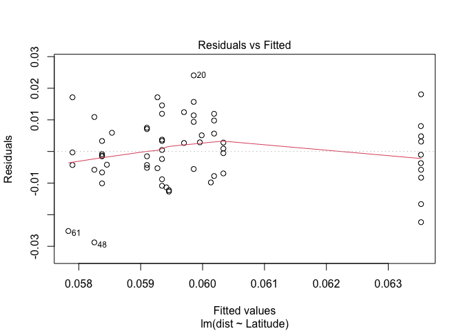<!-- -->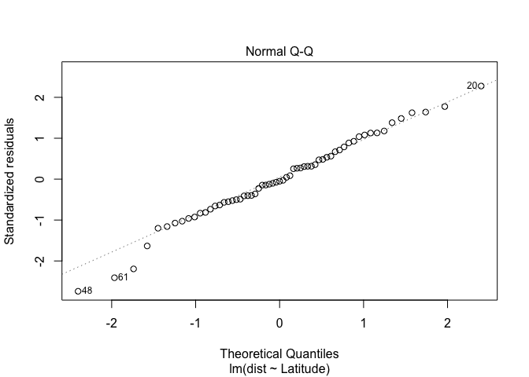<!-- -->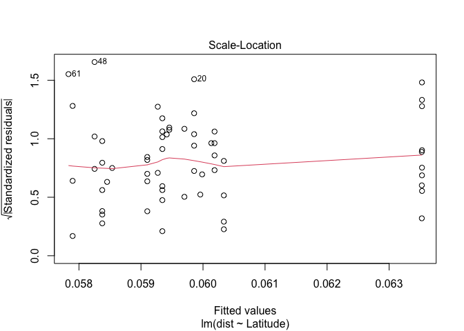<!-- -->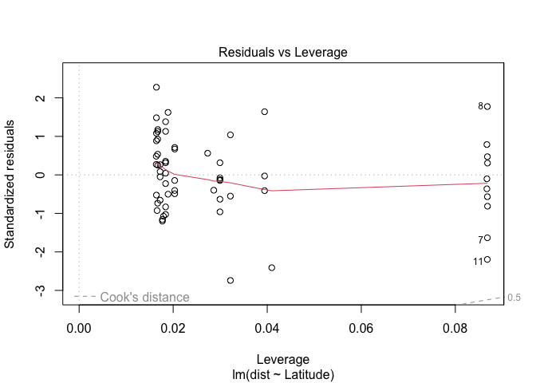<!-- -->

``` r
summary(model_dist)
```

    ## 
    ## Call:
    ## lm(formula = dist ~ Latitude, data = unifrac_dist2)
    ## 
    ## Residuals:
    ##        Min         1Q     Median         3Q        Max 
    ## -0.0287553 -0.0057823 -0.0005416  0.0070747  0.0240671 
    ## 
    ## Coefficients:
    ##               Estimate Std. Error t value Pr(>|t|)    
    ## (Intercept)  0.0656157  0.0046810  14.017   <2e-16 ***
    ## Latitude    -0.0002017  0.0001593  -1.266    0.211    
    ## ---
    ## Signif. codes:  0 '***' 0.001 '**' 0.01 '*' 0.05 '.' 0.1 ' ' 1
    ## 
    ## Residual standard error: 0.01066 on 59 degrees of freedom
    ## Multiple R-squared:  0.02644,    Adjusted R-squared:  0.009942 
    ## F-statistic: 1.603 on 1 and 59 DF,  p-value: 0.2105

``` r
Anova(model_dist, type=3)
```

    ## Anova Table (Type III tests)
    ## 
    ## Response: dist
    ##                Sum Sq Df  F value Pr(>F)    
    ## (Intercept) 0.0223391  1 196.4880 <2e-16 ***
    ## Latitude    0.0001822  1   1.6025 0.2105    
    ## Residuals   0.0067078 59                    
    ## ---
    ## Signif. codes:  0 '***' 0.001 '**' 0.01 '*' 0.05 '.' 0.1 ' ' 1

``` r
# Do regular unifrac distance 
unifrac_dist_reg<-lat_function(un_soilnod)
model_dist_un<-lm(dist ~ Latitude, data=unifrac_dist_reg)
plot(model_dist_un)
```

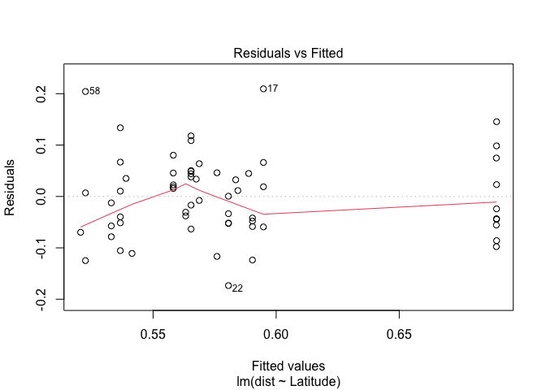<!-- -->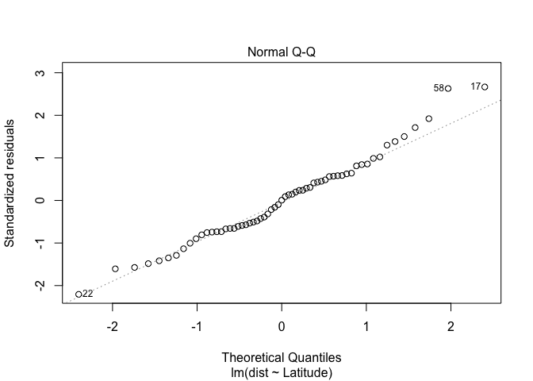<!-- -->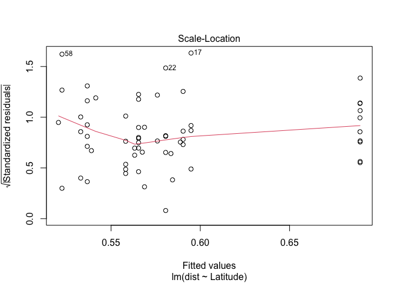<!-- -->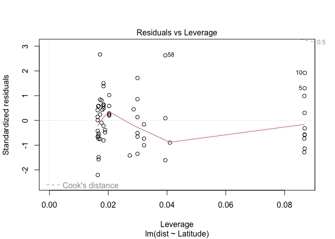<!-- -->

``` r
summary(model_dist_un)
```

    ## 
    ## Call:
    ## lm(formula = dist ~ Latitude, data = unifrac_dist_reg)
    ## 
    ## Residuals:
    ##       Min        1Q    Median        3Q       Max 
    ## -0.173429 -0.052562  0.000503  0.045639  0.209483 
    ## 
    ## Coefficients:
    ##              Estimate Std. Error t value Pr(>|t|)    
    ## (Intercept)  0.751392   0.034795   21.59  < 2e-16 ***
    ## Latitude    -0.005980   0.001184   -5.05 4.53e-06 ***
    ## ---
    ## Signif. codes:  0 '***' 0.001 '**' 0.01 '*' 0.05 '.' 0.1 ' ' 1
    ## 
    ## Residual standard error: 0.07926 on 59 degrees of freedom
    ## Multiple R-squared:  0.3018, Adjusted R-squared:   0.29 
    ## F-statistic: 25.51 on 1 and 59 DF,  p-value: 4.533e-06

``` r
Anova(model_dist_un, type=3)
```

    ## Anova Table (Type III tests)
    ## 
    ## Response: dist
    ##              Sum Sq Df F value    Pr(>F)    
    ## (Intercept) 2.92944  1 466.336 < 2.2e-16 ***
    ## Latitude    0.16023  1  25.507 4.533e-06 ***
    ## Residuals   0.37063 59                      
    ## ---
    ## Signif. codes:  0 '***' 0.001 '**' 0.01 '*' 0.05 '.' 0.1 ' ' 1

``` r
# Bray curtis 
bry_dist<-lat_function(bray_soilnod)
model_dist_bry<-lm(dist ~ Latitude, data=bry_dist)
plot(model_dist_bry)
```

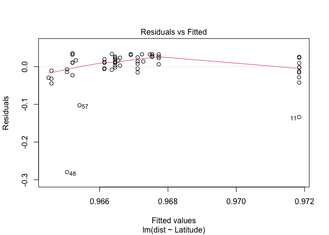<!-- -->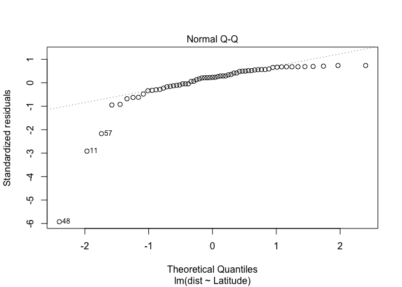<!-- -->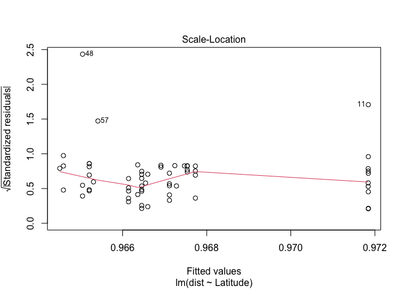<!-- -->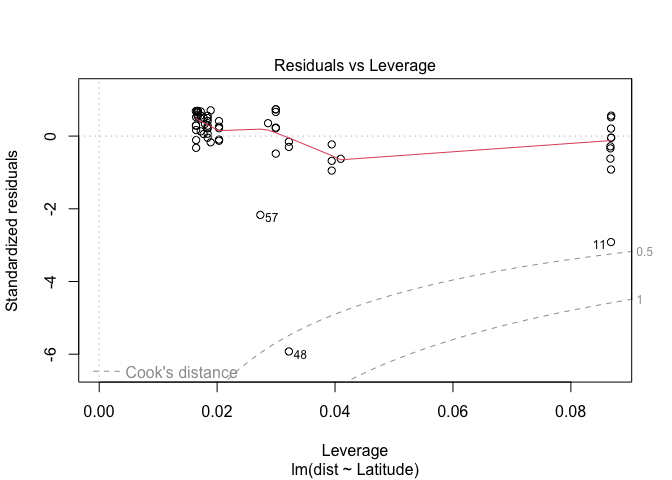<!-- -->

``` r
summary(model_dist_bry)
```

    ## 
    ## Call:
    ## lm(formula = dist ~ Latitude, data = bry_dist)
    ## 
    ## Residuals:
    ##       Min        1Q    Median        3Q       Max 
    ## -0.279632 -0.007261  0.011038  0.025816  0.034794 
    ## 
    ## Coefficients:
    ##               Estimate Std. Error t value Pr(>|t|)    
    ## (Intercept)  0.9745306  0.0210614  46.271   <2e-16 ***
    ## Latitude    -0.0002597  0.0007167  -0.362    0.718    
    ## ---
    ## Signif. codes:  0 '***' 0.001 '**' 0.01 '*' 0.05 '.' 0.1 ' ' 1
    ## 
    ## Residual standard error: 0.04797 on 59 degrees of freedom
    ## Multiple R-squared:  0.002221,   Adjusted R-squared:  -0.01469 
    ## F-statistic: 0.1313 on 1 and 59 DF,  p-value: 0.7184

``` r
Anova(model_dist_bry, type=3)
```

    ## Anova Table (Type III tests)
    ## 
    ## Response: dist
    ##             Sum Sq Df   F value Pr(>F)    
    ## (Intercept) 4.9277  1 2140.9988 <2e-16 ***
    ## Latitude    0.0003  1    0.1313 0.7184    
    ## Residuals   0.1358 59                     
    ## ---
    ## Signif. codes:  0 '***' 0.001 '**' 0.01 '*' 0.05 '.' 0.1 ' ' 1

``` r
# Jacc
jac_dist<-lat_function(jac_soilnod)
model_dist_jac<-lm(dist ~ Latitude, data=jac_dist)
plot(model_dist_jac)
```

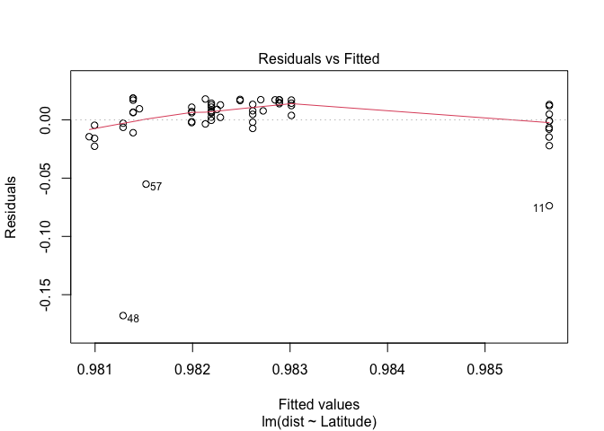<!-- --><!-- -->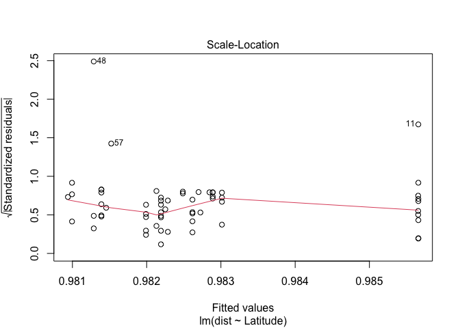<!-- -->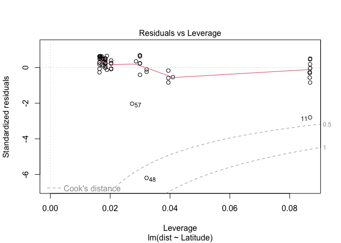<!-- -->

``` r
summary(model_dist_jac)
```

    ## 
    ## Call:
    ## lm(formula = dist ~ Latitude, data = jac_dist)
    ## 
    ## Residuals:
    ##       Min        1Q    Median        3Q       Max 
    ## -0.167939 -0.002850  0.006485  0.013285  0.018610 
    ## 
    ## Coefficients:
    ##               Estimate Std. Error t value Pr(>|t|)    
    ## (Intercept)  0.9873869  0.0120954  81.633   <2e-16 ***
    ## Latitude    -0.0001670  0.0004116  -0.406    0.686    
    ## ---
    ## Signif. codes:  0 '***' 0.001 '**' 0.01 '*' 0.05 '.' 0.1 ' ' 1
    ## 
    ## Residual standard error: 0.02755 on 59 degrees of freedom
    ## Multiple R-squared:  0.002783,   Adjusted R-squared:  -0.01412 
    ## F-statistic: 0.1647 on 1 and 59 DF,  p-value: 0.6864

``` r
Anova(model_dist_jac, type=3)
```

    ## Anova Table (Type III tests)
    ## 
    ## Response: dist
    ##             Sum Sq Df   F value Pr(>F)    
    ## (Intercept) 5.0585  1 6663.9495 <2e-16 ***
    ## Latitude    0.0001  1    0.1647 0.6864    
    ## Residuals   0.0448 59                     
    ## ---
    ## Signif. codes:  0 '***' 0.001 '**' 0.01 '*' 0.05 '.' 0.1 ' ' 1

# Merging some of the plots for publication

``` r
# matched asvs and otus 
match_plot2<-ggplot(soil_matches2, aes(x=as.factor(ASV), y=prop, fill=as.factor(type))) + 
  geom_bar(stat="identity", position="dodge", color="black") +
  (ylab("% soil taxa represented in nodules"))+
  (xlab(""))+
  labs(tag = "(a)") +
  scale_fill_manual(values = c(any=grey_col[7], sample=grey_col[2]), labels=c("any nodule sample", "paired nodule sample")) +
  #guides(shape = guide_legend(override.aes = list(size=0.2))) +
  theme_classic() + 
  theme(legend.title=element_blank(),
        axis.title = element_text(size=11), 
        axis.text = element_text(size=10), 
        legend.text=element_text(size=8), 
        #aspect.ratio=1.2,
        legend.key.size = unit(0.35, 'cm'),
        legend.position = "top",
        legend.direction = "vertical")
match_plot2
```

<!-- -->

``` r
# Clean up the taxa names 
custom_data3<-custom_data2 %>%
  mutate(Tax=as.character(Tax)) %>%
  mutate(Tax=gsub("\\[|\\]", "", Tax))

# Bar plot - this goes as its own in the supplement 
# Maybe actually group the rhizobia families together separate from the non rhizobia families (can I make these a different colour or something?)
soil_custom2 <- ggplot(custom_data3, aes(x= ID_clean, y=Abundance, fill=Tax)) +
  geom_bar(position="stack", stat="identity", size=0.1, colour="white") +
  facet_grid(Sample_type ~ region, space = "free", scales="free", switch="x") +
  scale_x_discrete(breaks = soil_plot_data$ID_clean) +
  xlab("")+
  labs(tag = "(b)") +
  scale_fill_manual(values = (palette_fam2)) +
  theme_classic() + 
  #guides(fill=guide_legend(ncol=1))+ # Make legend one column
  theme(axis.title.x = element_text(size=11), 
        axis.title.y = element_text(size=11), 
        axis.text.y= element_text(size=10), 
        axis.text.x= element_text(size=6, angle=90),
        legend.text=element_text(size=6), 
        legend.title=element_text(size=0),
        legend.position = "bottom", 
        legend.key.size = unit(0.35, 'cm'),# Change size of the legend boxes
        strip.background =element_rect(fill=grey_col[2]),
        ) # aspect ratio- maybe not needed here 
soil_custom2
```

<!-- -->

``` r
soil_legend<-get_legend(soil_custom2)

# Plot the bar plot 
soil_custom3 <- ggplot(custom_data3, aes(x= ID_clean, y=Abundance, fill=Tax)) +
  geom_bar(position="stack", stat="identity", size=0.1, colour="white") +
  facet_grid(Sample_type ~ region, space = "free", scales="free", switch="x") +
  scale_x_discrete(breaks = soil_plot_data$ID_clean) +
  xlab("")+
  labs(tag = "(b)") +
  scale_fill_manual(values = (palette_fam2)) +
  theme_classic() + 
  #guides(fill=guide_legend(ncol=1))+ # Make legend one column
  theme(axis.title.x = element_text(size=11), 
        axis.title.y = element_text(size=11), 
        axis.text.y= element_text(size=10), 
        axis.text.x= element_text(size=6, angle=90),
        legend.text=element_text(size=6), 
        legend.title=element_text(size=0),
        legend.position = "none", 
        legend.key.size = unit(0.35, 'cm'),# Change size of the legend boxes
        strip.background =element_rect(fill=grey_col[2]),
        ) # aspect ratio- maybe not needed here 
soil_custom3
```

<!-- -->

``` r
# Weighted unifrac distance PCoA 
wunifrac_plot_pub<-plot_ordination(data_input, wun_ord_soilnod) + 
  geom_point(aes(fill=Sample_type), size=2, shape=21) +
  scale_fill_manual(values=soils_pallete)+
  theme_classic() +
  labs(tag = "(a)") +
  xlab("PCoA Axis 1 (49.7%)") + 
  ylab("PCoA Axis 2 (10.3%)") +
  labs(color="Sample type") + 
  #guides(fill = guide_legend(override.aes = list(size=1))) +
  theme(axis.text = element_text(size=9), 
        axis.title = element_text(size=9), 
        legend.text=element_text(size=9), 
        legend.title=element_blank(),
        aspect.ratio = 1,
        legend.position = "right",
        #legend.direction = "vertical"
        )

# Make the label 
stat_label = c(paste0("italic(R[m])^2 == 0.005"),
               paste0("italic(p) == 0.373")) 


# Weighted soil and nodule correlation 
wun_corr_plot<-ggplot(wunifrac_data_pair1, aes(x=soil1, y=(nodule1))) + 
  geom_smooth(method="lm", colour="black") + 
  geom_point(alpha=0.6)+
  (ylab("Nodule PCoA Axis 1"))+
  (xlab("Soil PCoA Axis 1"))+
  labs(tag = "(b)") +
  theme_classic() +
  annotate(geom="text", x=-0.002, y=c(-0.018, -0.022), label=stat_label, color="black", hjust = 0, parse=TRUE, size=3) +
  theme(axis.title = element_text(size=9),
        axis.text = element_text(size=9),
        aspect.ratio=1
    )
wun_corr_plot

# Weighted unifrac plot 
stat_label_w = c(paste0("italic(p) == 0.211"),
               paste0("italic(R)^2 == 0.009")) 

wuni_lat<-ggplot(unifrac_dist2, aes(x=Latitude, y=dist)) + 
  geom_smooth(method="lm", colour="black") + 
  geom_point(alpha=0.6)+
  (ylab("Weighted unifrac distance"))+
  (xlab("Latitude"))+
  labs(tag = "(b)") +
  annotate(geom="text", x=10, y=c(0.031, 0.034), label=stat_label_w, color="black", hjust = 0, parse=TRUE, size=3) +
  theme_classic() +
  #coord_fixed(ratio = 0.5) +
  theme(axis.title = element_text(size=9),
        axis.text = element_text(size=9),
        aspect.ratio = 1
        )


# stat_label_u = c(paste0("bolditalic(p < 0.0001)"),
#               paste0("bolditalic(R)^bold(2) == 0.290")) 

stat_label_u = c(paste0("italic(p) < 0.0001"),
               paste0("italic(R)^italic(2) == 0.290")) 

uni_lat<-ggplot(unifrac_dist_reg, aes(x=Latitude, y=dist)) + 
  geom_smooth(method="lm", colour="black") + 
  geom_point(alpha=0.6)+
  (ylab("Unifrac distance"))+
  (xlab("Latitude"))+
  labs(tag = "(a)") +
  annotate(geom="text", x=10, y=c(0.41, 0.435), label=stat_label_u, color="black", hjust = 0, parse=TRUE, size=3) +
  theme_classic() +
  #coord_fixed(ratio = 0.5) +
  theme(axis.title = element_text(size=9),
        axis.text = element_text(size=9),
        aspect.ratio = 1
        )

# Join the figures 
soilnod_pcoa<-ggarrange(wunifrac_plot_pub, wun_corr_plot,
          ncol=2, nrow=1,
          common.legend=TRUE, 
          legend="bottom"
          )

#ggsave(filename="Figures/soilnod_pcoa.pdf", plot=soilnod_pcoa)


uni_lat<-ggarrange(uni_lat, wuni_lat,
          ncol=2, nrow=1)

ggsave(filename="Figures/uni_lat.pdf", plot=uni_lat)


# Join the plots together 
library(grid)
blank <- grid.rect(gp=gpar(col="white"))
```

<!-- -->

``` r
# Save the figure 
test<-grid.arrange(match_plot2, soil_custom3, soil_legend, blank,
             heights=c(3,1),
             ncol=4, nrow=2, 
             layout_matrix=rbind(c(1,2,2,2),
                                 c(4,3,3,3)))
```

<!-- -->

``` r
ggsave(filename="Figures/barplot.pdf", plot=test, width=8, height=5, units="in")

# Check % 
soil_matches2
```

    ##   ASV   type count total      prop
    ## 1 OTU sample    71  8573 0.8281815
    ## 2 OTU    any   390  8573 4.5491660
    ## 3 ASV sample    15 18907 0.0793357
    ## 4 ASV    any    35 18907 0.1851166

## Differential abundance for soil OTUs

Since we are using abundance data from 16S may not be appropriate to do
certain abundance test, but we can use the ANCOMBC method which might
deal with some of these biases.

ANCOMBC - with BC this is the bias correction so this is the one we want
to use

This method can only look at differential abundance by different taxa
classification (genus or family) across different groups (tropical, sub,
or temperate). So I would choose temperate, subtropical, and tropical.

This should be done with non-rarefied data

Merge the non-rarefied dataset at 0.03 and then use the asv codes

``` r
# set seed for reproducibility 
set.seed(123)
# Merged the raw (non rarefied reads) at h=0.03 to get merged asvs 
# load the rds 
soil_003<-read_rds("paired_seq_merge_raw.rds")
test3<-data.frame(tax_table(soil_003))
test3%>%
  filter(Genus=="g__Bradyrhizobium") # Only 3 ASVs that are g__Bradyrhizobium
```

    ##                                      Kingdom            Phylum
    ## 76cc532e0b083eeb4e499a21db9851b6 k__Bacteria p__Proteobacteria
    ## 28b8e912c170024b5f0fe8428c39fad2 k__Bacteria p__Proteobacteria
    ## beb3b80e75436d6d978d68e281d20ecf k__Bacteria p__Proteobacteria
    ## 8142d46bf1da3cd6870bad327d73ee97 k__Bacteria p__Proteobacteria
    ##                                                   Class          Order
    ## 76cc532e0b083eeb4e499a21db9851b6 c__Alphaproteobacteria o__Rhizobiales
    ## 28b8e912c170024b5f0fe8428c39fad2 c__Alphaproteobacteria o__Rhizobiales
    ## beb3b80e75436d6d978d68e281d20ecf c__Alphaproteobacteria o__Rhizobiales
    ## 8142d46bf1da3cd6870bad327d73ee97 c__Alphaproteobacteria o__Rhizobiales
    ##                                                Family             Genus Species
    ## 76cc532e0b083eeb4e499a21db9851b6 f__Bradyrhizobiaceae g__Bradyrhizobium     s__
    ## 28b8e912c170024b5f0fe8428c39fad2 f__Bradyrhizobiaceae g__Bradyrhizobium     s__
    ## beb3b80e75436d6d978d68e281d20ecf f__Bradyrhizobiaceae g__Bradyrhizobium     s__
    ## 8142d46bf1da3cd6870bad327d73ee97 f__Bradyrhizobiaceae g__Bradyrhizobium     s__

``` r
# Now filter for just the new asvs that are found in the nodules but in the soil and do abundance stuff on it 
# Result from previous stuff was that bradyrhizobium reads were very high in abundance in the tropics and non-rhizobia were generally low abundance in tropics 
# Take just the nodule asvs
soil_003_ph <- subset_samples(soil_003, Sample_type=="nodule")
soil_003_ph_clean= prune_taxa(taxa_sums(soil_003_ph)>0, soil_003_ph)
 # 694 ASVs total 
samples_soil_ph<-data.frame(otu_table(soil_003_ph_clean))
samples_soil_ph2<-rownames(samples_soil_ph)

# Filter the soil asvs for asvs in the nodule
samples_soil_ph_raw <- subset_samples(soil_003, Sample_type=="soil") # soil only 
soil_ph_raw<-prune_taxa(samples_soil_ph2, samples_soil_ph_raw)
soil_ph_raw_clean= prune_taxa(taxa_sums(soil_ph_raw)>0, soil_ph_raw)
soil_ph_raw_clean # 394 asvs in the soil that make it into the nodule 
```

    ## phyloseq-class experiment-level object
    ## otu_table()   OTU Table:         [ 394 taxa and 66 samples ]
    ## sample_data() Sample Data:       [ 66 samples by 6 sample variables ]
    ## tax_table()   Taxonomy Table:    [ 394 taxa by 7 taxonomic ranks ]
    ## phy_tree()    Phylogenetic Tree: [ 394 tips and 393 internal nodes ]

``` r
# Lets see if we can find Bradyrhizobium 
test<-data.frame(tax_table(soil_ph_raw_clean))
brady_test<-test %>%
  filter(Genus=="g__Bradyrhizobium") # Even here we are losing Bradyrhizobium, we could look further up at family instead? Would that give us better information since we have merged by phylogenetic similarity? 
```

Set up the abundance test

``` r
# Full dataset of soil asvs that make it into the nodule
meta_data_groups<-data.frame(sample_data(soil_ph_raw_clean))

# Discretize the latitude variable into groups for ANCOMBC 
# Change region to a factor 
meta_data_groups2 <- meta_data_groups %>%
  mutate(region=case_when(Latitude < 11 ~ "Tropical", 
                          Latitude > 35 ~ "Temperate", 
                          Latitude > 25 | Latitude <33 ~ "Subtropical")) %>%
  mutate(region=as.factor(region))

# Bind the new metadata 
sample_data(soil_ph_raw_clean) <- meta_data_groups2

# Merge at genus level first bc prob not enough individuals across all three groups to use the model 
soil_gens_merge = aggregate_taxa(soil_ph_raw_clean, "Family")
# 98 taxa after merging 

# Prepare the phyloseq object 
# Find any rows or samples that are zero across the board 
soil_gens_merge_prune= prune_taxa(taxa_sums(soil_gens_merge)>0, soil_gens_merge)
 # 98 this is the same 
# Prune samples with zero 
soil_gens_merge_prune2<-prune_samples(sample_sums(soil_gens_merge_prune) > 0, soil_gens_merge_prune)
# 66 samples! So good on this front 

# Try removing the uknown genus 
soil_gens_merge_prune3<-subset_taxa(soil_gens_merge_prune2, Family != "f__")
soil_gens_merge_prune4<-subset_taxa(soil_gens_merge_prune3, Family != "unassigned")
# 66 families  

# Try the anocombc model 
# prv_cut- prevalence of the genus to keep 
# lib_cut - the library size less than this will be cut, but since I am using rarefied data I might put this to zero to keep everythign (which may be the default anyway)
# global=TRUE if factor has greater than 3 levels - I have exactly three levels but still do true
density_model = ancombc(phyloseq = soil_gens_merge_prune4, formula = "region", tax_level = "Family", 
              p_adj_method = "holm", prv_cut = 0.10, lib_cut = 0, 
              group = "region", struc_zero = TRUE, neg_lb = TRUE, tol = 1e-5, 
              max_iter = 100, conserve = TRUE, alpha = 0.05, global = TRUE)

density_res = density_model$res
density_res_global = density_model$res_global 

# Bias corrected abundances of the different genera 
samp_frac = density_model$samp_frac
# Replace NA with 0
samp_frac[is.na(samp_frac)] = 0 

# Add pesudo-count (1) to avoid taking the log of 0
log_obs_abn = log(abundances(soil_gens_merge_prune4) + 1) 
# Adjust the log observed abundances
log_obs_abn_adj = t(t(log_obs_abn) - samp_frac)
# Show the first 6 samples
# Could make a plot of the abundances of the important genera and colour code the individual samples by temperate, subtropical, and tropical
round<-round(log_obs_abn_adj[, 1:6], 2) %>% 
  data.frame(caption = "Bias-corrected log observed abundances")
```

Visualize the results with h=0.03

``` r
# Get the global result 
# 35 known families went into the analysis 

# Take only sig differences
sig_taxa <- density_res_global %>%
  tibble::rownames_to_column("taxon") %>%
  dplyr::filter(diff_abn == TRUE) %>%
  .$taxon
# 20 genera that were significantly different 

# Save and prep the genera for diff abundances 
# Maybe try and filter out only the significant ones and plot those instead - could even go down to genera for that too
df_sig <- as.data.frame(t(log_obs_abn_adj[sig_taxa, ])) %>%
  tibble::rownames_to_column("sample.id") %>%
  dplyr::left_join(meta(soil_gens_merge_prune4) %>%
                     dplyr::select(sample.id, region),
                   by = "sample.id") %>%
  dplyr::filter(!is.na(region)) %>%
  tidyr::pivot_longer(cols = -one_of("sample.id", "region"), 
                      names_to = "taxon", values_to = "value")

# Prep data for heat map 
df_heat <- df_sig %>%
  dplyr::group_by(region, taxon) %>%
  dplyr::summarise_if(is.numeric, mean, na.rm = TRUE) %>%
  dplyr::mutate(value = round(value, 2)) %>%
  dplyr::arrange(region)
df_heat$taxon = factor(df_heat$taxon, levels = sig_taxa)

lo = floor(min(df_heat$value))
up = ceiling(max(df_heat$value))
mid = (lo + up)/2

# Clean up the data frame before plotting
df_heat2 <- df_heat %>%
  mutate(region=fct_relevel(region, "Temperate", "Subtropical")) %>%
  mutate(taxon=gsub("f__","",as.character(taxon))) 

# Colour palette for heat map 
heat_col<- park_palette("ArcticGates")

# The values are red (high abundances) and blue (low abundances)
# So looking across, does one have generally higher abundances than the others? 

# Code the families as rhizobia 
df_heat3 <- df_heat2 %>%
  mutate(rhizobia=case_when(taxon=="Bradyrhizobiaceae" | taxon=="Rhizobiaceae" | taxon=="Phyllobacteriaceae" | taxon=="Burkholderiaceae" | taxon=="Devosiaceae" | taxon=="Brucellaceae" ~ "rhizobia")) %>%
  mutate(rhizobia=ifelse(is.na(rhizobia), "nonrhizobia", rhizobia)) %>%
  filter(taxon != "Unknown")
  
# List of families that have rhizobia in them: Bradyrhizobiaceae, Rhizobiaceae, Phyllobacteriaceae, Burkholderiaceae, Devosiaceae,  Brucellaceae, 

df_heat4<-df_heat3 %>%
  mutate(rhizobia2=case_when(rhizobia=="rhizobia" ~ "R",
                             rhizobia=="nonrhizobia" ~ "NR"))

# Try facetting by rhizobia 
r_heat <- df_heat4 %>%
  ggplot(aes(x = region, y =  reorder(taxon,value), fill = value)) + 
  geom_tile(color = "white") +
  facet_grid(rows=vars(rhizobia2), scales="free", space="free") +
  scale_fill_gradient2(low = heat_col[2], high = heat_col[6], mid = heat_col[1], 
                       na.value = "white", midpoint = mid, limit = c(lo, up),
                       name = "log fold change") +
  geom_text(aes(region, taxon, label = value), color = "black", size = 2.5) +
  labs(x = NULL, y = NULL) +
  theme_minimal() +
  theme(axis.text.x = element_text(size=11),
        axis.text.y = element_text(size=8),
        legend.title=element_text(size=9),
        strip.text.y = element_text(size = 8))
r_heat # This looks better with the families bc then we can say something about Brady 
```

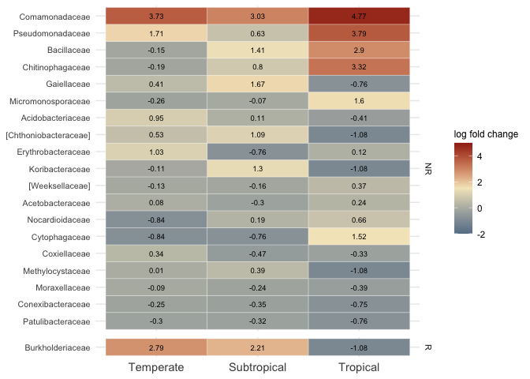<!-- -->

## Combine the soil and latitude figure of diversity to get a better idea

load the rds for the nodule data

``` r
# Load the nodule diversity 
nodules_div<-read_rds("nodule_latitude_table.rds")

# Prep the soil dataset 
full_obs_new_ph<-full_obs_ph %>%
  mutate(full_v=value) %>%
  dplyr::select(-value, -se)
rhiz_obs_new_ph<-rhiz_obs_ph%>%
  mutate(rhiz_v=value) %>%
  dplyr::select(-value, -se)
nonrhiz_obs_new_ph <- nonrhiz_obs_ph %>%
  mutate(nonrhiz_v=value) %>%
  dplyr::select(-value, -se)

# Merge the datasets and save as an r object 
soil_data_comp<-inner_join(nonrhiz_obs_new_ph, rhiz_obs_new_ph, by="sample.id")
soil_data_comp2<-inner_join(soil_data_comp, full_obs_new_ph, by="sample.id")
soil_data_comp2<- soil_data_comp2 %>%
  dplyr::select(sample.id, ID_clean, Sample_type, Pop_code, Latitude, Longitude, samples, variable, rhiz_v, samples, full_v, nonrhiz_v)

# Mutate to make the headers the same 
soil_data_comp3<-soil_data_comp2 %>%
  mutate(latitude=Latitude, 
         longitude=Longitude,
         sample.type=Sample_type)

soil_data_comp4<-soil_data_comp3 %>%
  dplyr::select(samples, variable, rhiz_v, full_v, nonrhiz_v, latitude, longitude, sample.type, sample.id)
nodules_div4<-nodules_div %>%
  dplyr::select(samples, variable, rhiz_v, full_v, nonrhiz_v, latitude, longitude, sample.type, sample.id)

# Make new dataset 
combined_diversity<-rbind(soil_data_comp4, nodules_div4)

# Now have to make the dataset longer 
combined_div2<- gather(combined_diversity, key = obs_type, value = obs_value, -c(samples,variable, latitude, longitude, sample.type, sample.id))
```

# Try plotting with facetting

Now have the soil and nodule diversity values all in one dataset. Should
be able to facet and get everything together nicely.

``` r
# Reorder the levels for the plot 
combined_div3<-combined_div2 # Copy the dataframe
combined_div3$obs_type <-factor(combined_div3$obs_type, levels = c("full_v", "rhiz_v", "nonrhiz_v"))
combined_div3$sample.type <-factor(combined_div3$sample.type, levels = c("field", "soil"))

# New colour palette for soil and nodule 
soils<-park_palette("Zion")
soils_pallete<-c(sampletypes2[3], soils[3])
```

Now have the soil and nodule diversity values all in one dataset. Should
be able to facet and get everything together nicely.

``` r
# Set the colour scheme for sample type 
rock_palette<-park_palette("RockyMountains")
grey_col<- brewer.pal(9, "Greys") 

# Try the plot and re-label 
# But need to show that the y-axis is not the same in both of these cases 
div_plot2<-ggplot(combined_div3, aes(x=latitude, y=(obs_value))) + 
  geom_point(aes(fill=sample.type),alpha=0.8, shape=21, colour="black") +
  scale_fill_manual(values=soils_pallete, labels=c(field="nodule", soil="soil"))+
  (ylab("Taxa richness (no.)"))+
  (xlab("Latitude"))+
  stat_smooth(data=subset(combined_div3, obs_type=="full_v" & sample.type=="field"), method="lm",  colour=rock_palette[5]) + 
  stat_smooth(data=subset(combined_div3, obs_type=="nonrhiz_v" & sample.type=="field"), method="lm",  colour=rock_palette[5]) + 
  stat_smooth(data=subset(combined_div3, obs_type=="nonrhiz_v" & sample.type=="soil"), method="lm",  colour=soils[3]) +
  stat_smooth(data=subset(combined_div3, obs_type=="full_v" & sample.type=="soil"), method="lm",  colour=soils[3]) + 
  facet_grid(sample.type ~ obs_type, labeller = labeller(
        sample.type = c("soil" = "soil OTUs", "field" = "nodule ASVs"),
        obs_type = c("full_v" = "full community", "rhiz_v" = "rhizobia only", "nonrhiz_v"="non-rhizobia only")),
        scales="free") +
  theme_classic()+
  theme(axis.title.x = element_text(colour="black",size=11), 
        axis.title.y = element_text(colour="black",size=11), 
        axis.text.y=   element_text(colour="black",size=11), 
        axis.text.x= element_text(colour="black",size=11), 
        axis.line=element_line(), 
        axis.line.y=element_line(colour=NA), 
        axis.line.x=element_line(colour=NA), 
        panel.background=element_rect(fill=NA), 
        panel.grid=element_blank(),
        strip.background =element_rect(fill=grey_col[2]),
        aspect.ratio = 0.9,
        legend.position="bottom", 
        legend.title= element_blank(),
        legend.text=element_text(size=10),
        strip.text = element_text(colour = 'black', size=9)) +
  guides(fill = guide_legend(override.aes = list(size=3))) +
  annotate("segment", x=-Inf, xend=Inf, y=-Inf, yend=-Inf, size=1)+ # Add the grid lines 
  annotate("segment", x=-Inf, xend=-Inf, y=-Inf, yend=Inf, size=1)
div_plot2
```

<!-- -->

``` r
#jpeg(file="latdiv.jpeg", units="in", res=600, width=6, height=4)
#div_plot2
#dev.off()

ggsave(filename="Figures/diversity_plot.pdf", plot=div_plot2)
```

``` r
# Weighted unifrac distance PCoA 
wunifrac_plot_pub<-plot_ordination(data_input, wun_ord_soilnod) + 
  geom_point(aes(fill=Sample_type), size=2, alpha=0.8, shape=21) +
  scale_fill_manual(values=soils_pallete)+
  theme_classic() +
  labs(tag = "(a)") +
  xlab("PCoA Axis 1 (49.7%)") + 
  ylab("PCoA Axis 2 (10.3%)") +
  labs(color="Sample type") + 
  #guides(fill = guide_legend(override.aes = list(size=1))) +
  theme(axis.title.x = element_text(colour="black",size=10), 
        axis.title.y = element_text(colour="black",size=10), 
        axis.text.y=   element_text(colour="black",size=10), 
        axis.text.x= element_text(colour="black",size=10), 
        axis.line=element_line(), 
        axis.line.y=element_line(colour=NA), 
        axis.line.x=element_line(colour=NA), 
        panel.background=element_rect(fill=NA), 
        panel.grid=element_blank(),
        strip.background =element_rect(fill=grey_col[2]),
        aspect.ratio = 0.9,
        legend.position="none", 
        legend.title= element_blank(),
        legend.text=element_text(size=10),
        strip.text = element_text(colour = 'black', size=9)) +
  #guides(fill = guide_legend(override.aes = list(size=3))) +
  annotate("segment", x=-Inf, xend=Inf, y=-Inf, yend=-Inf, size=0.5)+ # Add the grid lines 
  annotate("segment", x=-Inf, xend=-Inf, y=-Inf, yend=Inf, size=0.5)
      

# Make the label 
stat_label = c(paste0("italic(R[m])^2 == 0.005"),
               paste0("italic(p) == 0.373")) 

# Weighted soil and nodule correlation 
wun_corr_plot<-ggplot(wunifrac_data_pair1, aes(x=soil1, y=(nodule1))) + 
  geom_smooth(method="lm", colour="black") + 
  geom_point(alpha=0.8, size=2)+
  (ylab("Nodule PCoA Axis 1"))+
  (xlab("Soil PCoA Axis 1"))+
  labs(tag = "(b)") +
  theme_classic() +
  annotate(geom="text", x=-0.002, y=c(-0.018, -0.022), label=stat_label, color="black", hjust = 0, parse=TRUE, size=3) +
  theme(axis.title.x = element_text(colour="black",size=10), 
        axis.title.y = element_text(colour="black",size=10), 
        axis.text.y=   element_text(colour="black",size=10), 
        axis.text.x= element_text(colour="black",size=10), 
        axis.line=element_line(), 
        axis.line.y=element_line(colour=NA), 
        axis.line.x=element_line(colour=NA), 
        panel.background=element_rect(fill=NA), 
        panel.grid=element_blank(),
        strip.background =element_rect(fill=grey_col[2]),
        aspect.ratio = 0.9,
        legend.position="none", 
        legend.title= element_blank(),
        legend.text=element_text(size=10),
        strip.text = element_text(colour = 'black', size=9)) +
  #guides(fill = guide_legend(override.aes = list(size=3))) +
  annotate("segment", x=-Inf, xend=Inf, y=-Inf, yend=-Inf, size=0.5)+ # Add the grid lines 
  annotate("segment", x=-Inf, xend=-Inf, y=-Inf, yend=Inf, size=0.5)

test<-ggarrange(wunifrac_plot_pub, wun_corr_plot,
          ncol=2, nrow=1,
          common.legend=TRUE, 
          legend="bottom"
          )
test
```

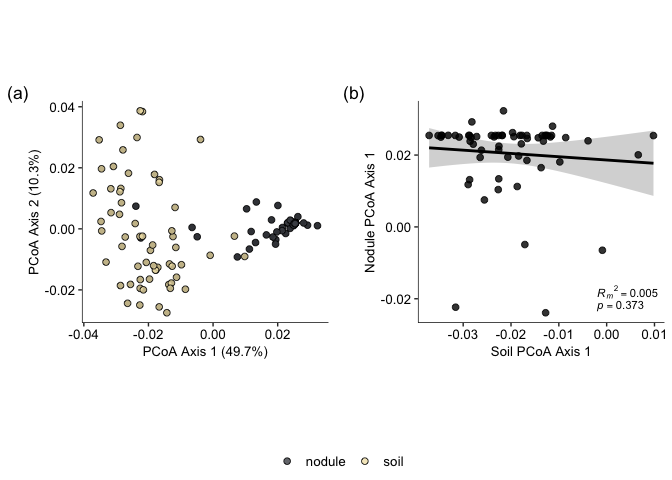<!-- -->

``` r
# Save the plot 
ggsave(path="Figures", filename="soilpredict.pdf", plot=test)
```

## Break down of three categories

Combine the nodule and soil datasets

``` r
# Create the three categories 
combined_div_3 <- combined_div3 %>%
  mutate(region=case_when(latitude < 11 ~ "Tropical", 
                          latitude > 35 ~ "Temperate", 
                          latitude > 25 | latitude <33 ~ "Subtropical")) %>%
  filter(obs_type=="nonrhiz_v")

# Draw the plot 
three_groups_com <-ggplot(combined_div_3, aes(x=region, y=obs_value, color=region))+ 
  geom_boxplot() +
  (ylab("Taxon richness"))+
  (xlab(""))+
  facet_wrap(~ sample.type, labeller = labeller(sample.type = c("soil" = "soil OTUs", "field" = "nodule ASVs"))) +
  scale_x_discrete(limits=c("Tropical", "Subtropical", "Temperate")) +
  geom_signif(data=subset(combined_div_3, sample.type=="field"), comparisons=list(c("Tropical", "Subtropical")), annotations="**", color="black") +
  geom_signif(data=subset(combined_div_3, sample.type=="soil"), comparisons=list(c("Tropical", "Subtropical"), c("Tropical", "Temperate")), annotations="***", map_signif_level = TRUE, y_position = c(52, 68), color="black") +
  scale_color_manual(values=region_col[c(3,1,5)])+
  theme_classic() + 
  theme(legend.title=element_blank(),
        axis.title = element_text(size=13), 
        axis.text = element_text(size=12), 
        legend.text=element_text(size=10), 
        aspect.ratio=1.2,
        legend.position = "none")
three_groups_com
```

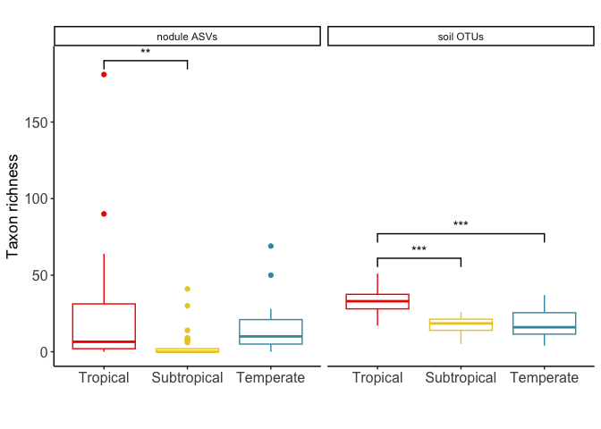<!-- -->
